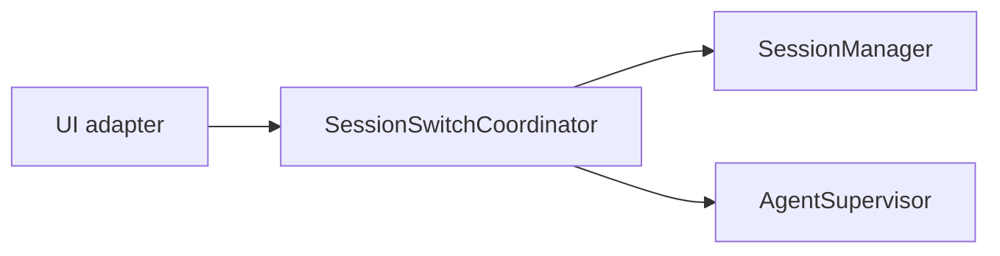

# AGENTS.md

本文件供 AI Agent 快速理解项目结构。

## ⛔ Pre-Flight Checklist（每次写文件前必答）

在调用 `write_file` / `edit` / `overwrite_file` 之前，回答以下问题：

| # | 问题 | 如果是 → 操作 |
|---|------|-------------|
| 1 | 本次变更是否涉及 `.css` / `.html` / `.svg` 的样式或布局？ | → 走视觉设计流程 |
| 2 | 本次变更是否新增/重排/删除 HTML 元素或组件？ | → 走视觉设计流程 |
| 3 | 用户是否使用了以下动词：**设计、美化、重设计、改样式、调布局、重新排布、改颜色、改字体、改间距、改卡片**？ | → 走视觉设计流程 |
| 4 | 用户是否要求「参考某个 skill 的美学」或「按 xx 风格」？ | → 走视觉设计流程 |

**视觉设计流程（三步，不可跳过）：**

```
Step 1: Open Design 生成/获取视觉参考（mcp__open-design__create_project → start_run → poll get_run → get_artifact）
Step 2: taste-skill 把关实现质量（加载 design-taste-frontend 或对应 skill）
Step 3: 写代码实现
```

**特例豁免（仅以下情况可跳过 Step 1–2）：**
- 纯逻辑修复（JS/TS bug fix，不涉及 UI）
- 纯内容替换（改文字不改样式）
- 已在当前 session 内完成过 Step 1–2 的同主题变更


## 编码规范

- TypeScript strict，2 spaces，semicolons，named exports，camelCase
- 文件 ≤300 行，一个文件一个职责
- 详见 `docs/STYLE.md`

## 文档绘图

架构图、流程图和时序图统一使用 Markdown 内嵌 Mermaid，不提交截图代替可维护的
图表源码。

- 架构和依赖关系使用 `flowchart LR` 或 `flowchart TB`
- 调用链和跨组件交互使用 `sequenceDiagram`
- 生命周期使用 `stateDiagram-v2`
- 节点 ID 使用稳定的 ASCII 标识，展示文本可以使用中文
- 复杂模块使用 `subgraph` 分层，每张图只表达一个主要关系
- 避免 Mermaid 中的 HTML、Emoji、主题 CSS 和依赖特定渲染器的扩展语法
- 修改图表后检查方向、节点归属、箭头语义以及代码块闭合

示例：



## 图像识别

支持 Vision 模型代理和 OCR 识别图片。**不要以"我是文本模型"为由拒绝处理图片。**

## 视觉设计

**任何涉及可见布局、样式、组件呈现的变更（修改 CSS、新增/重排 HTML 元素、调整视觉层次、设计 card/prototype/page），禁止直接写代码——必须先通过 Open Design（`mcp__open-design__*`）获取或创建视觉参考。** 设计分两层：**视觉方向**由 Open Design 提供，**实现质量**由 taste-skill（`design-taste-frontend`）保证。视觉决策经 explore→propose 流程沉淀为 change 的 design.md + prototype 后方可实施。`docs/prototypes/` 仅是暂存区：apply 完成后按 `prototype-workflow` 逐文件决定 `archive` 或 `delete`，archive 阶段将长期资产移入按日期和 change 分组的归档目录。Session 00MRIZMZQJ 是 HTML 原型→视觉迭代→实现的标准案例。

## Web 前端

修改 Web UI 前必读 `openspec/specs/web-frontend/spec.md`。禁止引入第三方组件库（Material UI、Ant Design 等），必须使用 `web/src/index.css` 的 `--color-*` token。视觉流程遵循上方「视觉设计」节。


## 运行

```bash
npm install                         # 安装根项目依赖
cd web && npm install && cd ..      # 安装 Web 依赖
npm start                           # 源码运行 REPL
npm run build                       # 构建 CLI、Web 和 Package Resources
npm start -- --web                  # 源码运行 Web 模式（需先构建）
node dist/dscode.mjs                # 运行构建后的 CLI
npm run typecheck                   # 类型检查
npm test                            # 全量测试
npm run test:subagent               # SubAgent/Vision 专项测试
```

## 本地 npm 包验证

`npm run build` 会生成 `release/package/` 发布 staging。不要从仓库根目录
执行 `npm publish`，也不要提交 `release/` 目录。

```bash
rm -rf release/artifacts
mkdir -p release/artifacts
npm pack ./release/package --pack-destination release/artifacts
npm run package:verify -- release/artifacts/*.tgz
```

`package:verify` 会校验文件白名单、版本、资源 manifest、SHA-256 和包体积，
然后在临时项目中安装 tgz，并从随机 cwd 执行 CLI 版本及资源加载检查。

## 自定义模型

dscode 在 `src/models/registry.ts` 模块初始化时，通过 pi-ai 的 `createProvider()` + `models.setProvider()` 注册非 pi-ai builtin 的模型提供商。

当前注册的自定义 provider：
- **qwen** (DashScope) — 定义在 `src/models/qwen.ts`，baseUrl `https://dashscope.aliyuncs.com/compatible-mode/v1`

**⚠️ 升级 pi-ai 时请确认**：
1. `createProvider` / `envApiKeyAuth` / `lazyApi` 仍从 `@earendil-works/pi-ai` 可导入
2. Qwen 模型的 `compat.thinkingFormat: "qwen"` 兼容新版本（pi-ai 0.80.3+ 支持）
3. 模型定义的 `Omit<Model<Api>, "id" | "name">` 类型仍然兼容 pi-ai 的 `Model` 类型

添加新自定义 provider 的模式：
1. 在 `src/models/` 下创建 `<provider>.ts`，导出 model map 和 baseUrl
2. 在 `registry.ts` 中用 `createProvider()` 构造 Provider
3. 调用 `models.setProvider()` 注册 ⚠️ 光注册到 dscode 自己的 Map 不够，必须注册到 pi-ai 实例

## MCP 命名规范

MCP tool/driver name 必须使用 `src/mcp/names.ts` 中的工具函数构造，**禁止手动拼接字符串**。

```
mcpToolName("github", "search_repos") → "mcp__github__search_repos"
mcpDriverName("github")             → "mcp__github"
isMcpToolName(name)                  → boolean
```

分隔符固定为双下划线 `__`（`mcp__<server>__<tool>`），不是单下划线。
手动拼接容易写出 `` `mcp__${server}_${tool}` `` 导致 reducer 匹配失败。


## 配置文件

- `~/.dscode/settings.json` — 用户偏好（权限、skills、retry），可版本管理
- `<project>/.dscode/settings.json` — 项目偏好，覆盖用户设置
- `~/.mcp.json` — 用户全局 MCP servers，包含敏感信息不提交
- `<project>/.mcp.json` — 项目 MCP servers，应加入 `.gitignore`

## Command & Skill File Priority

Commands and skills may coexist in three locations: `.dscode/`, `.clinerules/`, `.claude/`.

- **`.dscode/commands/` / `.dscode/skills/` is the canonical source**
- **`.clinerules/` and `.claude/` are sync copies**
- When modifying commands or skills, **must update all three locations**, with `.dscode/` as the authority
- When searching for command definitions, **read `.dscode/` first** — do not stop at `.clinerules/` or `.claude/`

## 日志排查

当需要追踪运行时执行路径时，使用项目内置的 Logger（**禁止 `console.log`**，TUI 独占终端，stdout 不可见）。

### Logger API

日志写入 `~/.dscode/logs/dscode.log`，所有 channel 合并为单一文件。

| 位置 | 调用方式 |
|------|---------|
| `tui-app.ts` / `web-backend.ts` | `this.deps.logger.info("diag-tag", \`msg...\`)` |
| `commands.ts` | `ctx.harness.logger.info("diag-tag", \`msg...\`)` |
| `harness.ts` | `this.logger.info("diag-tag", \`msg...\`)` |


tag 必须使用 PascalCase 常量字符串（如 `EventBus`、`SessionManager`、`Phase0`），禁止 kebab-case / snake_case / 动态变量。
同一文件内的所有日志调用必须使用一致的命名风格。

### 操作流程

```bash
# 1. 清空旧日志
> ~/.dscode/logs/dscode.log

# 2. 启动并触发目标行为
npm start

# 3. 查看
cat ~/.dscode/logs/dscode.log | grep diag-tag
```

### 注意事项

- 排查完毕后**删除诊断日志**，避免污染代码和日志文件
- 添加日志后运行 `npm run typecheck` 确保编译通过
- 标签（diag-tag）用有意义的名称，方便 grep 过滤
- 必要时在关键分支的入口和出口**都加日志**，而不是只加一处
