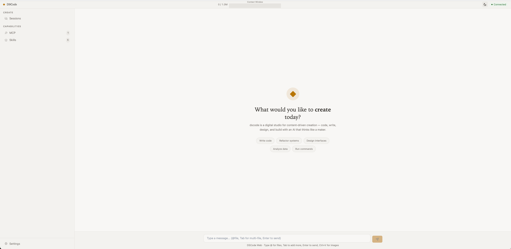

<p align="center">
  
</p>

<p align="center">
  <strong>
    A digital studio for content-driven creation.<br />
    Code, write, design, and build — with an AI that thinks like a maker.
  </strong>
</p>

<p align="center">
  <a href="https://www.npmjs.com/package/@creative-dswork/dscode"></a>
  =20" />
  
  
</p>

<p align="center">
  <sub><a href="README.zh-CN.md">中文文档</a></sub>
</p>

---

## See it in action

<p align="center">
  
</p>

> dscode's editorial workshop — a creative space for code, design, and conversation.

## What makes dscode different

<table>
<tr>
<td colspan="2" valign="top">

### 🧠 Agent as OS

dscode is designed as an operating system for Agents: the Harness is the Kernel, the Main Agent is PID 1, SubAgents are processes, `Agent.md` files are Applications, Sessions are TTYs, Drivers are device interfaces, and MCP servers are external devices. This keeps execution generic and composable — new Agent capabilities come from configuration, not specialized runtimes.

**Applications are configured. Agents are processes. Sessions are TTYs.**

The CLI is assembled on the same reusable headless Agent Host used by internal
tests. TUI/Web and process signal handling remain CLI adapters. This is an
internal architecture boundary, not a published SDK or public npm API.

</td>
</tr>
<tr>
<td width="50%" valign="top">

### 🔌 MCP-First

Digital studios don't use one tool. They use ten. MCP turns every tool into an API — dscode is the Agent system that orchestrates them. Blender for 3D modeling, PlayCanvas for real-time graphics, browser automation for testing, documents for specs, spreadsheets for data. If your production tool has an MCP server, dscode brings it into the workflow.

**Your toolchain. Coordinated Agents. All through MCP.**

</td>
<td width="50%" valign="top">

### 🧬 Spec-Driven Development

dscode is built entirely through **spec coding** with [OpenSpec](https://github.com/Fission-AI/OpenSpec). Every feature begins as a formal spec — `openspec/specs/` is the source of truth, code is the implementation. We don't encourage manual commits; all design and development flows through the SDD pipeline.

**Code is the implementation of specs — not the other way around.**

</td>
</tr>
<tr>
<td width="50%" valign="top">

### 🔍 MCP Tool Search

Too many MCP servers? Context explosion is a real problem when every tool schema competes for token budget. dscode ships with a built-in `search_tools` driver — MCP tools are discovered **on-demand** by the model, not pre-loaded. Only the tools actually needed enter the context window. Connect dozens of MCP servers without worrying about overhead.

**All the tools. None of the bloat.**

</td>
<td width="50%" valign="top">

### 🎨 Editorial Workshop

dscode is not a chatbot with a dark theme. It's a **digital studio** — a creative workspace with editorial typography, generous whitespace, and a warm, tool-like aesthetic. The interface is designed for makers: phase-labeled message groups, serif structural labels, sidebar detail panels, and a Dashboard that's a mode of Chat, not a separate page. Every pixel earns its place.

**A creative space. Not just a chat window.**

</td>
</tr>
</table>

---

## Capabilities

<table>
<tr>
<td width="33%" valign="top">
  <strong>🖥 Terminal + Web</strong><br />
  <sub>Full TUI with streaming, thinking, tool calls, per-turn token usage & cost stats. Modern React Web UI with identical feature parity via WebSocket.</sub>
</td>
<td width="33%" valign="top">
  <strong>🔌 MCP Connector</strong><br />
  <sub>Stdio, Streamable HTTP (MCP 2025-11-25), legacy SSE fallback. Auto transport inference. MCP App sandbox for server-driven UI.</sub>
</td>
<td width="33%" valign="top">
  <strong>🛡 Agent Harness</strong><br />
  <sub>OS-style Agent processes with Agent.md Applications, foreground/background execution, process control, Worktree isolation, permissions, and persistence.</sub>
</td>
</tr>
<tr>
<td width="33%" valign="top">
  <strong>📦 Skills System</strong><br />
  <sub>Declarative third-party extensions via SKILL.md. On-demand activation. User-level + project-level scopes.</sub>
</td>
<td width="33%" valign="top">
  <strong>⚙️ SubAgents</strong><br />
  <sub>Claude Code-compatible Agent.md Applications with foreground/background execution, inline activity, process control, and persisted results.</sub>
</td>
<td width="33%" valign="top">
  <strong>🔧 Open Design</strong><br />
  <sub>AI-driven visual design workspace with frontend generation, image-to-code, and design-system management. Integrated via MCP.</sub>
</td>
</tr>
<tr>
<td width="33%" valign="top">
  <strong>🎬 Dashboard & Motion</strong><br />
  <sub>Chat↔Dashboard cascade transition with physics-based "dscode" cluster animation. Session dashboard with context-window usage bar.</sub>
</td>
<td width="33%" valign="top">
  <strong>📐 Hash-Anchor Editing</strong><br />
  <sub>Content-addressable file editing with 3-level adaptive resolution, atomic batch operations, checkpoint safety rollback, and structured invalidation scopes.</sub>
</td>
<td width="33%" valign="top">
  <strong>🔁 Retry & Resilience</strong><br />
  <sub>Exponential backoff with configurable retry policy. Handles rate limits, timeouts, and server errors transparently. Respects Retry-After headers.</sub>
</td>
</tr>
</table>

> **Tip:** In TUI, paste clipboard images with `Ctrl+V` (macOS) or `/image clipboard`.

---

## Agent as OS

The Main Agent runs as PID 1 and delegates work to independent SubAgent
processes. Applications use **Claude Code-compatible `Agent.md` files**; dscode
automatically discovers user and project definitions from `.claude/agents`
alongside native `.dscode/agents` directories. Terminal and Web conversations
show foreground and background process activity with persisted results.

The bundled [`vision.md`](resources/agents/vision.md) uses the same SubAgent
runtime and falls back to Tesseract OCR when needed. See
[Agent.md configuration and usage](docs/AGENT_MD.md) for supported fields,
discovery priority, and process tools, or read the full
[Agent as OS architecture](docs/ARCHITECTURE.md#设计哲学).

---

## MCP in 30 seconds

```jsonc
// ~/.mcp.json
{
  "mcpServers": {
    "blender": {
      "command": "uvx",
      "args": ["blender-mcp"]
    },
    "playwright": {
      "command": "npx",
      "args": ["@anthropic/mcp-playwright"]
    }
  }
}
```

dscode auto-connects on launch. Tools appear as `mcp__blender__*` and
`mcp__playwright__*`. Agent.md Applications can allow an exact connected tool,
such as `tools: [mcp__github__search_repos]`; MCP Server definitions remain in
`.mcp.json`. MCP servers can also serve sandboxed UI via the App Host — no
boilerplate, no SDK, no glue code.

### See what MCP can do

<table align="center">
<tr>
<td align="center" width="50%">
  <video src="https://github.com/user-attachments/assets/917414f9-9f39-457e-9358-98f6abe01220" controls width="100%"></video>
  <br /><sub><b>PlayCanvas + MCP</b> — build a jump game entirely through natural language</sub>
</td>
<td align="center" width="50%">
  <video src="https://github.com/user-attachments/assets/cf62021e-bb1c-4aa3-953d-b0d09631a1ef" controls width="100%"></video>
  <br /><sub><b>Blender + MCP</b> — 3D modeling and scene composition through conversation</sub>
</td>
</tr>
</table>

> **Tip:** Videos play inline — these are real MCP workflows, click to watch.

## Install

```bash
npm install -g @creative-dswork/dscode
dscode              # Terminal UI
dscode --web        # Web UI → http://localhost:3000
```

> First launch? Run `/config key <your-api-key>` and `/config model deepseek-v4-pro` to get started. Type `/help` for the full guide.

**Build from source:**

```bash
git clone https://github.com/creativedswork/dscode.git
cd dscode && npm install && npm run build
node dist/dscode.mjs
```

---

## Configuration

dscode uses two levels of `settings.json`, merged with project settings overriding user settings:

| Scope | Path | Purpose |
|-------|------|---------|
| User | `~/.dscode/settings.json` | Defaults across all projects |
| Project | `.dscode/settings.json` | Per-project overrides |

> **Note:** Model configuration (`provider`, `modelId`, `apiKey`, `thinkingLevel`) lives in `~/.dscode/config.json`, managed via `/config` commands. Type `/help` in-session for the full command list.

### Quick reference

```jsonc
// ~/.dscode/settings.json
{
  // --- External Integrations ---
  "integrations": {
    "openDesign": {
      "enabled": true,
      "path": "/path/to/open-design",
      "port": 7456,
      "autoStart": true
    }
  },

  // --- Permissions ---
  "permissions": {
    "allow": [
      "Bash(git add *)",
      "Bash(npm *)"
    ],
    "deny": [
      "Bash(rm -rf *)"
    ],
    "rules": [
      { "tool": "Bash(curl *)", "decision": "allow", "priority": 5 }
    ]
  },

  // --- Skills ---
  "skills": ["brandkit", "minimalist-ui"],

  // --- Agent Applications ---
  "agents": { "enabled": true },
  "agentModelAliases": {
    "haiku": "deepseek/deepseek-v4-flash",
    "sonnet": "deepseek/deepseek-v4-pro"
  },

  // --- Retry ---
  // Controls how dscode retries failed API calls (rate limits, timeouts, server errors).
  // Uses exponential backoff: starts at baseDelayMs, doubles each retry, capped at maxDelayMs.
  "retry": {
    "maxRetries": 3,           // Max retry attempts before giving up
    "baseDelayMs": 1000,       // Initial delay before first retry (ms)
    "maxDelayMs": 30000,       // Upper bound on backoff delay (ms)
    "retryOnTimeout": true,    // Retry when the provider times out
    "retryOnRateLimit": true,  // Retry when hitting rate limits (respects Retry-After header)
    "retryOnServerError": true // Retry on 5xx server errors
  },

  // --- @-file limits ---
  "atFileMaxFiles": 5,
  "atFileMaxFileSize": 51200,
  "atFileMaxTotalSize": 204800
}
```

### MCP server config

MCP servers use user-level `~/.mcp.json` or project-level `.mcp.json`, not the
Open Design integration object in `settings.json`:

```jsonc
{
  "mcpServers": {
    "blender": {
      "command": "uvx",
      "args": ["blender-mcp"],
      "env": { "BLENDER_HOST": "127.0.0.1" }
    },
    "my-api": {
      "url": "https://my-mcp.example.com/mcp",
      "headers": { "Authorization": "Bearer <token>" }
    }
  }
}
```

Each server under `mcpServers` supports:

| Field | Type | Description |
|-------|------|-------------|
| `command` | string | Executable (for stdio transport) |
| `args` | string[] | Arguments passed to the command |
| `url` | string | HTTP endpoint (for streamable-http transport) |
| `env` | object | Extra environment variables passed only to this MCP server process |
| `headers` | object | Custom HTTP headers |
| `transport` | string | `"stdio"` \| `"streamable-http"` \| `"sse"` (auto-detected if omitted) |
| `preferredProtocolVersion` | string | `"2025-11-25"` \| `"2025-03-26"` \| `"2024-11-05"` |
| `requestTimeoutMs` | number | Per-request timeout |
| `connectTimeoutMs` | number | Connection timeout |

> **Tip:** Transport is auto-detected — if `url` is set without `command`, streamable-http is used. Otherwise stdio.

### Environment variables

Some runtime settings have dedicated environment-variable overrides for CI and
containers. `settings.json` does not have a generic `env` field:

| Variable | Setting |
|----------|---------|
| `DEEPSEEK_API_KEY` | API key (provider-specific vars also supported: `OPENAI_API_KEY`, `ANTHROPIC_API_KEY`, etc.) |
| `AGENT_PROVIDER` | Provider override |
| `AGENT_MODEL` | Model override |
| `AGENT_THINKING_LEVEL` | Thinking level override |
| `AGENT_VISION_PROVIDER` | Vision model provider |
| `AGENT_VISION_MODEL` | Vision model ID |
| `DSCODE_MAX_TOKENS` | Max tokens |
| `DSCODE_CONFIG_HOME` | Custom config directory (default: `~/.dscode`) |
| `DSCODE_DATA_HOME` | Custom data directory |
| `DSCODE_PROJECT_PATH` | Project directory |
| `DSCODE_AGENTS_ENABLED` | Enable Agent process tools (`false` restores single-Agent behavior) |
| `DSCODE_MANAGED_AGENTS_DIR` | Highest-priority managed Agent Application directory |
| `DSCODE_RETRY_MAX_RETRIES` | Retry max retries |
| `DSCODE_RETRY_BASE_DELAY_MS` | Retry base delay |
| `DSCODE_RETRY_MAX_DELAY_MS` | Retry max delay |
| `OPEN_DESIGN_DIR` | Legacy Open Design repository path fallback |
| `OD_PORT` | Legacy Open Design daemon port fallback (default: `7456`) |

---


## Open Design

dscode integrates **[Open Design](https://github.com/wangcan26/open-design)** — a visual design workspace that brings AI-driven frontend generation directly into your workflow. Think of it as Figma meets AI: design tokens, components, and entire layouts generated through natural language, with real-time preview and iteration.

### What Open Design does for dscode

- **Visual design workspace** — create, edit, and iterate on frontend designs without leaving dscode
- **Image-to-code** — generate production-ready HTML/CSS from design mockups
- **Design system management** — maintain consistent design tokens, typography scales, and color palettes across projects
- **Multi-file artifact generation** — produce complete frontend projects with structured file trees

### Installation

```bash
git clone https://github.com/wangcan26/open-design.git
cd open-design
npm install
```

### Recommended configuration: settings.json

Enable the integration in user-level `~/.dscode/settings.json` or project-level
`.dscode/settings.json`:

```jsonc
{
  "integrations": {
    "openDesign": {
      "enabled": true,
      "path": "/path/to/open-design",
      "port": 7456,
      "autoStart": true
    }
  }
}
```

Open Design uses the typed `path` and `port` fields above. Do not place
`OPEN_DESIGN_DIR` or `OD_PORT` in an `env` object in `settings.json`;
`mcpServers.<name>.env` belongs to `.mcp.json` and only configures that MCP child
process.

| Field | Default | Description |
|-------|---------|-------------|
| `enabled` | `false` | Contribute the Open Design MCP server and enable the integration |
| `path` | none | Local Open Design repository path; `~` is supported |
| `port` | `7456` | Daemon port and MCP proxy target |
| `autoStart` | `true` | Ask dscode to ensure the daemon is running |

Project fields override matching user fields. Set `autoStart: false` when the
daemon is managed externally. In that mode, dscode contributes the MCP proxy
but does not start or stop the daemon.

### Compatibility configuration: .env

Existing `.env` setups remain supported:

```bash
cp .env.example .env
```

```dotenv
OPEN_DESIGN_DIR=~/Workspace/DeepSeekSpace/open-design
OD_PORT=7456
```

Start dscode with the one-run compatibility flag:

```bash
dscode --with-od
# Development checkout:
node ./dist/dscode.mjs --with-od
```

The compatibility values provide `path` and `port`; `--with-od` enables the
integration and requests auto-start for that invocation. The direct CLI reads
only `OPEN_DESIGN_DIR` and `OD_PORT` from the project `.env`. It does not import
unrelated variables or write configuration back to disk.

Configuration precedence is:

1. `integrations.openDesign` in user/project `settings.json`
2. `OPEN_DESIGN_DIR` and `OD_PORT` already present in the process environment
3. `OPEN_DESIGN_DIR` and `OD_PORT` in the project `.env`
4. Disabled defaults with port `7456`

If either settings scope contains an `integrations.openDesign` object, legacy
environment values are ignored, including when typed configuration explicitly
sets `enabled: false`.

### Runtime behavior

When auto-start is active, dscode:

1. Probes `http://127.0.0.1:<port>/api/projects`.
2. Reuses a healthy externally managed daemon without claiming ownership.
3. Otherwise starts `od --port <port> --no-open` through `ServiceSupervisor`.
4. Derives the `open-design` MCP server in memory without modifying
   `~/.mcp.json` or project configuration.
5. Captures daemon output in `~/.dscode/logs/dscode.log`, applies bounded
   restart protection, and stops only the daemon process owned by dscode.

For troubleshooting, confirm that
`<integrations.openDesign.path>/apps/daemon/src/cli.ts` exists, inspect
`~/.dscode/logs/dscode.log`, and check readiness with:

```bash
curl http://127.0.0.1:7456/api/projects
```

---

## Contributing

dscode is currently a single-developer SDD project and does not accept direct code contributions (Pull Requests).

We welcome bug reports, feature ideas, and technical discussions via **[GitHub Issues](https://github.com/creativedswork/dscode/issues)**. See [CONTRIBUTING.md](CONTRIBUTING.md) for the full policy.

| [CONTRIBUTING.md](CONTRIBUTING.md) | Contribution policy & how the SDD workflow operates |

## Learn more

| Document | What's inside |
|----------|---------------|
| [ARCHITECTURE.md](docs/ARCHITECTURE.md) | Full architecture: Agent as OS, 6-layer design, Driver/Skill model, source tree |
| [AGENT_MD.md](docs/AGENT_MD.md) | Agent.md setup, supported fields, Claude Code compatibility, process tools |
| [CONTRIBUTING.md](CONTRIBUTING.md) | How to contribute: philosophy alignment, OpenSpec SDD workflow, coding conventions |
| [STYLE.md](docs/STYLE.md) | TypeScript coding style: naming, imports, module structure, error handling |
| [Documentation archive](docs/archive/README.md) | Historical plans and research; not a source of current behavior |

---

## Acknowledgments

dscode stands on the shoulders of:

- **[OpenSpec](https://github.com/Fission-AI/OpenSpec)** — the spec-driven development framework that shapes our entire workflow

- **[@earendil-works/pi-ai](https://www.npmjs.com/package/@earendil-works/pi-ai) / [pi-agent-core](https://www.npmjs.com/package/@earendil-works/pi-agent-core)** — agent loop and model abstraction foundation
- **[taste-skill](https://github.com/Leonxlnx/taste-skill)** — Leonxlnx's design taste skill system, inspired our skills architecture
- **[@_can1357](https://x.com/_can1357/status/2021828033640911196)** — hash-anchor editing protocol, the cornerstone of our `edit` tool

---

<p align="center">
  <sub>If you like this project, give it a ⭐ Star — your support keeps dscode evolving.</sub>
</p>
