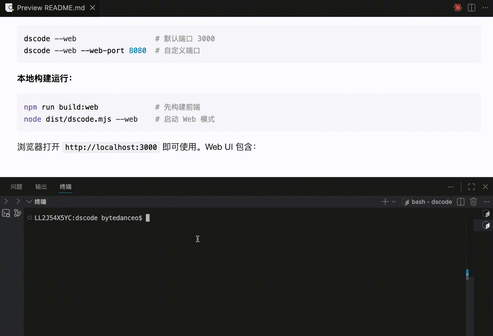
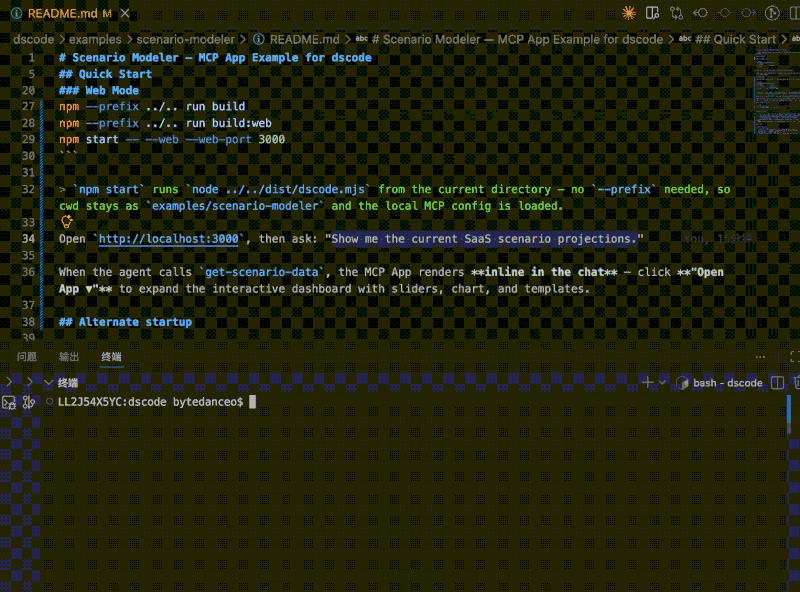

<p align="center">
  
</p>

<p align="center">
  <strong>The open source MCP-first AI agent for DeepSeek — built for digital creation, not just coding.</strong>
</p>

<p align="center">
  <a href="https://www.npmjs.com/package/@wangcan26/dscode"></a>
  =20" />
  
</p>

<p align="center">
  <sub><a href="README.zh-CN.md">中文文档</a></sub>
</p>

<p align="center">
  Terminal or browser — one agent harness. MCP-native tooling, agentic workflows, purpose-built for DeepSeek.<br />
  From context management to memory systems to permission control — everything you need in one tool.
</p>

<p align="center">
  <a href="https://www.npmjs.com/package/@wangcan26/dscode">npm</a> ·
  <a href="docs/Introduction.md">Philosophy</a> ·
  <a href="docs/">Architecture</a> ·
  <a href="docs/roadmap.md">Roadmap</a>
</p>

---

## Why dscode

<table>
<tr>
<td width="33%" valign="top">
  <strong>DeepSeek native</strong><br />
  Designed around DeepSeek model capabilities — no multi-model abstraction layer. Configuration, inference modes, and experience are all optimized for DeepSeek.
</td>
<td width="33%" valign="top">
  <strong>Agent harness</strong><br />
  File operations, shell, code search, permission control, context compression, session persistence, and memory system — all in one.
</td>
<td width="33%" valign="top">
  <strong>MCP-first</strong><br />
  Extend capabilities to browsers, 3D, documents, spreadsheets, and more external tools via MCP — not limited to code generation.
</td>
</tr>
</table>

## Digital work, not just coding

dscode connects external tools through **MCP (Model Context Protocol)**, extending DeepSeek's capabilities to broader digital workflows — from Blender 3D modeling to browser automation, from document and spreadsheet processing to design and content production.

<table>
<tr>
<td width="50%"></td>
<td width="50%"></td>
</tr>
</table>

The screenshots above demonstrate controlling Blender via `blender-mcp`, manipulating a 3D scene with natural language. Creative toolchains like this are just one example of digital work — dscode uses the standard MCP protocol to let DeepSeek models access a much broader ecosystem of digital tools.

## Install in 30 seconds

<table>
<tr>
<td width="50%" valign="top">

### Install via npm

```bash
# Node.js >= 20
npm install -g @wangcan26/dscode
dscode --version
dscode
```

Package: <https://www.npmjs.com/package/@wangcan26/dscode>

</td>
<td width="50%" valign="top">

### Build from source

```bash
npm install
npm run build
node dist/dscode.mjs
```

Suitable for local development, debugging, and customization.

</td>
</tr>
</table>

> If you like this project, give it a ⭐ Star, 👀 Watch, and 👍 on GitHub! Your support keeps dscode evolving, and every piece of feedback is deeply appreciated.

### First launch

```bash
/config key sk-your-deepseek-api-key
/config model deepseek-v4-pro
```

Configuration written by the `/config` command is persisted to `~/.dscode/config.json` — no need to repeat setup on subsequent launches. The `cwd` field records the project directory associated with the current session; it is only reused when you manually run `/config cwd <path>`. Declarative settings go in `settings.json`: user-level at `~/.dscode/settings.json`, project-level at `<project>/.dscode/settings.json`.

## Web UI

In addition to terminal interaction, dscode also offers a clean, modern **browser interface** with full feature parity with the TUI.

**Global npm install:**

```bash
dscode --web                  # Default port 3000
dscode --web --web-port 8080  # Custom port
```

**Build from source:**

```bash
npm run build:web             # Build frontend first
node dist/dscode.mjs --web    # Start web mode
```

Open `http://localhost:3000` in your browser:

<p align="center">
  
</p>

Web UI features:

| Feature | Description |
| --- | --- |
| Streaming chat | Real-time display of thinking + text output, consistent with TUI |
| Tool calls | Inline cards showing tool name, parameters, and result (success/failure icons) |
| Permission confirm | Graphical dialogs: Allow / Always Allow / Deny |
| Slash commands | Type `/` for command palette with keyboard navigation and click |
| Session management | Sidebar with visual browse, save, load, delete sessions |
| MCP browser | View connected MCP servers and tool lists |
| Config management | Graphical model switching, thinking level, and API key settings |
| Image upload | Drag & drop / paste / click to upload images |
| Responsive layout | Adapts to desktop and mobile |
| Dark theme | Default GitHub-style dark theme, easy on the eyes |

> Web UI and CLI share the same Agent backend — all features are fully consistent. No reconfiguration needed when switching modes.

## What you get

| Capability | Description |
| --- | --- |
| Multi-turn chat | Streaming output + thinking (reasoning models) |
| Built-in drivers | fs, shell, search — always available |
| Permission control | Dangerous ops require confirmation; glob patterns to deny read/write of sensitive files |
| Session persistence | Auto-save, resume historical conversations |
| Context management | Auto-compress long conversations to prevent token overflow; 1M token window |
| Memory system | Cross-session memory of user preferences and project context |
| Skills system | Declarative third-party skill extensions (SKILL.md), on-demand activation |
| MCP protocol | MCP Client connecting to external tool servers (stdio / streamable-http / legacy SSE) |
| Image OCR | Text extraction via tesseract.js, supports Chinese and English |
| Two-level config | User-level + project-level config, environment variable overrides |
| Web UI | Browser GUI with real-time streaming, permission dialogs, sidebar management |

## MCP connector

| Capability | Description |
| --- | --- |
| **Stdio transport** | Launch local process as MCP Server, zero network overhead |
| **Streamable HTTP transport** | Connect to remote MCP Server, prefers 2025-11-25 MCP spec |
| **Legacy SSE compatibility** | Explicit passthrough or auto-fallback to legacy SSE when remote doesn't support new transport |
| **Auto transport inference** | `command` present → stdio, `url` only → streamable-http, zero config |
| **Tool namespacing** | `mcp_<server>_<tool>` format, avoids conflicts |
| **Graceful degradation** | Server connection failure doesn't block startup, errors are observable |

### MCP configuration example

Place MCP config in `~/.dscode/settings.json` or `<project>/.dscode/settings.json`, not in the `/config`-managed `config.json`.

```jsonc
{
  "mcpServers": {
    "blender": {
      "description": "Blender 3D modeling via MCP",
      "command": "uvx",
      "args": ["blender-mcp"]
    },
    "playwright": {
      "description": "Browser automation",
      "command": "npx",
      "args": ["@anthropic/mcp-playwright"]
    },
    "custom-api": {
      "description": "Remote API server",
      "url": "http://localhost:3000/mcp"
    }
  }
}
```

| Field | Type | Required | Description |
| --- | --- | --- | --- |
| `command` | string | Required for stdio | Launch command |
| `args` | string[] | No | Command arguments |
| `url` | string | Required for remote | Remote MCP Server URL |
| `transport` | `"stdio" \| "streamable-http" \| "sse"` | No | Transport method; when unspecified, `url` defaults to `streamable-http` |
| `description` | string | No | Description |
| `env` | object | No | Custom environment variables |
| `headers` | object | No | Remote MCP request headers |
| `preferredProtocolVersion` | string | No | Preferred MCP protocol version, default `2025-11-25` |
| `allowLegacySseFallback` | boolean | No | Whether to allow fallback to legacy SSE when remote doesn't support new transport |
| `requestTimeoutMs` / `connectTimeoutMs` | number | No | Request / connection timeout |

MCP tools are registered as Drivers with naming format `mcp_<server>_<tool>`, e.g. `mcp_blender_get_scene_info`. Connection failures don't block startup; error messages are output to the console.

Type `/mcp` in the TUI to open the interactive browser: select an MCP server, then view its tool list, load status, transport, protocol version, compatibility mode, and refresh status.

## Model configuration

Manage configuration in the TUI with `/config` — no file editing or environment variables needed:

```bash
/config                     # View current config
/config model <id>          # Switch model (immediate)
/config thinking <level>    # Set thinking intensity
/config key <api-key>       # Set API Key
/config cwd <path>          # Set working directory for current project (restart to apply)
/config help                # Show help
```

Defaults to `deepseek-v4-flash`. Recommended to switch to `deepseek-v4-pro` for stronger reasoning/thinking:

| Model | Characteristics |
| --- | --- |
| `deepseek-v4-flash` | Default, fast, suitable for daily coding |
| `deepseek-v4-pro` | Supports reasoning/thinking, stronger on complex tasks, image OCR |

> DeepSeek V4 series all support a **1 million token** context window with a maximum output of 384K tokens.

Under the hood is `pi-ai`, extensible to 25+ providers including OpenAI, Anthropic, Google, and more.

### Thinking levels

DeepSeek reasoning models control thinking intensity via `thinkingLevel`. The default is automatically set when switching models (pro → `medium`, others → `off`), and can be manually overridden:

| Level | Behavior |
| --- | --- |
| `off` | Thinking disabled, direct output |
| `minimal` / `low` / `medium` / `high` | Thinking enabled, mapped to `reasoning_effort: "high"` |
| `xhigh` | Maximum thinking intensity, mapped to `reasoning_effort: "max"` |

```bash
/config thinking xhigh
```

## Skills system

dscode uses an **Agent as OS** architecture: Drivers (kernel modules, always loaded) and Skills (user-mode programs, activated on demand).

```text
~/.dscode/skills/
├── git-workflow/
│   └── SKILL.md
└── docker/
    └── SKILL.md
```

**SKILL.md format:**

```yaml
---
name: git-workflow
description: Advanced git operations for PR workflows
tools:
  - read_file
  - list_files
  - grep
  - bash
---
## Instructions
When the user asks about git workflows, use these tools.
Always push the branch before creating a PR.
```

- YAML frontmatter declares `name`, `description`, `tools` whitelist
- When activated, instructions are injected into the system prompt; tools are filtered from loaded Drivers by the whitelist
- All scanned Skills are auto-activated at startup; manual activation via `/skills activate <name>` is also supported

## CLI commands

| Command | Description |
| --- | --- |
| `/help` | Show all commands |
| `/config` | View or modify user config (model / key / thinking / cwd) |
| `/reset` | Clear conversation history |
| `/session list/save/load/delete` | Session management |
| `/memory list/add/remove/clear` | Memory management |
| `/skills` | List skills and status |
| `/drivers` | List loaded drivers |
| `/mcp` | Interactive MCP server & tool browser |
| `/permissions` | View current permission grants |
| `/cost` | Show token usage |
| `/compact` | Manually trigger context compression |

Exit: type `exit` or press `Ctrl+C` twice. Interrupt generation: single `Ctrl+C`. In Web UI, commands correspond to sidebar and button actions.

## Configuration reference

We recommend separating configuration into two categories:

- User command config written by `/config`: `~/.dscode/config.json` (includes cwd record for current project)
- Declarative settings:
  - User-level: `~/.dscode/settings.json`
  - Project-level: `<project>/.dscode/settings.json`

Project-level configuration always uses `<project>/.dscode/settings.json`.

### `/config` command config

```jsonc
{
  "modelId": "deepseek-v4-flash",
  "thinkingLevel": "high",
  "cwd": "/absolute/path/to/project/subdir",
  "cwdProjectPath": "/absolute/path/to/project"
}
```

### `settings.json`

```jsonc
{
  "skills": ["git-workflow"],
  "permissions": {
    "deny": ["**/.env", "**/.env.*", "**/secrets/**"]
  },
  "mcpServers": {
    "playwright": {
      "command": "npx",
      "args": ["@anthropic/mcp-playwright"]
    }
  }
}
```

### Environment variables

| Env Variable | Corresponding Config |
| --- | --- |
| `DEEPSEEK_API_KEY` | API Key |
| `AGENT_MODEL` / `DEEPSEEK_MODEL` | modelId |
| `AGENT_THINKING_LEVEL` | thinkingLevel |
| `DSCODE_MAX_TOKENS` | maxTokens |
| `DSCODE_PROJECT_PATH` | Working directory (defaults to current directory) |
| `DSCODE_CONFIG_HOME` | Custom config directory (default `~/.dscode`) |
| `DSCODE_DATA_HOME` | Custom data directory (default `~/.dscode`) |

## Examples

`examples/` provides runnable sample projects demonstrating dscode's MCP integration and interactive UI capabilities.

### MCP App

| Example | Description | Quick Start |
| --- | --- | --- |
| `examples/scenario-modeler` | A SaaS scenario modeling MCP Server. Demonstrates how dscode renders MCP Apps when a tool returns `structuredContent` / `isError`; uses MDX when no server HTML is present, and prefers server-provided pages when an HTML resource is available. | `cd examples/scenario-modeler && npm install && npm start` |

<p align="center">
  
</p>

> The screenshot above shows scenario-modeler rendering an MCP App HTML inline in the Web UI — click "Open App ▼" to expand an interactive SaaS financial modeling dashboard.

More usage instructions in:
- `examples/scenario-modeler/README.md`

## Project structure

```text
src/
├── core/           # Entry, host assembly, config, shared types
├── session/        # Session persistence
├── context/        # Token estimation, context compression
├── memory/         # Cross-session memory
├── drivers/        # Driver registry + built-in drivers (fs, shell, search)
├── skills/         # Skill manager + SKILL.md loader
├── mcp/            # MCP client (stdio / streamable-http / legacy SSE) + manager + MCP App host/runtime
├── permissions/    # Permission interception
└── ui/             # TUI (terminal), Web UI (browser), streaming renderer, slash commands
```

## Permission model

| Tool | Default Policy |
| --- | --- |
| `read_file`, `list_files`, `grep`, `glob` | Auto-allow |
| `write_file` | Requires confirmation |
| `bash` | Requires confirmation; `sudo`, `rm -rf`, etc. are directly denied |

When confirming, you can choose: **Y** (allow this time), **N** (deny), **A** (always allow this tool for the current session).

Configure `permissions.deny` with glob patterns to block reading/writing sensitive files. User-level and project-level deny lists are merged.

## Development

```bash
npm start
npm run typecheck
npm test
```

**Web UI development:**

```bash
# Install frontend dependencies
cd web && npm install && cd ..

# Build frontend + start web mode
npm run build:web
dscode --web

# Development mode (frontend HMR + backend hot reload)
npm run dev:web
```

**Tech stack:** TypeScript + tsx · React + Vite + Tailwind CSS (Web UI) · [pi-agent-core](https://www.npmjs.com/package/@mariozechner/pi-agent-core) · [pi-ai](https://www.npmjs.com/package/@mariozechner/pi-ai) · DeepSeek API

Contributions welcome! Please read [CONTRIBUTING.md](CONTRIBUTING.md) for philosophy alignment and PR process.

## Known limitations

- The `summarize-prefix` context compression strategy currently falls back to `sliding-window`
- Automatic memory extraction is off by default; use `/memory add` manually
- Image input is OCR-based, text extraction only — no visual understanding
- If there's no output on first launch, it's usually an invalid API Key or network issue

## More docs

- [Architecture docs](docs/)
- [Roadmap](docs/roadmap.md)

## License

MIT
