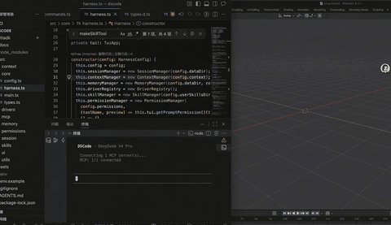

# dscode

> 面向数字工作的 DeepSeek 交互式命令行 Agent Harness。从 Agentic Workflow 到上下文管理再到记忆系统——模型每强一分，Harness 的重心就移一寸。dscode 只做 DeepSeek 模型的 Harness，就像 Claude Code 是 Claude 模型的 Harness。如果你想了解 dscode 的设计理念，[点击这里](docs/Introduction.md)。

具备文件操作、Shell 执行、代码搜索、权限控制、会话持久化、上下文管理和记忆系统，让 DeepSeek 成为你终端里的数字工作搭档。

## 快速开始

**方式一：安装已发布包**

```bash
# 前置条件：Node.js ≥ 20.6
npm install -g @wangcan26/dscode
dscode
```

npm 包名为 `@wangcan26/dscode`，安装后仍然使用 `dscode` 命令启动。

**方式二：本地编译运行**

```bash
npm install
npm run build
node dist/dscode.mjs
```

首次启动时会看到欢迎引导，在 TUI 中输入以下命令完成配置：

```
/config key sk-your-deepseek-api-key
/config model deepseek-v4-pro
```

配置会持久化到 `~/.dscode/config.json`，后续启动无需重复配置。

## 数字工作支持

dscode 通过 **MCP (Model Context Protocol)** 连接外部工具，将 DeepSeek 的能力延伸到更广义的数字工作流——从 Blender 3D 建模到浏览器自动化，从文档与表格处理到设计与内容生产。

<table>
<tr>
<td width="50%"></td>
<td width="50%"></td>
</tr>
</table>

上图演示了通过 `blender-mcp` 连接 Blender，用自然语言操控 3D 场景。这类创意工具链只是数字工作的一种场景；dscode 通过标准 MCP 协议，让 DeepSeek 模型同样能接入更广泛的数字工具生态。

### MCP Connector 能力

| 能力                    | 说明                                         |
| ----------------------- | -------------------------------------------- |
| **Stdio 传输**          | 启动本地进程作为 MCP Server，零网络开销      |
| **SSE 传输**            | 连接远程 MCP Server，支持分布式工具调用      |
| **自动 Transport 推断** | 有 `command` → stdio，仅 `url` → SSE，零配置 |
| **工具命名空间**        | `mcp_<server>_<tool>` 格式，避免冲突         |
| **容错降级**            | Server 连接失败不阻塞启动，错误信息可观测    |

## 核心功能

| 功能        | 说明                                               |
| ----------- | -------------------------------------------------- |
| 多轮对话    | 流式输出 + thinking（reasoning 模型）              |
| 内置驱动    | fs、shell、search，始终可用                        |
| 权限控制    | 危险操作需确认，支持 glob 模式禁止读写敏感文件     |
| 会话持久化  | 自动保存，可恢复历史对话                           |
| 上下文管理  | 自动压缩长对话，防止 token overflow；1M token 窗口 |
| 记忆系统    | 跨 session 记住用户偏好和项目上下文                |
| Skills 系统 | 声明式第三方 Skill 扩展（SKILL.md），按需激活      |
| MCP 协议    | 作为 MCP Client 连接外部工具服务器（stdio/SSE）    |
| 图片 OCR    | 基于 tesseract.js 的文字提取，支持中英文           |
| 两级配置    | 用户级 + 项目级配置，环境变量覆盖                  |

## 模型配置

在 TUI 中使用 `/config` 命令管理所有配置，无需编辑文件或设置环境变量：

```
/config                     # 查看当前配置
/config model <id>          # 切换模型（即时生效，热切换）
/config thinking <level>    # 设置思考强度
/config key <api-key>       # 设置 API Key
/config cwd <path>          # 设置工作目录（重启生效）
/config help                # 查看帮助
```

默认使用 `deepseek-v4-flash`，推荐切换为 `deepseek-v4-pro` 获得 reasoning/thinking 能力：

| 模型                | 特点                                                |
| ------------------- | --------------------------------------------------- |
| `deepseek-v4-flash` | 默认，快速，适合日常编码                            |
| `deepseek-v4-pro`   | 支持 reasoning/thinking，复杂任务更强，支持图片 OCR |

> DeepSeek V4 系列均支持 **100 万 token** 上下文窗口，最大输出 384K token。

底层基于 `pi-ai`，可扩展接入 OpenAI、Anthropic、Google 等 25+ 提供商。

### 思考模式

DeepSeek reasoning 模型通过 `thinkingLevel` 控制思考强度，切换模型时自动匹配默认值（pro → `medium`，其他 → `off`），也可手动覆盖：

| Level                                | 行为                                           |
| ------------------------------------ | ---------------------------------------------- |
| `off`                                | 关闭思考，直接输出                             |
| `minimal` / `low` / `medium` / `high` | 启用思考，映射为 `reasoning_effort: "high"`    |
| `xhigh`                              | 最大思考强度，映射为 `reasoning_effort: "max"` |

```
/config thinking xhigh    # 最大推理深度
```

## MCP 配置

dscode 支持通过 [MCP](https://modelcontextprotocol.io/) 连接外部工具服务器，动态扩展 agent 能力。在 `config.json` 中通过 `mcpServers` 字段配置（兼容 Claude Desktop 格式）：

```jsonc
{
  "mcpServers": {
    "blender": {
      "description": "Blender 3D modeling via MCP",
      "command": "uvx",
      "args": ["blender-mcp"],
    },
    "playwright": {
      "description": "Browser automation",
      "command": "npx",
      "args": ["@anthropic/mcp-playwright"],
    },
    "custom-api": {
      "description": "Remote API server",
      "url": "http://localhost:3000/mcp",
    },
  },
}
```

| 字段          | 类型             | 必填       | 说明                 |
| ------------- | ---------------- | ---------- | -------------------- |
| `command`     | string           | stdio 必填 | 启动命令             |
| `args`        | string[]         | 否         | 命令参数             |
| `url`         | string           | SSE 必填   | SSE 服务端 URL       |
| `transport`   | "stdio" \| "sse" | 否         | 传输方式（自动推断） |
| `description` | string           | 否         | 描述信息             |
| `env`         | object           | 否         | 自定义环境变量       |

MCP 工具注册为 Driver，命名格式 `mcp_<server>_<tool>`，例如 `mcp_blender_get_scene_info`。连接失败不阻塞启动，错误信息输出到控制台。

## Skills 系统

dscode 采用 **Agent as OS** 架构：Drivers（内核模块，始终加载）和 Skills（用户态程序，按需激活）。

```
~/.dscode/skills/                 # 用户级 Skills
├── git-workflow/
│   └── SKILL.md
└── docker/
    └── SKILL.md
```

**SKILL.md 格式：**

```yaml
---
name: git-workflow
description: Advanced git operations for PR workflows
tools:
  - read_file
  - list_files
  - grep
  - bash
---
## Instructions
When the user asks about git workflows, use these tools.
Always push the branch before creating a PR.
```

- YAML frontmatter 声明 name、description、tools 白名单
- 激活时 instructions 注入 system prompt，根据白名单从已加载 Driver 中筛选工具
- 启动时自动激活所有扫描到的 Skill，也支持 `/skills activate <name>` 手动激活

## 配置参考

推荐使用 `/config` 命令在 TUI 中管理配置。配置持久化到 JSON 文件，项目级覆盖用户级：

- 用户级：`~/.dscode/config.json`
- 项目级：`<project>/.dscode/config.json`

```jsonc
{
  "provider": "deepseek",
  "modelId": "deepseek-v4-flash",
  "maxTokens": 16384,
  "thinkingLevel": "high",
  "skills": ["git-workflow"],
  "permissions": {
    "deny": ["**/.env", "**/.env.*", "**/secrets/**"],
  },
}
```

### 环境变量

环境变量作为备选方案，优先级高于配置文件（适合 CI/CD 等自动化场景）：

| 环境变量                         | 对应配置                           |
| -------------------------------- | ---------------------------------- |
| `DEEPSEEK_API_KEY`               | API Key                            |
| `AGENT_MODEL` / `DEEPSEEK_MODEL` | modelId                            |
| `AGENT_THINKING_LEVEL`           | thinkingLevel                      |
| `DSCODE_MAX_TOKENS`              | maxTokens                          |
| `DSCODE_PROJECT_PATH`            | 工作目录（默认当前目录）           |
| `DSCODE_CONFIG_HOME`             | 自定义配置目录（默认 `~/.dscode`） |
| `DSCODE_DATA_HOME`               | 自定义数据目录（默认 `~/.dscode`） |

## Slash 命令

| 命令                           | 说明                         |
| ------------------------------ | ---------------------------- |
| `/help`                        | 显示所有命令                 |
| `/config`                      | 查看或修改配置（模型/Key/思考） |
| `/reset`                       | 清空对话历史                 |
| `/session list/save/load/delete` | 会话管理                   |
| `/memory list/add/remove/clear`  | 记忆管理                   |
| `/skills`                      | 列出 Skills 及状态           |
| `/drivers`                     | 列出已加载的驱动             |
| `/permissions`                 | 查看当前权限授予             |
| `/cost`                        | 显示 token 用量              |
| `/compact`                     | 手动压缩上下文               |

退出：输入 `exit` 或按 `Ctrl+C` 两次。中断生成：单次 `Ctrl+C`。

## 项目结构

```
src/
├── core/           # 入口、host 组装、配置、共享类型
├── session/        # 会话持久化
├── context/        # token 估算、上下文压缩
├── memory/         # 跨 session 记忆
├── drivers/        # 驱动注册 + 内置驱动 (fs, shell, search)
├── skills/         # Skill 管理器 + SKILL.md 加载器
├── mcp/            # MCP 客户端（stdio/SSE）+ 管理器
├── permissions/    # 权限拦截
└── ui/             # REPL、流式渲染、slash commands
```

## 权限模型

| 工具                              | 默认策略                            |
| --------------------------------- | ----------------------------------- |
| read_file, list_files, grep, glob | 自动放行                            |
| write_file                        | 需确认                              |
| bash                              | 需确认；`sudo`, `rm -rf` 等直接拒绝 |

确认时可选择：**Y**（放行本次）、**N**（拒绝）、**A**（本 session 始终放行该工具）。

通过 `permissions.deny` 配置 glob 模式阻止读写敏感文件，用户级和项目级的 deny 列表取并集。

## 开发

```bash
npm start            # 启动 Agent REPL
npm run typecheck    # TypeScript 类型检查
npm test             # 运行单元测试
```

**技术栈：** TypeScript + tsx · [pi-agent-core](https://www.npmjs.com/package/@mariozechner/pi-agent-core) · [pi-ai](https://www.npmjs.com/package/@mariozechner/pi-ai) · DeepSeek API

欢迎贡献！请先阅读 [CONTRIBUTING.md](CONTRIBUTING.md) 了解理念对齐和 PR 流程。

## 已知限制

- 上下文压缩的 `summarize-prefix` 策略当前回退为 `sliding-window`
- 记忆自动提取默认关闭，需手动 `/memory add`
- 图片输入基于 OCR，仅提取文字，不具备视觉理解能力
- 首次启动若无输出，通常为 API Key 无效或网络问题

## 更多文档

- [架构设计文档](docs/)
- [Roadmap](docs/roadmap.md)

## License

MIT
