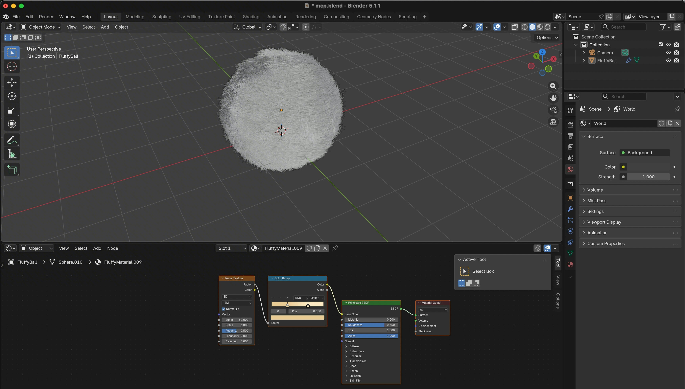
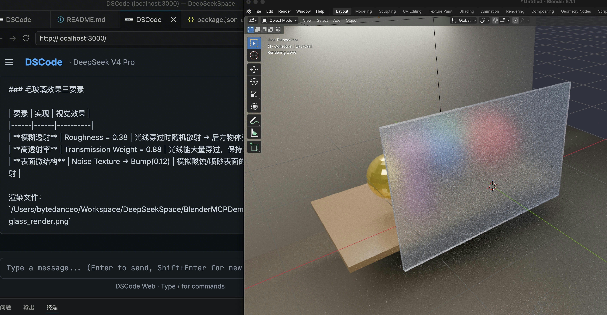

<p align="center">
  
</p>

<p align="center">
  <strong>
    MCP-first、Spec-driven 的 DeepSeek AI Agent。<br />
    为数字创作而生 —— 不止于编程。
  </strong>
</p>

<p align="center">
  <a href="https://www.npmjs.com/package/@wangcan26/dscode"></a>
  =20" />
  
  
</p>

<p align="center">
  <sub><a href="README.md">English</a></sub>
</p>

---

## dscode 有什么不同

<table>
<tr>
<td width="50%" valign="top">

### 🔌 MCP-First

MCP 不是附加功能，而是 **一等扩展机制**。dscode 第一时间跟进最新 MCP 规范，优先通过 MCP 协议实现能力——Blender 3D 建模、PlayCanvas、浏览器自动化、文档处理、电子表格。任何有 MCP Server 的工具，dscode 即连即用。

**MCP 不是功能。MCP 是地基。**

</td>
<td width="50%" valign="top">

### 🧬 Spec-Driven 开发

dscode 通过 [OpenSpec](https://github.com/anthropics/open-spec) 实现 **规约驱动开发（SDD）**。每个功能先有正式 spec——`openspec/specs/` 是唯一真相源，代码只是实现。我们不鼓励手动提交；所有设计和开发都在 SDD 管线中完成，由 AI Agent 协作实现。

**代码是规约的实现 —— 而不是反过来。**

</td>
</tr>
<tr>
<td width="50%" valign="top">

### 🔍 MCP Tool Search

MCP Server 太多导致上下文爆炸？dscode 内置 `search_tools` 驱动——MCP 工具由模型**按需发现**，而非预加载。只有真正需要的工具才会进入上下文窗口。接入几十个 MCP Server 也无需担心 token 开销。

**所有工具，零浪费。**

</td>
<td width="50%" valign="top">

### 🐋 DeepSeek 原生优化

dscode 专为 DeepSeek 打造。**视觉模型 fallback 链路**在主模型不支持多模态时，透明地将图片路由到 vision 模型。Prompt Cache 通过 `prompt_cache_key` 亲和与前缀稳定的消息构建，维持 **97–99% 的缓存命中率**。每一项优化都针对 DeepSeek API 行为调校。

**不只是兼容。是深度优化。**

</td>
</tr>
</table>

---

## 效果演示

<p align="center">
  <video src="docs/screen_shots/show_dscode.mp4" width="720" controls muted loop playsinline poster="docs/screen_shots/web-ui.gif"></video>
</p>

<p align="center">
  
  
</p>

<p align="center">
  <sub>Web UI 流式对话、工具调用与权限确认。通过 MCP 控制 Blender 3D 建模。</sub>
</p>

---

## 安装

```bash
npm install -g @wangcan26/dscode
dscode              # 终端模式
dscode --web        # Web 模式 → http://localhost:3000
```

> 首次使用？运行 `/config key <你的 API Key>` 和 `/config model deepseek-v4-pro` 即可开始。键入 `/help` 查看完整指南。

**从源码构建：**

```bash
git clone https://github.com/wangcan26/dscode.git
cd dscode && npm install && npm run build
node dist/dscode.mjs
```

---

## 能力一览

<table>
<tr>
<td width="33%" valign="top">
  <strong>🖥 终端 + Web 双界面</strong><br />
  <sub>完整 TUI：流式输出、thinking、工具调用。现代 React Web 界面，通过 WebSocket 实现功能完全一致。</sub>
</td>
<td width="33%" valign="top">
  <strong>🔌 MCP 连接器</strong><br />
  <sub>Stdio、Streamable HTTP（MCP 2025-11-25）、Legacy SSE 兼容。自动传输推断。MCP App 沙箱支持服务端驱动 UI。</sub>
</td>
<td width="33%" valign="top">
  <strong>🛡 Agent Harness</strong><br />
  <sub>权限控制、上下文压缩（1M token 窗口）、会话持久化、跨会话记忆、指数退避重试。</sub>
</td>
</tr>
<tr>
<td width="33%" valign="top">
  <strong>📦 Skills 系统</strong><br />
  <sub>通过 SKILL.md 声明式定义第三方扩展。按需激活。用户级 + 项目级双重作用域。</sub>
</td>
<td width="33%" valign="top">
  <strong>👁 Vision Pipeline</strong><br />
  <sub>自动路由到 vision 模型。tesseract OCR 回退（中英文）。支持拖拽、粘贴、@文件 引入图片。</sub>
</td>
<td width="33%" valign="top">
  <strong>🔧 内置驱动</strong><br />
  <sub><code>read_file</code>、<code>write_file</code>、<code>edit</code>（hash-anchor）、<code>bash</code>、<code>grep</code>、<code>glob</code>。MCP 工具通过 <code>search_tools</code> 按需发现。</sub>
</td>
</tr>
</table>

---

## 30 秒上手 MCP

```jsonc
// ~/.dscode/settings.json
{
  "mcpServers": {
    "blender": {
      "command": "uvx",
      "args": ["blender-mcp"]
    },
    "playwright": {
      "command": "npx",
      "args": ["@anthropic/mcp-playwright"]
    }
  }
}
```

dscode 启动时自动连接，工具以 `mcp_blender_*` 和 `mcp_playwright_*` 命名空间出现。MCP Server 还可通过 App Host 提供沙箱化 UI —— 无需样板代码，无需 SDK，无需胶水层。

---

## 了解更多

| 文档 | 内容 |
|------|------|
| [ARCHITECTURE.md](docs/ARCHITECTURE.md) | 完整架构：Agent as OS、6 层设计、Driver/Skill 模型、源码树 |
| [ROADMAP.md](docs/ROADMAP.md) | 路线图：Sub-Agent 系统、System Prompt 模块化、Diff-based 编辑 |
| [CONTRIBUTING.md](CONTRIBUTING.md) | 贡献指南：理念对齐、OpenSpec SDD 流程、编码规范 |
| [STYLE.md](docs/STYLE.md) | TypeScript 编码风格：命名、导入、模块结构、错误处理 |

---

<p align="center">
  <sub>如果你喜欢这个项目，请给一个 ⭐ Star —— 你的支持让 dscode 持续进化。</sub>
</p>
