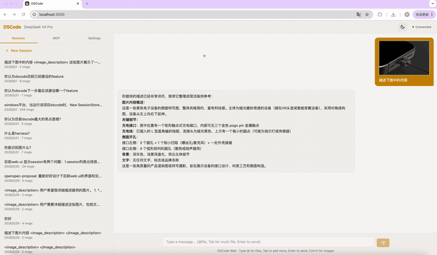
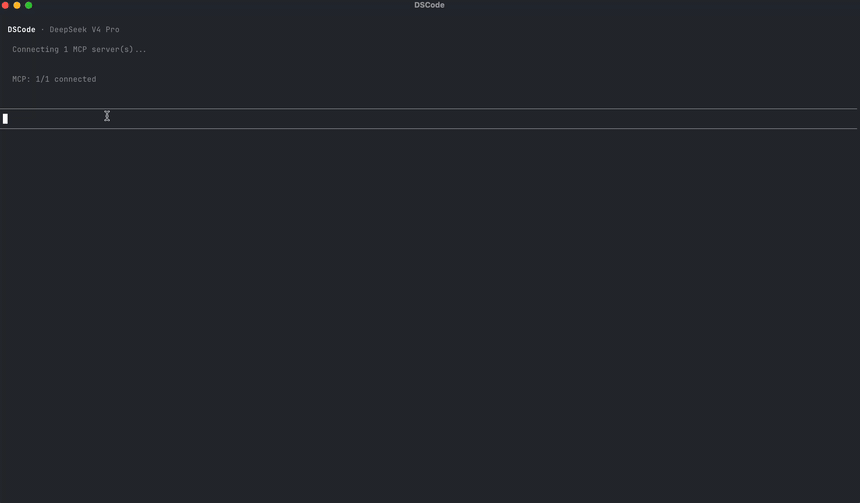
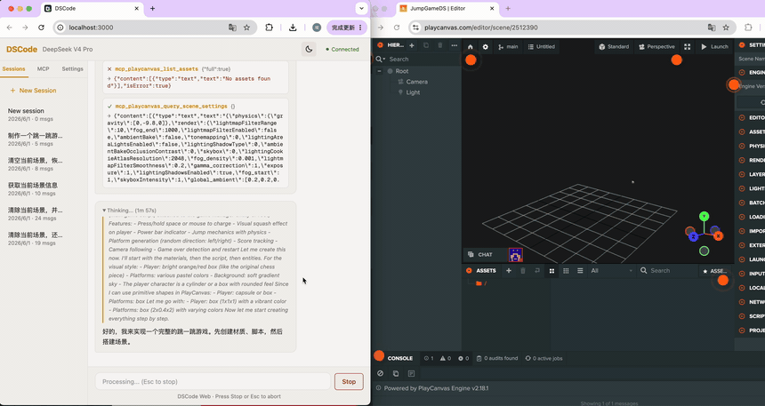
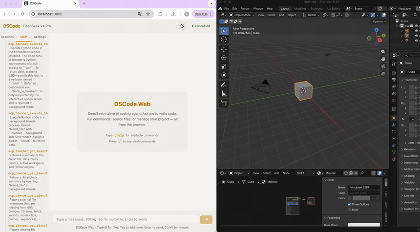

<p align="center">
  
</p>

<p align="center">
  <strong>
    面向数字工作室的 MCP-first 编程 Agent。<br />
    连接 Blender、游戏引擎和创作工具 —— 不只是代码助手。
  </strong>
</p>

<p align="center">
  <a href="https://www.npmjs.com/package/@wangcan26/dscode"></a>
  =20" />
  
  
</p>

<p align="center">
  <sub><a href="README.md">English</a></sub>
</p>

---

## 效果演示

<table align="center">
<tr>
<td align="center" width="50%">
  
  <br /><sub><b>Web UI</b> — 流式对话、工具调用、权限确认</sub>
</td>
<td align="center" width="50%">
  
  <br /><sub><b>Terminal UI</b> — 实时流式、斜杠命令、内联渲染</sub>
</td>
</tr>
</table>

> **提示：** GIF 在 GitHub 自动播放。点击图片可查看全尺寸。

---

## dscode 有什么不同

<table>
<tr>
<td width="50%" valign="top">

### 🔌 MCP-First

数字工作室不用一个工具，而是十个。MCP 把每一个工具变成 API —— dscode 就是编排它们的 Agent。Blender 做 3D 建模、PlayCanvas 做实时渲染、浏览器自动化做测试、文档做规约、电子表格做数据。只要你的创作工具有 MCP Server，dscode 就能把它接入工作流。

**你的工具链。一个 Agent。全通过 MCP。**

</td>
<td width="50%" valign="top">

### 🧬 Spec-Driven 开发

dscode 通过 [OpenSpec](https://github.com/Fission-AI/OpenSpec) 实现**规约驱动开发（SDD）**。每个功能先有正式 spec——`openspec/specs/` 是唯一真相源，代码只是实现。我们不鼓励手动提交；所有设计和开发都在 SDD 管线中完成，由 AI Agent 协作实现。

**代码是规约的实现 —— 而不是反过来。**

</td>
</tr>
<tr>
<td width="50%" valign="top">

### 🔍 MCP Tool Search

MCP Server 太多导致上下文爆炸？dscode 内置 `search_tools` 驱动——MCP 工具由模型**按需发现**，而非预加载。只有真正需要的工具才会进入上下文窗口。接入几十个 MCP Server 也无需担心 token 开销。

**所有工具，零浪费。**

</td>
<td width="50%" valign="top">

### 🐋 DeepSeek V4 Pro — 首选推荐

dscode 专为 DeepSeek V4 Pro 打造 —— 我们首推的数字创作模型。它的推理深度能处理复杂的多工具工作流（「先在 Blender 建模，再在 PlayCanvas 渲染，然后写文档总结」），不会丢失上下文。**视觉模型 fallback 链路**透明地将截图和参考图路由到 vision 模型。Prompt Cache 通过 `prompt_cache_key` 亲和与前缀稳定的消息构建，维持 **97–99% 的缓存命中率**。每一项优化都针对 DeepSeek API 行为调校。

**DeepSeek V4 Pro。当你的工具链需要的不仅是代码补全。**

</td>
</tr>
</table>

---

## 能力一览

<table>
<tr>
<td width="33%" valign="top">
  <strong>🖥 终端 + Web 双界面</strong><br />
  <sub>完整 TUI：流式输出、thinking、工具调用。现代 React Web 界面，通过 WebSocket 实现功能完全一致。</sub>
</td>
<td width="33%" valign="top">
  <strong>🔌 MCP 连接器</strong><br />
  <sub>Stdio、Streamable HTTP（MCP 2025-11-25）、Legacy SSE 兼容。自动传输推断。MCP App 沙箱支持服务端驱动 UI。</sub>
</td>
<td width="33%" valign="top">
  <strong>🛡 Agent Harness</strong><br />
  <sub>权限控制、上下文压缩（1M token 窗口）、会话持久化、跨会话记忆、指数退避重试。</sub>
</td>
</tr>
<tr>
<td width="33%" valign="top">
  <strong>📦 Skills 系统</strong><br />
  <sub>通过 SKILL.md 声明式定义第三方扩展。按需激活。用户级 + 项目级双重作用域。</sub>
</td>
<td width="33%" valign="top">
  <strong>👁 Vision Pipeline</strong><br />
  <sub>自动路由到 vision 模型。tesseract OCR 回退（中英文）。支持拖拽、粘贴、@文件 引入图片。</sub>
</td>
<td width="33%" valign="top">
  <strong>🔧 内置驱动</strong><br />
  <sub><code>read_file</code>、<code>write_file</code>、<code>edit</code>（hash-anchor）、<code>bash</code>、<code>grep</code>、<code>glob</code>。MCP 工具通过 <code>search_tools</code> 按需发现。</sub>
</td>
</tr>
</table>

---

## 30 秒上手 MCP

```jsonc
// ~/.dscode/settings.json
{
  "mcpServers": {
    "blender": {
      "command": "uvx",
      "args": ["blender-mcp"]
    },
    "playwright": {
      "command": "npx",
      "args": ["@anthropic/mcp-playwright"]
    }
  }
}
```

dscode 启动时自动连接，工具以 `mcp_blender_*` 和 `mcp_playwright_*` 命名空间出现。MCP Server 还可通过 App Host 提供沙箱化 UI —— 无需样板代码，无需 SDK，无需胶水层。

### MCP 实战效果

<table align="center">
<tr>
<td align="center" width="50%">
  
  <br /><sub><b>PlayCanvas + MCP</b> — 纯自然语言构建一个跳跃小游戏</sub>
</td>
<td align="center" width="50%">
  
  <br /><sub><b>Blender + MCP</b> — 对话式 3D 建模与场景搭建</sub>
</td>
</tr>
</table>

> **提示：** 以上为真实 MCP 工作流 —— dscode 像调用原生 API 一样编排 PlayCanvas 和 Blender。

---

## 安装

```bash
npm install -g @wangcan26/dscode
dscode              # 终端模式
dscode --web        # Web 模式 → http://localhost:3000
```

> 首次使用？运行 `/config key <你的 API Key>` 和 `/config model deepseek-v4-pro` 即可开始。键入 `/help` 查看完整指南。

**从源码构建：**

```bash
git clone https://github.com/wangcan26/dscode.git
cd dscode && npm install && npm run build
node dist/dscode.mjs
```

---

## 配置

dscode 使用两层 `settings.json`，项目级配置覆盖用户级配置：

| 作用域 | 路径 | 用途 |
|-------|------|---------|
| 用户级 | `~/.dscode/settings.json` | 所有项目的默认配置 |
| 项目级 | `.dscode/settings.json` | 单个项目的覆盖配置 |

> **注意：** 模型配置（`provider`、`modelId`、`apiKey`、`thinkingLevel`）存放在 `~/.dscode/config.json`，通过 `/config` 命令管理。在会话中输入 `/help` 查看完整命令列表。

### 配置速览

```jsonc
// ~/.dscode/settings.json
{
  // --- MCP 服务器 ---
  "mcpServers": {
    "blender": {
      "command": "uvx",
      "args": ["blender-mcp"]
    },
    "playwright": {
      "command": "npx",
      "args": ["@anthropic/mcp-playwright"]
    },
    "my-api": {
      "url": "https://my-mcp.example.com/mcp",
      "headers": { "Authorization": "Bearer <token>" }
    }
  },

  // --- 权限 ---
  "permissions": {
    "allow": [
      "Bash(git add *)",
      "Bash(npm *)"
    ],
    "deny": [
      "Bash(rm -rf *)"
    ],
    "rules": [
      { "tool": "Bash(curl *)", "decision": "allow", "priority": 5 }
    ]
  },

  // --- Skills ---
  "skills": ["brandkit", "minimalist-ui"],

  // --- 重试 ---
  // 控制 dscode 如何在 API 调用失败时重试（限流、超时、服务器错误）。
  // 使用指数退避策略：从 baseDelayMs 开始，每次重试翻倍，上限为 maxDelayMs。
  "retry": {
    "maxRetries": 3,           // 最大重试次数
    "baseDelayMs": 1000,       // 首次重试前的初始延迟（毫秒）
    "maxDelayMs": 30000,       // 退避延迟的上限（毫秒）
    "retryOnTimeout": true,    // 提供商超时时重试
    "retryOnRateLimit": true,  // 触发限流时重试（遵循 Retry-After 头）
    "retryOnServerError": true // 5xx 服务器错误时重试
  },

  // --- @-文件 限制 ---
  "atFileMaxFiles": 5,
  "atFileMaxFileSize": 51200,
  "atFileMaxTotalSize": 204800
}
```

### MCP 服务器配置

`mcpServers` 下每个服务器支持以下字段：

| 字段 | 类型 | 说明 |
|-------|------|-------------|
| `command` | string | 可执行文件（用于 stdio 传输） |
| `args` | string[] | 传递给命令的参数 |
| `url` | string | HTTP 端点（用于 streamable-http 传输） |
| `env` | object | 服务器进程的额外环境变量 |
| `headers` | object | 自定义 HTTP 头 |
| `transport` | string | `"stdio"` \| `"streamable-http"` \| `"sse"`（省略时自动检测） |
| `preferredProtocolVersion` | string | `"2025-11-25"` \| `"2025-03-26"` \| `"2024-11-05"` |
| `requestTimeoutMs` | number | 单次请求超时时间 |
| `connectTimeoutMs` | number | 连接超时时间 |

> **提示：** 传输方式自动检测 —— 如果设置了 `url` 而没有 `command`，则使用 streamable-http，否则使用 stdio。

### 环境变量

所有配置均可通过环境变量设置，适用于 CI / 容器场景：

| 变量 | 对应配置 |
|----------|---------|
| `DEEPSEEK_API_KEY` | API Key（也支持 provider 专用变量：`OPENAI_API_KEY`、`ANTHROPIC_API_KEY` 等） |
| `AGENT_PROVIDER` | Provider 覆盖 |
| `AGENT_MODEL` | Model 覆盖 |
| `AGENT_THINKING_LEVEL` | Thinking Level 覆盖 |
| `AGENT_VISION_PROVIDER` | Vision 模型 provider |
| `AGENT_VISION_MODEL` | Vision 模型 ID |
| `DSCODE_MAX_TOKENS` | 最大 token 数 |
| `DSCODE_CONFIG_HOME` | 自定义配置目录（默认：`~/.dscode`） |
| `DSCODE_DATA_HOME` | 自定义数据目录 |
| `DSCODE_PROJECT_PATH` | 项目目录 |
| `DSCODE_RETRY_MAX_RETRIES` | 重试最大次数 |
| `DSCODE_RETRY_BASE_DELAY_MS` | 重试基础延迟 |
| `DSCODE_RETRY_MAX_DELAY_MS` | 重试最大延迟 |

---


## Harness 设计哲学

我们在 Harness 设计上遵循**奥卡姆剃刀原则**。dscode 不会预设意图理解模块、Plan 模式或复杂的 agent 编排层——直到系统提示词确实不够用。大多数 coding agent 在一开始就堆叠了推理规划、反思循环和多 agent 协调，而我们选择等模型真正需要时再添加。

这不意味着 Harness 很简陋。它意味着每一块功能都经过了必要性论证。

一个我们深入投入的例子：**edit 工具**。基于 [@_can1357 的 hash-anchor 协议](https://x.com/_can1357/status/2021828033640911196)，我们的 `edit` 工具用**内容寻址的锚点系统**替代了脆弱的行号和正则匹配（详见 [spec](openspec/specs/edit-tool/spec.md)）：

- **三级自适应消歧** — 歧义哈希静默解析：6 位 → 8 位 → 上下文增强（三行窗口）匹配，全部失败才显式拒绝
- **Occurrence + line-hint 双重消歧** — `occurrence: 3` 选取第 N 次出现；`line` 字段自动选最近候选，仅等距时拒绝
- **Proximity 范围消歧** — 范围端点一侧唯一时，另一侧自动在正确方向找最近候选项
- **低熵过滤** — `}` 等行被拒绝作为锚点，工具返回最多 6 个相邻 `[high]` 锚点作为替代建议
- **原子批量 + 重叠检测** — 6 种操作类型一次调用，全部成功或全部回滚。批量内重叠区间自动检测拒绝
- **Checkpoint + 安全回滚** — 编辑前保存快照。编辑后安全检查（重复行、括号平衡、孤儿 `else`）失败则自动回滚
- **结构化失效区间** — `anchors_valid_through` + `must_refresh_from_line` 精确告知模型哪些锚点仍有效，支持链式编辑无需重读
- **Localized diff + 新锚点** — 编辑成功返回带全新 6 位 hash 的 diff，模型可立即继续编辑

**dscode 开发 dscode。** 正是这个 edit 工具——配合我们的 spec-driven 工作流——让 dscode 实现了自我开发。从 hash-anchor 协议到 checkpoint 系统，每一个功能都由 dscode + DeepSeek V4 Pro 编写，通过 MCP 工具编辑自己的源码树。这不是 demo。这就是我们交付项目的方式。

这就是我们投入的 Harness 工作：不是加更多 AI，而是让 AI 的工具更可靠。

---

## 了解更多

| 文档 | 内容 |
|------|------|
| [ARCHITECTURE.md](docs/ARCHITECTURE.md) | 完整架构：Agent as OS、6 层设计、Driver/Skill 模型、源码树 |
| [ROADMAP.md](docs/ROADMAP.md) | 路线图：Sub-Agent 系统、System Prompt 模块化、Diff-based 编辑 |
| [CONTRIBUTING.md](CONTRIBUTING.md) | 贡献指南：理念对齐、OpenSpec SDD 流程、编码规范 |
| [STYLE.md](docs/STYLE.md) | TypeScript 编码风格：命名、导入、模块结构、错误处理 |

---

## 致谢

dscode 站在以下工作的肩膀上：

- **[OpenSpec](https://github.com/Fission-AI/OpenSpec)** — 规约驱动开发框架，塑造了我们的整个工作流

- **[pi-ai](https://www.npmjs.com/package/@mariozechner/pi-ai) / [pi-agent-core](https://www.npmjs.com/package/@mariozechner/pi-agent-core)** — Mario Zechner 的 agent 循环与模型抽象基础
- **[taste-skill](https://github.com/Leonxlnx/taste-skill)** — Leonxlnx 的设计品味技能系统，启发了我们的 skills 架构
- **[@_can1357](https://x.com/_can1357/status/2021828033640911196)** — hash-anchor 编辑协议，成为我们 `edit` 工具的基石

---

<p align="center">
  <sub>如果你喜欢这个项目，请给一个 ⭐ Star —— 你的支持让 dscode 持续进化。</sub>
</p>
