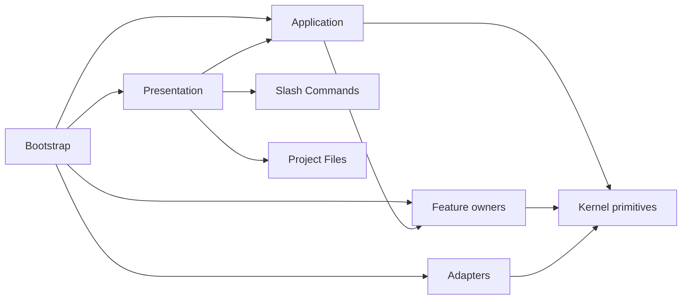

# Architecture

dscode 是一个基于 `@earendil-works/pi-agent-core`、`@earendil-works/pi-ai`
和 `@earendil-works/pi-tui` 构建的分层 Agent Harness，提供 TUI 与 Web 双界面。

## 设计哲学

**Agent as OS** — dscode 借用操作系统概念描述组件之间的责任边界。这是架构类比，
不是声称 Harness 实现了完整操作系统；每项映射都以当前代码行为为依据。

### Kernel 与计算

| Agent 概念 | OS 类比 | dscode 职责 |
|-----------|---------|------------|
| Harness | Kernel | 以 Application coordinator 形式协调进程、权限、I/O 与生命周期 |
| Model | CPU / 计算引擎 | 执行推理计算 |
| Agent Runtime | 进程执行环境 | 驱动单个 Agent 的 prompt、tool-call 和事件循环 |
| System Prompt | 进程启动策略 / 只读指令段 | 为 Runtime 装载身份、规则和行为约束 |

这里的 Kernel 是运行时职责类比，不是源码目录名。物理上，`Harness` 位于
`src/application/harness.ts`，concrete wiring 位于 `src/bootstrap/`，
`src/kernel/` 只保存 Execution Context、日志和路径安全等基础原语。System Prompt
影响单个进程如何执行，但不管理其他进程或资源，因此不是 Kernel。

### 应用与进程

| Agent 概念 | OS 类比 | dscode 职责 |
|-----------|---------|------------|
| AgentApplication / Agent.md | Application / Executable Image / Manifest | 定义 Prompt、模型和 capability，编译为不可变 snapshot |
| Main Agent / SubAgent | 进程 | 由同构 Agent Runtime 执行的运行实例 |
| Main Agent | PID 1 / init | 当前 Harness 中的根 Agent 进程 |
| `agentId` / `parentAgentId` | PID / PPID | 标识进程及父子关系 |
| AgentSupervisor | 进程表 + 生命周期管理 + Job Control | spawn、list、wait、terminate、kill 及前后台切换 |
| AgentContext | PCB + 进程环境 + capability set | 保存 cwd、Session 归属、深度、工具权限和 Worktree |

AgentSupervisor 当前没有时间片、优先级或抢占机制，因此不等同于完整的 OS Scheduler。

### 内存与状态

| Agent 概念 | OS 类比 | dscode 职责 |
|-----------|---------|------------|
| 上下文窗口 | RAM / Agent 进程工作集 | 保存当前推理可见的 Prompt、消息、工具定义与结果 |
| ContextManager | 内存管理器 / Pager | 负责 token 预算、工作集压缩和 overflow 恢复 |
| Session `messages` | 可恢复会话快照 / Backing Store | 持久化 Main Agent 消息并重新装载工作集 |
| Agent Runtime Snapshot | 进程快照 / Backing Store | 持久化 Agent Process transcript 与 usage |
| MemoryManager | 持久化长期知识存储 | 保存跨 Session 知识，并在选中后注入 System Prompt |

这里的 RAM 不是 `MemoryManager` 的同义词。前者是当前推理的易失工作集，后者保存
跨 Session 的长期知识。

### I/O

| Agent 概念 | OS 类比 | dscode 职责 |
|-----------|---------|------------|
| Tool Call | System Call | Agent 发起的原子操作，如 `read_file`、`write_file`、`bash` |
| Tool Schema | Syscall ABI | 定义操作名称、参数和返回契约 |
| ToolRegistry | Syscall Table / 可调用操作表 | 汇总 Tool，并控制基础、延迟和已发现状态 |
| DriverRegistry / Driver | 驱动注册表 / 资源适配器 | 将一组 Tool 连接到文件系统、Shell 或 MCP |
| MCP Server | 外部应用、设备或远程服务 | 提供由 MCP Driver 暴露给 Agent 的能力 |
| 文件系统、Shell、浏览器等 | Device / Resource | 被 Driver 实际操作的资源 |

`read_file`、`write_file` 和 MCP Tool 是 Agent 可调用的操作，不是 Driver 本身。调用链为：

```text
Agent Process
  → Tool Call
  → Tool Schema / ToolRegistry
  → Driver
  → Resource
```

文件读取和 MCP 调用分别落到：

```text
Agent → read_file(path) → schema / ToolRegistry → fs Driver → 文件系统 / 磁盘
Agent → mcp__<server>__<tool> → schema / ToolRegistry → MCP Driver → MCP Server → 外部资源
```

### 外部设备与服务进程

外部设备可能由独立的用户态服务进程提供能力。dscode 将这种进程与 Agent 进程
严格分开：

| dscode 概念 | OS 类比 | 职责 |
|-------------|---------|------|
| Open Design | 虚拟设备 | 对 Agent 提供设计生成、资源与预览能力 |
| MCP Client / Proxy | Device Driver / 协议适配器 | 把 Tool Call 转换为 MCP 请求 |
| Open Design daemon | 用户态设备服务进程 | 执行设备能力并暴露 HTTP 服务 |
| ServiceSupervisor | init / systemd | 启动、健康检查、重启和关闭受管服务进程 |
| Open Design integration | 设备配置与适配模块 | 解析配置、声明服务并贡献 MCP Driver |

调用路径与启动路径彼此独立：

```text
调用: Agent → ToolRegistry → MCP Driver → Open Design MCP Proxy → OD daemon
启动: Bootstrap → Open Design integration → ServiceSupervisor → OD daemon
```

这与 FUSE 类似：VFS 请求通过 FUSE Driver 转发给用户态文件系统 daemon。
Driver 负责协议适配，daemon 实现实际能力，服务管理器负责进程生命周期。因此
Open Design 整体可视为虚拟设备，但 daemon 本身不是 Driver。

`ServiceSupervisor` 只管理 dscode 自己启动的服务。启动前已健康的 daemon 被标记为
external，dscode 不会重启或终止它。服务进程不进入 `AgentSupervisor` Process
Table，也没有 AgentContext、Session、模型循环或 capability set。

配置入口遵循各自的所有权边界：

| 配置入口 | 所有者 | Open Design 用法 |
|---------|--------|------------------|
| `settings.json` 的 `integrations.openDesign` | Integration 配置 | 使用 typed `path`、`port`、`enabled`、`autoStart` |
| `.mcp.json` 的 `mcpServers.<name>.env` | MCP Driver | 仅传递给指定 MCP 子进程，不配置 Integration |
| 进程环境或项目 `.env` | 兼容输入 | 仅在 typed Integration 配置不存在时读取 `OPEN_DESIGN_DIR`、`OD_PORT` |

`settings.json` 没有通用 `env` 字段。Open Design 的持久单一事实来源是
`integrations.openDesign`；兼容环境变量只在当前运行中派生配置，不会写回文件。

### 能力与隔离

| Agent 概念 | OS 类比 | dscode 职责 |
|-----------|---------|------------|
| Skill | 按需加载的用户态能力模块 / Library | 注入 instructions，并选择允许使用的 Driver Tool |
| SKILL.md | 模块 Manifest + 指令源 | 声明 Skill 元数据、操作规程和 Tool 白名单 |
| PermissionManager | Capability / ACL / Syscall Filter | 在 Tool Call 前执行 allow、deny 或 ask 策略 |
| Worktree Isolation | Filesystem Namespace / Sandbox | 为后台写进程隔离 cwd、分支和文件修改 |

Skill 编排 Tool，但不实现底层资源访问；真正连接资源的是 Driver。

Skill 与 MCP 在 Presentation 中可以同属 “Capabilities” 分组，但源码所有权保持独立：
`src/skills/` 负责 SKILL.md 扫描、instructions 激活和 Tool allowlist；
`src/mcp/` 负责 JSON-RPC、transport、连接、重连、Server state 和动态 Driver 贡献。
二者没有共享生命周期、基类或 Registry，UI 分组不定义后端 ownership。

### 通信与恢复

| Agent 概念 | OS 类比 | dscode 职责 |
|-----------|---------|------------|
| Agent Message | 定向 IPC | 父进程向运行中的 Agent Process 补充消息 |
| HarnessEventBus | Kernel 内事件分发 | 在 Harness 组件间发布生命周期与 UI 事件 |
| Session | TTY + 可恢复会话 | 承载用户交互，并持久化 Main Agent 消息 |
| Agent Runtime Snapshot | 进程快照 | 保存 Agent Process 的可审计运行状态 |
| CheckpointManager | 文件级 Snapshot / Rollback Journal | 在文件修改前保存内容并支持回滚 |

Session snapshot、Agent Runtime Snapshot 和 CheckpointManager 的粒度不同：它们分别恢复
用户会话、记录 Agent Process 状态和回滚单个文件，不应混称为同一种 checkpoint。

### 类比边界

dscode 当前没有抢占式 Scheduler、通用文件描述符表，也不管理模型内部的 CPU
寄存器式即时状态。没有对应运行时原语的 OS 概念保持未映射，不能为了让表格看起来
完整而分配给无关组件。

dscode 不服务传统"代码感知"场景（那是 Cursor / Claude Code 的领地），而是面向**数字创作**——通过 MCP 连接 Blender、浏览器、文档、表格等创作工具，让模型探索和操控各类数字环境。

## Agent 进程模型

所有 Agent 都是进程。Main Agent 是当前应用的 PID 1，SubAgent 是由
`AgentSupervisor` 启动和管理的子进程。Session 只承担用户会话与消息持久化，
不作为 SubAgent 的执行载体。

SubAgent 不创建独立 Session。父 Session 的 `agentMessages` 保存
`role: "subagent"` 的轻量关联记录，完整 transcript、Application snapshot 和
退出结果保存在独立的 `agent-processes` 目录。旧 Session 的 `visionMessages`
仅在加载时兼容迁移。

AgentApplication 使用 Markdown 配置：

```text
resources/agents/vision.md        # 当前唯一随发行版本提供的 Agent.md
~/.dscode/agents/*.md             # 用户级
<project>/.dscode/agents/*.md     # 项目级
~/.claude/agents/*.md             # Claude Code 用户级兼容
<project>/.claude/agents/*.md     # Claude Code 项目级兼容
```

完整字段、覆盖顺序和使用方式见 [Agent.md 配置与使用](AGENT_MD.md)。

运行中的进程保存到：

```text
~/.dscode/data/agent-processes/by-project/<project>/<agentId>.json
```

所有 AgentProcess 通过 `PiAgentRuntimeAdapter` 持有独立 Pi Agent。Application
只能配置 Prompt、模型和 capability，不能选择内部 Runtime。

Agent.md 可声明用户配置的 foreground/background 默认值，Main Agent 通过
`spawn_agent` 为单次动态委派显式覆盖，并可使用 `list_agents`、`terminate_agent`、
`kill_agent` 和 `send_agent_message` 管理后台进程。foreground 结果由工具直接返回，
background 结果由 `agent:exit` 和父 Session 通知自动传递，并在 Main turn 的安全
边界事件驱动 continuation；不向模型暴露等待或输出轮询工具。后台写进程必须使用
Git Worktree，相对路径和 Checkpoint 通过
AsyncLocalStorage 中的 AgentContext 隔离。

## 分层架构

每层只依赖内侧的层，禁止反向依赖。

```
┌──────────────────────────────────────────────────────────┐
│  Layer 6: UI        TUI (TuiBackend) + Web (WebBackend)  │
├──────────────────────────────────────────────────────────┤
│  Layer 5: Permissions   beforeToolCall 拦截 + 规则引擎     │
├──────────────────────────────────────────────────────────┤
│  Layer 4: Skills         用户态程序，SKILL.md 声明式加载    │
│           Drivers        内核模块 (fs/shell/search/edit/    │
│                           discovery)                         │
│           Tool Search    延迟工具发现 (search_tools)         │
│           Checkpoint     编辑安全网 (save/commit/rollback)   │
├──────────────────────────────────────────────────────────┤
│  Layer 3: Memory         跨 session 记忆 + system prompt 注入│
├──────────────────────────────────────────────────────────┤
│  Layer 2: Context        token 估算 + 压缩 + overflow 恢复 │
├──────────────────────────────────────────────────────────┤
│  Layer 1: Session        会话持久化 + 恢复                  │
├──────────────────────────────────────────────────────────┤
│  Layer 0: Agent Loop     pi-agent-core + pi-ai（已有）     │
└──────────────────────────────────────────────────────────┘
```

---

## Layer 0: Agent Loop

由 `@earendil-works/pi-agent-core` 提供，dscode 不重复实现。

### Agent 核心 API

```typescript
const agent = new Agent({
  initialState: {
    systemPrompt, model, tools, thinkingLevel
  },
  streamFn: streamSimple,
  transformContext: (msgs, signal) => contextManager.transform(msgs, signal),  // Layer 2
  beforeToolCall: (ctx, signal) => permissionManager.check(ctx, signal),       // Layer 5
  afterToolCall: (ctx, signal) => ...,                                         // 校准 + 日志
  sessionId: string,   // 用于 DeepSeek prompt cache 亲和
});
```

### 事件流

```
agent.prompt(input)
  → turn_start → message_start → [thinking/text/tool_call 流式 delta]
  → message_end → [tool_execution_start → tool_execution_end × N]
  → turn_end → (循环直到无 tool_call) → agent_end
```

### 事件类型

| 事件 | 用途 |
|------|------|
| `agent_start` / `agent_end` | Session 自动保存、记忆提取 |
| `turn_start` / `turn_end` | 统计追踪 |
| `message_start` / `message_update` / `message_end` | UI 渲染、token 校准 |
| `tool_execution_start` / `tool_execution_end` | 权限拦截、审计日志 |

---

## Layer 1: Session

### 职责

将对话状态（Main Agent 消息历史 + SubAgent 关联记录 + 元数据 +
compactedPrefix）持久化到磁盘，支持恢复。

### 数据模型

```
~/.dscode/data/sessions/
├── index.json           # SessionMetadata[] 索引
├── <ulid>.json          # 单个 session 完整数据
└── ...
```

- **ID**: ULID（时间可排序，26 字符）
- **写入**: 原子写入（tmp → rename）
- **标题**: 首条用户消息截 60 字符
- **SubAgent**: Session v3 使用 `agentMessages` 关联 Agent Process，不将其
  transcript 混入 Main Agent 的 `messages`

### SessionManager

- `createSession(model)` — 新建 session
- `saveSession(agent, metadata)` — 从 `agent.state.messages` 序列化并写入
- `prepareLoad(id)` — 校验并恢复目标快照，不修改当前 Session
- `commitPreparedLoad(snapshot, agent)` — 无 I/O 地提交 Main messages、metadata
  和独立的 `agentMessages`
- `loadSession(id, agent)` — prepare/commit 兼容包装
- `listSessions()` / `deleteSession(id)` — 管理操作
- `getCurrentSessionId()` — 返回 ULID 用于 prompt cache 亲和

跨组件切换由 `Harness.switchSession()` 协调，固定执行
prepare → abort/quiesce → save source → persist Main Process rebind → commit。
`session:loaded` 只在 commit 后作为完成通知发布。已有 SubAgent 不参与 Main
Process 重绑定，并继续按创建时的 `parentSessionId` 写回源 Session。完整约束见
[`session-switching` specification](../openspec/specs/session-switching/spec.md)。

---

## Layer 2: Context

### 职责

通过 `transformContext` hook，在每次 LLM 调用前确保消息不超上下文窗口。

### Token 估算

无本地 tokenizer，使用启发式算法：

- 英文/代码: `chars ÷ 3.5`
- CJK: `chars ÷ 2.5`
- 混合文本按比例加权
- 每次 LLM 返回 `usage.input` 后自动校准，精度逐渐收敛

### 压缩策略

| 策略 | 行为 | 适用场景 |
|------|------|----------|
| `drop-oldest` | 从头丢弃 user+assistant 对 | 简单快速 |
| `sliding-window` | 保留最近 K 轮 | 近期上下文优先 |
| `summarize-prefix` | 用 LLM 摘要前部消息，替换为合成消息 | 长对话保上下文 |

### Overflow 恢复

当 `isContextOverflow()` 返回 true → 强制激进压缩 → `agent.continue()` 重试。

### ContextManager

- `transform(messages, signal)` → 估算 → 判断 → 压缩
- `getTokenBudget(model, systemPrompt, tools)` → 计算可用预算
- 压缩后的 `compactedPrefix` 存入 Session，恢复时注入

---

## Layer 3: Memory

### 职责

跨 session 持久化知识（用户偏好、项目上下文），session 结束自动提取，session 开始注入 system prompt。

### 数据模型

```
~/.dscode/data/memory/
├── global.json              # 全局记忆
└── projects/
    └── <sha256-12>.json     # 项目级记忆（路径 hash 隔离）
```

### MemoryEntry

```typescript
{ id: ULID, scope: "global" | "project",
  category: "preference" | "fact" | "instruction",
  content: string, source: { sessionId, timestamp } }
```

### MemoryManager

- `getRelevantMemories()` → 格式化为 `## Memories` 注入 system prompt
- `extractAndStore(messages, sessionId)` → session 结束时 LLM 提取
- `addMemory()` / `removeMemory()` / `clearMemories()` — 手动管理
- 去重：新增前全文搜索相似条目（编辑距离 > 0.8 则更新而非新增）

---

## Layer 4: Drivers, Skills & Tool Search

### Driver（内核模块，始终加载）

Driver 是工具提供者，分为 builtin 和 MCP 两类：

| 驱动 | 来源 | 工具 |
|------|------|------|
| `fs` | builtin | `read_file`, `write_file`, `overwrite_file`, `list_files` |
| `shell` | builtin | `bash` |
| `search` | builtin | `grep`, `glob` |
| `edit` | builtin | `edit`（基于 hash anchor 的文件编辑） |
| `discovery` | builtin | `search_tools`（延迟工具发现） |
| `<mcp-server>` | mcp | MCP Server 提供的工具，命名空间: `mcp__<server>__<tool>` |

`DriverRegistry` 管理所有驱动。builtin 驱动始终激活，MCP 驱动由 `MCPManager`
动态注册。每个 Harness 实例持有一个 `MCPManager`，统一管理用户级与项目级
`.mcp.json` 以及 Integration 内存贡献合并后的 MCP Server 连接；Main Agent 和 SubAgent 共享连接，
再通过各自 capability 决定可见的 MCP Tool。这里的“唯一”是 Harness 实例级，
不是整个操作系统进程或所有 dscode 实例共享的全局单例。

### Skill（用户态程序，按需激活）

Skill 通过 SKILL.md 声明式定义，从两个目录扫描加载：

- 用户级: `~/.dscode/skills/<name>/SKILL.md`
- 项目级: `<project>/.dscode/skills/<name>/SKILL.md`

Skill 不直接提供工具，而是声明**允许使用的 Driver 工具白名单**和**注入 system prompt 的 instructions**。激活后，`SkillManager` 将 instructions 追加到 system prompt，并限制该 skill 的工具访问范围。

### Tool Search（延迟工具发现）

当 MCP Server 提供的工具过多时，将所有工具 schema 塞进 context 会导致 token 浪费。Tool Search 解决此问题：

1. `ToolRegistry` 包装 `DriverRegistry`，标记 MCP 工具为 `deferred`
2. builtin 工具始终发送给 LLM；deferred 工具仅发送名称列表（不发送 schema）
3. LLM 需要时调用 `search_tools` 工具按关键词或 `select:` 精确匹配
4. 匹配到的工具被标记为 `discovered`，下一轮请求中携带完整 schema

### Vision Agent 与 OCR fallback

非原生多模态路径由 `AgentSupervisor` 启动 `vision.md` 对应的普通 Pi Agent。
任务描述作为 prompt，图片作为通用 Attachment；Vision Agent 不加载工具或 Skills。

图片先通过 `ImageCache` 压缩并转换为 ImageRef。Pi Agent 模型不可用、调用失败或
返回空结果时，Supervisor 根据 Application fallback 配置在同一 agentId 下调用
`OcrFallbackHandler`。取消信号贯穿模型与 OCR。Agent 系统启用时，图片统一经过
Vision Agent；只有显式关闭 Agent 系统时，才使用 `ImagePipeline` 兼容路径，并在
没有独立 Vision 配置且 Main 模型支持图片时直接交给 Main Agent。

### Checkpoint 系统

编辑安全网（`src/checkpoint/`），在每次文件修改前自动保存快照，支持完整的 save → commit → rollback 生命周期：

- **save(filePath)** — 修改前复制文件内容到 `.dscode/checkpoints/<sessionId>/`，写入 `meta.json` 记录元数据
- **commit(filePath)** — 修改成功后清理 checkpoint
- **rollback(filePath)** — 修改失败后恢复文件原始内容
- **isDirty / listDirty** — 查询未提交的 checkpoint
- **baseCommit** — 初始化时捕获 git HEAD 作为变更基线

`Harness.initialize()` 初始化 Main Agent CheckpointManager。SubAgent 通过
AgentContext 的 agentId、parentSessionId 和 cwd 使用独立 Checkpoint namespace。

---

## Layer 5: Permissions

### 职责

在 `beforeToolCall` hook 中拦截工具调用，按规则允许/拒绝/询问。

### 决策流程

```
工具调用
  → session 级授权？→ 放行
  → 匹配规则（按 priority 降序）
     → allow → 放行
     → deny → 阻止 + reason
     → ask → 弹出权限对话框 → 用户选择 → 可选 rememberForSession
```

### 默认规则

| 工具 | 决策 |
|------|------|
| `read_file`, `list_files`, `grep`, `glob` | allow |
| `edit`, `write_file`, `overwrite_file` | ask |
| `bash` (危险模式: rm -rf, sudo, chmod 777, mkfs, dd) | deny |
| `bash` (其他) | ask |

### 配置

permission 规则在 `settings.json` 中配置（路径 denyPatterns、自定义工具规则），`PermissionManager` 在构造时加载。

---

## Layer 6: UI

### 双后端架构

| 后端 | 实现 | 入口 |
|------|------|------|
| `TuiBackend` | `src/ui/tui/` + HarnessEventBus adapter | `dscode` (终端模式) |
| `WebUiBackend` | `src/ui/web/` + WebSocket/HTTP | `dscode --web` |

两者通过统一的 Harness 事件和 `UiBackend` 生命周期/权限接口消费 Agent 能力。
TUI 与 Web 分别将事件投影到各自的 conversation model；双端共用的 reducer、
projector 和展示数据模型位于 `src/ui/shared/`。Presentation 中的 MCP/Skill 分组
不意味着两者共享后端生命周期。

### 前端

Web 模式下的前端是独立 Vite + React 项目（`web/`），通过 WebSocket 与后端通信。

### Slash Commands

内建 dispatch、自定义 manifest loader/manager、执行上下文和 Presenter port 均由
`src/slash-commands/` 拥有。TUI 与 Web 结构化实现 `SlashCommandPresenter`，
Slash Command 不导入 concrete Presentation adapter。

| 命令 | 功能 |
|------|------|
| `/config` | 配置管理（provider, modelId, apiKey, thinkingLevel, cwd） |
| `/session` | 会话管理（list, load, save, delete, new） |
| `/memory` | 记忆管理（list, add, remove, clear） |
| `/skills` | Skill 列出与激活 |
| `/mcp` | MCP Server 浏览与管理 |
| `/vision` | Vision 模型配置 |
| `/help` | 帮助 |

---

## Harness 组装

具体组装只发生在 `src/bootstrap/`：

```text
CLI adapter
  → createStandardAgentHost()
  → HarnessAPI (Commands / Queries / subscribe-only Events)
  → Coordinators
  → Features / owner ports
  → Drivers / Persistence / Managed Services
```

`createStandardAgentHost()` 创建标准 headless Host，包括 Agent、Session、Tool、
Skill、Memory、Permission、MCP、Open Design 和受管服务能力，但不创建 TUI/Web。
`cli-main.ts` 只追加参数解析、环境快照、UI 选择、signal/fatal handler 和
`process.exit()`；开发、构建和发布均直接使用该入口，不存在兼容转发模块。

`Harness` 是 Application lifecycle facade，不是 concrete service locator。
Conversation、Session、Project、MCP 和 Agent Runtime 工作流分别由专用
Coordinator 负责；Harness 只排序生命周期、构建 system prompt 并委托 facade。

### 所有权矩阵

| 能力 | 所有者 | 对外边界 |
|------|--------|----------|
| Host 生命周期与 concrete wiring | Bootstrap | `AgentHost` |
| Commands、Queries、Events | Application | `HarnessAPI` |
| Process identity 与 cwd attribution | Kernel | `ExecutionContext` |
| Agent authoring、compiler、snapshot | `agents/definitions` | `AgentDefinition`、immutable snapshot |
| Agent runtime、process lifecycle | `agents/process`、`agents/runtimes` | Process contracts 与 events |
| Settings 文件与运行快照 | Config | Repository、Service、Snapshot |
| Slash Command | `slash-commands` | `HarnessAPI` + `SlashCommandPresenter` |
| Project file resolution 与 attachment | `project-files` | resolver 与 staging API |
| Skill instructions 与 Tool allowlist | `skills` | Skill snapshot |
| MCP protocol、transport 与连接 | `mcp` | MCP state 与 Driver contribution |
| Session、Memory、Permission | 各 Feature | owner ports 与 snapshots |
| 文件、Shell、Vision、MCP transport | Driver / Adapter | Driver ports |
| TUI、Web、live/replay projection | Presentation | `HarnessAPI` + UI models |

`src/application/` 仅表示用例协调；领域名 `AgentApplication` 的定义位于
`src/agents/definitions/`。模块类型由功能所有者定义，不存在跨领域类型仓库、
`core/` 或 `utils/` catch-all。

### System Prompt 构建

```typescript
base prompt
  + skill instructions（每激活一个 skill 追加一段）
  + ## Memories（global + project 记忆，MemoryManager 格式化）
  + AGENTS.md 内容（项目级 agent 指令，最低优先级）
  + deferred tools hint（ToolRegistry 生成的延迟工具提示）
```

### Settings 流

```text
settings.json / config.json / .mcp.json
  → SettingsRepository（原子读写）
  → SettingsService（Command）
  → RuntimeConfigStore（完整不可变 snapshot）
  → config:change Event
  → TUI / Web projection
```

`settings.json` 是声明式配置的单一事实来源。CLI 只捕获只读环境快照并传入解析器；
Host 不修改 `process.env`，项目切换也不调用 `process.chdir()`。

### HarnessAPI 接口

`HarnessAPI` 位于 `src/application/harness-api.ts`。TUI 与 Web 只能消费
capability facade：

- Commands：prompt、Session switch、Settings、Project、Skill、MCP、Agent spawn。
- Queries：不可变 conversation、Session、Config、Driver、Agent、Tool snapshots。
- Events：仅暴露 `on()`，Presentation 不能 `emit()` 或 `clear()`。
- Interaction：权限请求通过窄 `UserInteractionPort` 反向注入。

API 不暴露 Pi Agent、Manager、Registry、Supervisor、mutable store 或未遮罩 secret。
Runtime 产生 owner-neutral execution record，Presentation 再投影为 Tool detail、
Agent activity 和 Conversation message；live event 与 Session replay 共用 projector。

### Execution Context ABI

Main 与 SubAgent Runtime 入口均绑定不可变 Kernel context：

```ts
interface ExecutionContext {
  hostId: string;
  processId: string;
  parentProcessId?: string;
  sessionId: string;
  application: string;
  cwd: string;
  facilities?: HostFacilities;
}
```

Driver 通过 AsyncLocalStorage 获取归属，不读取 Agent 实现。Checkpoint、
invalidation、undo、image cache、logger 等 mutable facility 由每个 Host 持有。
即使两个 Host 的 Process/Session ID 相同，`hostId` 仍能隔离归属与存储。

### SDK-ready 边界

`AgentDefinition` 是 source-neutral authoring contract；Markdown 与 trusted
programmatic definition 走同一 compiler，生成带 source、digest、generation 的
不可变 `AgentApplicationSnapshot`。内部 `AgentHost` 支持显式 identity、start 和
幂等 shutdown，因此未来可由 SDK wrapper 包装。

当前版本没有发布 SDK、第三方 SPI 或新的 npm public export；内部源码路径也不构成
SemVer 承诺。

## 目录结构

源码顶层目录由架构检查显式分类；未知目录会失败，`src/core/` 和 `src/utils/`
被明确禁止。



```
src/
├── bootstrap/          # Bootstrap: concrete composition 与 CLI process adapter
├── kernel/             # Kernel: ExecutionContext、Logger、path safety、facilities
├── application/        # Application: Harness/API/events、AgentHost、Coordinators
├── agents/
│   ├── definitions/    # Feature: Agent authoring、compiler、registry、snapshot
│   ├── process/        # Feature/Persistence: process lifecycle 与 store
│   ├── runtimes/       # Feature: 同构 Runtime adapters
│   └── tools/          # Feature: process tools
├── slash-commands/     # Feature: builtins、custom manifests、Presenter port
├── project-files/      # Feature: @file resolution 与 attachment staging
├── skills/             # Feature: SKILL.md loader、activation、Tool allowlist
├── mcp/                # Feature: protocol、transport、connection、App Host
├── config/             # Feature: loader、Repository、SettingsService、snapshots
├── session/            # Feature/Persistence: Session lifecycle 与 store
├── context/            # Feature: token 预算、压缩与 invalidation
├── memory/             # Feature: 长期记忆
├── models/             # Feature: immutable provider/model catalog
├── permissions/        # Feature: policy、prompt queue、suggestions
├── eval/               # Feature: CHIEF evaluation
├── resources/          # Feature: owner-neutral resource identity
├── drivers/            # Adapter: FS、Shell、Search、Edit、Vision
├── integrations/
│   └── open-design/    # Adapter: Open Design config、service、MCP contribution
├── services/           # Adapter: 外部服务进程监管
├── checkpoint/         # Persistence: Host-owned 文件回滚设施
└── ui/                 # Presentation lifecycle port
    ├── shared/         # 双端 projector、reducer、model、formatter
    ├── tui/            # TUI-only input、rendering、theme、image、browser
    └── web/            # Web backend、protocol、WebSocket server

web/                # Web 前端（独立 Vite + React 项目）
```

产品发行资源位于顶层 `resources/`；构建后统一进入
`release/package/dist/resources/`，并由带 SHA-256 的 manifest 管理。

### 运行时数据

```
~/.dscode/
├── config.json              # /config 写入的运行时配置
├── settings.json            # 用户级声明式 settings
└── data/
    ├── sessions/
    │   ├── index.json       # 全局元数据索引
    │   └── by-project/<project-slug>/<ulid>.json + index.json
    ├── agent-processes/by-project/<project-slug>/<agentId>.json + index.json
    └── memory/global.json + projects/<hash>.json

<project>/.dscode/
└── settings.json            # 项目级 settings（覆盖用户级）

~/.dscode/data/checkpoints/
└── per-project/<project-hash>/<hostId>/<sessionId>/
        ├── <safeFileName>-<timestamp>/
        │   ├── original     # 修改前文件副本
        │   └── meta.json    # 元数据（filePath, baseCommit, timestamp）
        └── ...
```

---

## 参考链接

- [AGENT_MD.md](./AGENT_MD.md) — Agent.md 配置与使用
- [STYLE.md](./STYLE.md) — 编码规范
- [OpenSpec](../openspec/specs/) — 当前行为规格
- [archive/](./archive/README.md) — 已完成方案、过期 ADR 与历史调研
