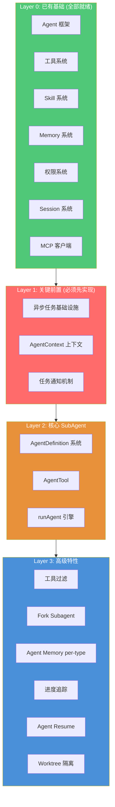

# SubAgent 实现前置条件分析

> 基于对 dscode 项目现状的全面审计，对照 Claude Code SubAgent 架构，梳理实现 SubAgent 所需的前置能力缺口。

---

## 一、项目现状盘点

### 1.1 已具备的能力（可直接复用）

| 模块 | 当前实现 | 复用价值 |
|------|----------|----------|
| **Agent 框架** | `@mariozechner/pi-agent-core` 提供的 `Agent` 类 | ✅ SubAgent 运行时的基础 Agent 实例 |
| **Tool 系统** | `AgentTool` 类型 + `Driver` 分组 + `DriverRegistry` | ✅ AgentTool 可作为 Driver 注册到 Registry |
| **Tool 延迟发现** | `ToolRegistry.search()` + `search_tools` 工具 | ✅ 子代理可复用同样的工具发现机制 |
| **Skill 系统** | `SkillManager`：SKILL.md 加载、工具白名单、激活/停用 | ✅ 概念类似 AgentDefinition，可扩展复用 |
| **Memory 系统** | `MemoryManager`：global/project 作用域 | ⚠️ 需扩展为支持 per-agent-type 作用域 |
| **Permission 系统** | `PermissionManager`：allow/deny/ask 规则引擎 | ✅ 子代理可共用权限框架 |
| **Session 系统** | `SessionManager`：保存/加载对话 | ⚠️ 需扩展支持子代理转录 |
| **MCP 客户端** | `MCPManager`：连接 MCP Server、注册 Driver | ✅ 子代理可使用父代理的 MCP 连接 |
| **上下文压缩** | `ContextManager`：drop-oldest/sliding-window | ✅ 子代理可独立使用压缩策略 |
| **基础工具集** | read_file、write_file、list_files、bash、grep、glob | ✅ 子代理可直接使用 |

### 1.2 核心依赖库分析

```
@mariozechner/pi-agent-core (^0.70.2)
  ├── Agent 类：构造和运行 agent
  ├── AgentTool 类型：工具定义 Schema
  └── buildTool() 工厂函数

@mariozechner/pi-ai (^0.70.2)  
  ├── getModel()：获取模型实例
  ├── streamSimple()：流式调用 LLM
  └── Type.*：参数类型系统
```

---

## 二、前置条件分层

整个 SubAgent 系统依赖一个清晰的**前置条件依赖图**。按实现顺序分为 4 层：



---

## 三、Layer 1：关键前置条件（必须先实现）

这是实现 SubAgent 的**硬性门槛**，缺少任何一个都无法让子代理运行。

### 3.1 异步任务基础设施

**现状**：当前 `Harness.initialize()` 中的 Agent 是单实例同步运行的。子代理退出（`yield`/`return`）后父代理继续。没有管理后台任务的能力。

**需要实现**：

| 子能力 | 说明 | 复杂度 |
|--------|------|--------|
| `Task Registry` | 注册/查询/终止后台任务的中心注册表，存入 `AppState` | 中 |
| `AbortController 管理` | 每个子代理有独立的 AbortController，支持父代理取消 | 低 |
| `void 闭包执行` | 后台任务在 detached Promise 中运行，不阻塞主循环 | 低 |
| `任务状态机` | pending → running → completed/failed/killed | 中 |
| `foreground → background 转换` | 同步代理可被自动转为后台运行（Promise.race 竞态） | 高 |
| `LocalAgentTaskState` | 任务数据模型：agentId、prompt、progress、result、messages | 中 |

**依赖链**：无外部依赖，可独立实现。

**Claude Code 参考**：`src/tasks/LocalAgentTask/LocalAgentTask.tsx`

---

### 3.2 AgentContext 上下文系统

**现状**：没有并发安全的 Agent 身份追踪。当多个子代理并发运行时，无法区分日志/分析事件归属。

**需要实现**：

| 子能力 | 说明 | 复杂度 |
|--------|------|--------|
| `AsyncLocalStorage 封装` | `agentContextStorage` 实例 + `runWithAgentContext()` | 低 |
| `SubagentContext 类型` | agentId、parentSessionId、subagentName、isBuiltIn、invokingRequestId | 低 |
| `getAgentContext()` | 获取当前代理上下文，不在代理中时返回 undefined | 低 |
| `getSubagentLogName()` | 返回用于日志/分析的代理名称 | 低 |
| `consumeInvokingRequestId()` | 一次性消费 request ID（每次调用仅首次返回） | 低 |

**依赖链**：无外部依赖，可独立实现。

**Claude Code 参考**：`src/utils/agentContext.ts`

**关键原因**：这是并发安全的基础。没有它，多个并发子代理的日志会互相污染。Node.js 的 `AsyncLocalStorage` 是内置模块，无额外依赖。

---

### 3.3 任务通知机制

**现状**：Agent 之间没有通信机制。主 Agent 无法获知后台子代理何时完成。

**需要实现**：

| 子能力 | 说明 | 复杂度 |
|--------|------|--------|
| `Message Queue` | 存储待投递的通知消息队列 | 中 |
| `enqueueAgentNotification()` | 格式化 task-notification XML 并推入队列 | 中 |
| `通知注入` | 在下个主 Agent 轮次的 messages 中注入通知 | 中 |
| `XML 通知格式` | `<task-notification>` 统一协议：status、output、usage、worktree 路径 | 低 |
| `输出文件机制` | `getTaskOutputPath(taskId)` 提供可轮询的输出文件 | 低 |

**XML 通知格式**：
```xml
<task-notification>
  <task-id>agent-abc123</task-id>
  <status>completed</status>
  <description>重构 utils 目录</description>
  <output>子代理最终响应文本</output>
  <usage>
    <tokens>15420</tokens>
    <tool-uses>38</tool-uses>
    <duration-ms>45000</duration-ms>
  </usage>
</task-notification>
```

**依赖链**：依赖 3.1 的 Task Registry（需要 taskId）。

**Claude Code 参考**：`src/tasks/LocalAgentTask/LocalAgentTask.tsx`（`enqueueAgentNotification` 函数）

---

## 四、Layer 2：核心 SubAgent（前置条件就绪后实现）

### 4.1 AgentDefinition 系统

**需要实现**：

| 子能力 | 说明 | 复杂度 |
|--------|------|--------|
| `AgentDefinition 类型` | BaseAgentDefinition + BuiltInAgentDefinition + CustomAgentDefinition | 中 |
| `内置代理定义` | general-purpose、Explore、Plan 三个内置代理 | 低 |
| `自定义代理加载` | 从 `.dscode/agents/*.md` 加载 Markdown 格式代理 | 中 |
| `Zod/TypeBox Schema 校验` | 验证代理定义的必要字段 | 低 |
| `代理筛选` | 按权限规则、MCP 依赖筛选可用代理列表 | 中 |

**依赖链**：无外部依赖，可独立实现（但需 3.2 的 AgentContext 来追踪代理类型）。

**⚠️ 提示**：dscode 已有的 `SkillManager` + `SkillManifest` 概念与 `AgentDefinition` 高度相似。Skill 有 `name`、`description`、`tools`（白名单）、`instructions`、`source`。AgentDefinition 在此基础上增加：
- `getSystemPrompt()` 函数（Skill 是静态 `instructions` 字符串）
- `model` 覆写
- `permissionMode`
- `maxTurns`
- `memory` 作用域
- `background`/`isolation` 配置

**可考虑**：AgentDefinition 作为 Skills 的超集设计，一个 Skill 可以通过简单包装变成 Agent。

---

### 4.2 AgentTool

**需要实现**：

| 子能力 | 说明 | 复杂度 |
|--------|------|--------|
| `inputSchema` | TypeBox Schema 定义：description、prompt、subagent_type、model、run_in_background | 低 |
| `outputSchema` | 联合类型：同步返回 completed，异步返回 async_launched | 低 |
| `prompt()` | 生成 AgentTool 的工具描述（含可用代理列表） | 中 |
| `call()` | 主逻辑：参数解析、代理筛选、模式分发（sync/async/fork） | 高 |
| `代理过滤` | `filterDeniedAgents()` 按权限规则过滤 | 中 |
| `MCP 依赖检查` | `hasRequiredMcpServers()` 校验 | 低 |

**依赖链**：
- 依赖 4.1（AgentDefinition 系统）
- 依赖 3.1（异步任务注册/终止）
- 依赖 3.3（任务通知，异步模式需要）

---

### 4.3 runAgent 引擎

**需要实现**：

| 子能力 | 说明 | 复杂度 |
|--------|------|--------|
| `runAgent()` AsyncGenerator | 接受 AgentDefinition、promptMessages、toolUseContext，产出 Message 流 | 高 |
| `系统提示构建` | `agent.getSystemPrompt()` + `enhanceSystemPromptWithEnvDetails()` + 记忆注入 | 中 |
| `上下文隔离` | 独立的 readFileState 缓存、独立的 userContext/systemContext | 中 |
| `Agent MCP 初始化` | 连接代理专属 MCP Server，合并父代理 MCP 连接 | 中 |
| `查询循环` | 基于 `streamSimple()` 的循环，支持 maxTurns 截断 | 中 |
| `侧链转录` | 记录子代理完整对话到独立文件 `subagents/<agentId>.jsonl` | 中 |
| `AbortController 集成` | 支持中断和清理 | 低 |

**依赖链**：
- 依赖 3.1（异步任务基础设施，registerAsyncAgent + AbortController）
- 依赖 3.2（AgentContext：执行时设置上下文）
- 依赖 4.1（AgentDefinition：获取系统提示和配置）

**关键注意点**：dscode 使用 `@mariozechner/pi-agent-core` 的 `Agent` 类，而非 Claude Code 的自研 `query()` 函数。`runAgent()` 需要创建一个**新的 Agent 实例**（而非复用主 Agent），并在其中运行查询循环。这与 Claude Code 的做法不同——Claude Code 是直接调用 `query()` API，而 dscode 需要通过 `Agent` 类的 `streamFn` 回调来实现。

---

## 五、Layer 3：高级特性（可在核心 SubAgent 之后迭代）

### 5.1 工具过滤系统
- 定义 `ALL_AGENT_DISALLOWED_TOOLS`（防止递归 Agent 调用）
- 定义 `ASYNC_AGENT_ALLOWED_TOOLS`（异步代理仅允许非交互式工具）
- 实现 `filterToolsForAgent()` 多层过滤
- 依赖：Layer 2 完成后

### 5.2 Fork Subagent
- `buildForkedMessages()` 消息构建
- Prompt Cache 共享策略
- 递归 Fork 防护
- 依赖：Layer 2 完成后

### 5.3 Agent Memory per Agent Type
- 扩展 `MemoryManager` 支持 `agent-memory/<agentType>/MEMORY.md`
- 依赖：4.1 AgentDefinition 系统

### 5.4 进度追踪
- `ProgressTracker`：工具调用计数、Token 统计
- `updateAsyncAgentProgress()` 状态更新
- 依赖：3.1 异步任务基础设施

### 5.5 Agent Resume
- `resumeAgentBackground()` 从侧链转录恢复
- 状态重建（文件缓存、内容替换、Worktree）
- 依赖：4.3 runAgent + 侧链转录

### 5.6 Worktree 隔离
- `createAgentWorktree()` + 变更检测 + 清理
- 依赖：4.3 runAgent（需要在 runAgent 中集成 cwd 覆写）

---

## 六、实现关键路径

按最短可验证路径（MVP），建议分 3 个里程碑：

```
里程碑 1: 同步子代理 MVP (4-6 周)
├── 3.1 异步任务基础设施 (1 周)
├── 3.2 AgentContext 上下文 (0.5 周)
├── 3.3 任务通知机制 (1 周)
├── 4.1 AgentDefinition 系统 (1 周)
├── 4.2 AgentTool (1.5 周)
└── 4.3 runAgent 引擎 (同步模式) (1.5 周)

里程碑 2: 异步子代理 (2-3 周)
├── 完善 4.3 runAgent 异步模式
├── 5.4 进度追踪
├── 5.1 工具过滤
└── 5.6 Worktree 隔离

里程碑 3: 高级特性 (3-4 周)
├── 5.2 Fork Subagent
├── 5.3 Agent Memory per-type
└── 5.5 Agent Resume
```

---

## 七、与 Claude Code 的关键架构差异

| 维度 | Claude Code | dscode | 对 SubAgent 的影响 |
|------|------------|--------|--------------------|
| **Agent 运行时** | 自研 `query()` 函数 + `runAgent` AsyncGenerator | `pi-agent-core` 的 `Agent` 类 | `runAgent()` 需要通过创建新 Agent 实例而非调用 `query()` |
| **工具系统** | 自研 `Tool` 类型 + `buildTool()` | `AgentTool` 类型（pi-agent-core） | 需确保 AgentTool 与其他工具类型兼容 |
| **提示缓存** | Anthropic 专用 Prompt Cache | DeepSeek API（无公开 Prompt Cache） | **Fork Subagent 的 Cache 共享策略可能不适用** |
| **平台特性** | macOS/Linux，有 tmux 支持 | 跨平台 Node.js | 不需要 tmux 群组模式 |
| **进程模型** | 支持 tmux 多进程 | Node.js 单进程 + AsyncLocalStorage | 必须依赖 AsyncLocalStorage 实现并发安全 |

### ⚠️ 关键风险：Fork Subagent 在 DeepSeek 上的适配

Claude Code 的 Fork Subagent 核心价值在于**利用 Anthropic 的 Prompt Cache** 实现多个 Fork 子代理共享 API 请求前缀以降低成本。DeepSeek API 的缓存机制不同，需要评估：

1. DeepSeek 是否支持 Prompt Cache？如果不支持，Fork 模式的核心优势（成本降低）不成立
2. 如果只保留 Fork 的"继承上下文"语义（不含缓存优化），其价值降低为普通的"无 subagent_type 的默认代理"
3. **建议**：MVP 阶段跳过 Fork Subagent，在里程碑 3 中评估 DeepSeek API 的缓存能力后再决定

---

## 八、总结

| 层级 | 前置条件数 | 必须/可选 | 实现难度 |
|------|-----------|-----------|----------|
| Layer 1 | 3 个 | **必须** | 2-3 周 |
| Layer 2 | 3 个 | **必须** | 3-4 周 |
| Layer 3 | 6 个 | 可选（迭代） | 3-4 周 |

**核心结论**：dscode 已具备 SubAgent 所需的基础设施（Agent 框架、工具系统、权限系统、MCP），但缺少 3 个关键前置能力：**异步任务管理**、**Agent 上下文追踪**、**任务通知机制**。这三个能力是实现任何形式的子代理（无论同步还是异步）的先决条件，应优先实现。
