# SubAgent 技术方案详解

> 基于 Claude Code 源码逆向分析，深入解析 SubAgent 的架构设计、执行模式、系统提示适配及操作系统进程模型

---

## 目录

1. [概述：什么是 SubAgent](#1-概述什么是-subagent)
2. [核心架构](#2-核心架构)
3. [SubAgent 的类型体系](#3-subagent-的类型体系)
4. [三种执行模式详解](#4-三种执行模式详解)
5. [系统提示词的适配策略](#5-系统提示词的适配策略)
6. [与操作系统进程的关系](#6-与操作系统进程的关系)
7. [工具过滤与安全模型](#7-工具过滤与安全模型)
8. [Agent Memory 持久化记忆](#8-agent-memory-持久化记忆)
9. [进度追踪与通知机制](#9-进度追踪与通知机制)
10. [Agent Context：并发安全的身份追踪](#10-agent-context并发安全的身份追踪)
11. [文件系统隔离：Worktree 机制](#11-文件系统隔离worktree-机制)
12. [中断恢复机制](#12-中断恢复机制)
13. [实现路线图](#13-实现路线图)

---

## 1. 概述：什么是 SubAgent

SubAgent（子代理）是 AI 编程助手中的一项核心架构能力，允许**主 Agent 将复杂任务委派给专业化子代理执行**。子代理拥有独立的系统提示、工具权限、执行上下文，可以与主 Agent 并行运行。

### 1.1 为什么需要 SubAgent

| 痛点 | 单 Agent 模式 | SubAgent 模式 |
|------|--------------|---------------|
| **上下文膨胀** | 所有工具调用结果占据主上下文，导致后续对话质量下降 | 子代理独立上下文，结果仅返回摘要 |
| **任务耦合** | 所有操作串行执行 | 多个子代理可并行执行独立子任务 |
| **专业化不足** | 单一系统提示难以覆盖所有场景 | 每种子代理有定制化的系统提示和工具集 |
| **缓存浪费** | 每次任务切换重建上下文 | Fork 模式共享 Prompt Cache，大幅降低成本 |

### 1.2 适用场景

```
┌─────────────────────────────────────────────────────────────┐
│                    SubAgent 适用场景                          │
├─────────────────┬─────────────────┬─────────────────────────┤
│   🔍 代码搜索    │   📋 任务规划    │   🔎 代码审查             │
│  (Explore)      │  (Plan)         │  (code-reviewer)        │
│  大规模代码库搜索 │  生成执行计划    │  独立审查 PR/代码变更     │
│  多文件模式匹配  │  任务分解与排序   │  安全漏洞检测            │
├─────────────────┼─────────────────┼─────────────────────────┤
│   🧪 测试运行    │   🔄 大规模重构   │   📊 审计分析             │
│  (test-runner)  │  (general)      │  (fork)                 │
│  自动运行测试套件│  跨文件代码重构   │  分支状态审计            │
│  生成覆盖率报告  │  批量文件修改    │  依赖分析                │
└─────────────────┴─────────────────┴─────────────────────────┘
```

**典型对话模式**：

```
用户: "帮我审查 PR #342 的安全问题，同时探索一下认证模块的代码结构"

主 Agent:
  ├─→ Agent(code-reviewer): "审查 PR #342 的 diff，重点检查 SQL 注入和 XSS"
  │   └─ 返回：发现 2 处潜在 SQL 注入，1 处缺少输入校验
  │
  └─→ Agent(Explore): "探索 /src/auth 目录，梳理认证流程和关键文件"
      └─ 返回：认证流程涉及 5 个核心文件，JWT + OAuth2 混合方案

主 Agent: (整合两个子代理的结果，生成综合报告)
```

---

## 2. 核心架构

### 2.1 整体架构图

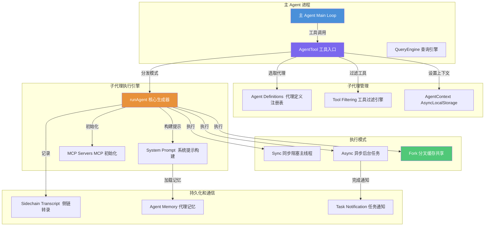

### 2.2 AgentTool 作为统一入口

SubAgent 的调用通过 `AgentTool`（别名 `Task`）实现，与其他工具（Bash、Read、Write）处于**同一抽象层次**。这意味着：

- 模型无需学习新的调用协议
- 现有的工具过滤、权限校验基础设施直接复用
- prompt 生成时可统一管理代理列表

```typescript
// AgentTool 的输入 Schema（简化）
Agent({
  description: "搜索认证代码",       // 3-5 词简述
  prompt: "找出所有认证相关的...",    // 详细任务指令
  subagent_type: "Explore",         // 可选：指定代理类型
  model: "haiku",                   // 可选：模型覆写
  run_in_background: true,          // 可选：后台执行
  isolation: "worktree"             // 可选：隔离模式
})
```

---

## 3. SubAgent 的类型体系

### 3.1 三层来源架构

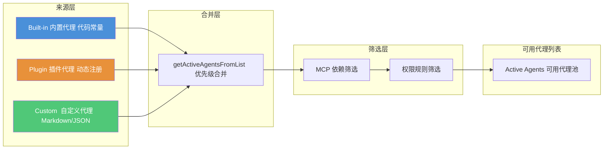

### 3.2 AgentDefinition 完整结构

```typescript
// 代理定义的核心数据结构
type AgentDefinition = {
  // ============ 必填字段 ============
  agentType: string                    // 唯一类型名："Explore"、"code-reviewer"
  whenToUse: string                    // 使用场景描述（注入到 AgentTool prompt）
  source: 'built-in' | 'plugin' | SettingSource  // 来源标识
  getSystemPrompt: (params) => string  // 返回系统提示的函数

  // ============ 工具控制 ============
  tools?: string[]                     // 工具白名单，["*"] = 全可用
  disallowedTools?: string[]           // 工具黑名单
  skills?: string[]                    // 预加载技能

  // ============ 行为控制 ============
  model?: string                       // 模型别名或 "inherit"
  permissionMode?: PermissionMode      // 权限模式：'default' | 'acceptEdits' | 'plan' | 'bypass'
  maxTurns?: number                    // 最大对话轮次
  effort?: EffortValue                 // 努力程度

  // ============ 高级特性 ============
  mcpServers?: AgentMcpServerSpec[]    // 代理专属 MCP 服务器
  hooks?: HooksSettings                // 会话级钩子
  color?: AgentColorName               // UI 显示颜色
  memory?: 'user' | 'project' | 'local'  // 持久化记忆作用域
  background?: boolean                 // 是否始终后台运行
  isolation?: 'worktree'               // 文件系统隔离
  initialPrompt?: string               // 首个用户轮次前插入的提示
  requiredMcpServers?: string[]        // MCP 服务器依赖（不满足则代理不可用）
  omitClaudeMd?: boolean               // 是否省略 CLAUDE.md 上下文
}
```

### 3.3 内置代理一览

| 代理类型 | 用途 | 工具权限 | 默认模型 | 特殊标记 |
|----------|------|----------|----------|----------|
| `general-purpose` | 通用研究、代码搜索、多步骤任务 | `["*"]` 全部工具 | 继承父代理 | — |
| `Explore` | 只读文件搜索专家 | 禁止 Write/Edit/NotebookEdit | haiku (外部) / inherit (内部) | `omitClaudeMd: true` |
| `Plan` | 结构化规划代理 | 只读 + TodoWrite | 继承父代理 | `omitClaudeMd: true` |

**Explore 代理的系统提示摘要**：

```
你是 Claude Code 的文件搜索专家。你擅长彻底导航和探索代码库。

=== 关键：只读模式 - 禁止文件修改 ===
严格禁止：
- 创建新文件
- 修改现有文件
- 删除文件
- 使用重定向运算符写入文件

你的优势：
- 使用 Glob 进行广泛的文件模式匹配
- 使用 Grep 进行强大的正则搜索
- 读取和分析文件内容

准则：
- 高效使用工具：同时对多个文件进行 grep 和读取（并行调用）
- 根据调用者指定的详尽程度调整搜索方法
- 将最终报告作为常规消息直接传达——不要试图创建文件
```

---

## 4. 三种执行模式详解

### 4.1 模式决策树

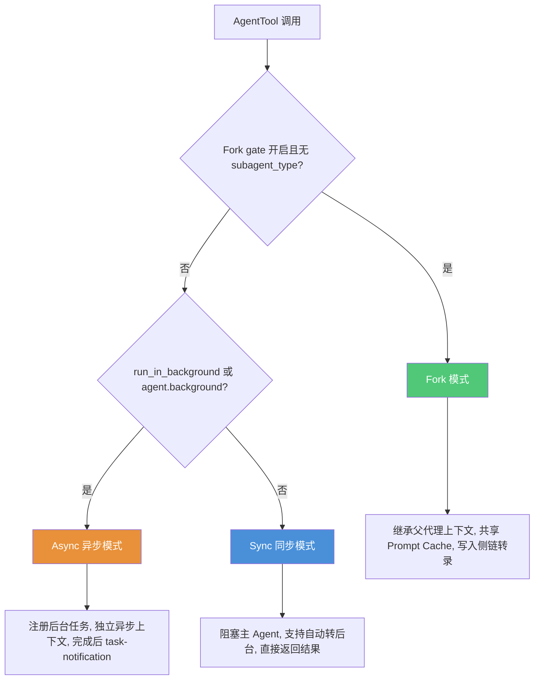

### 4.2 Sync 同步模式

**适用场景**：快速子任务（如 Explore 搜索），结果直接用于当前对话流。

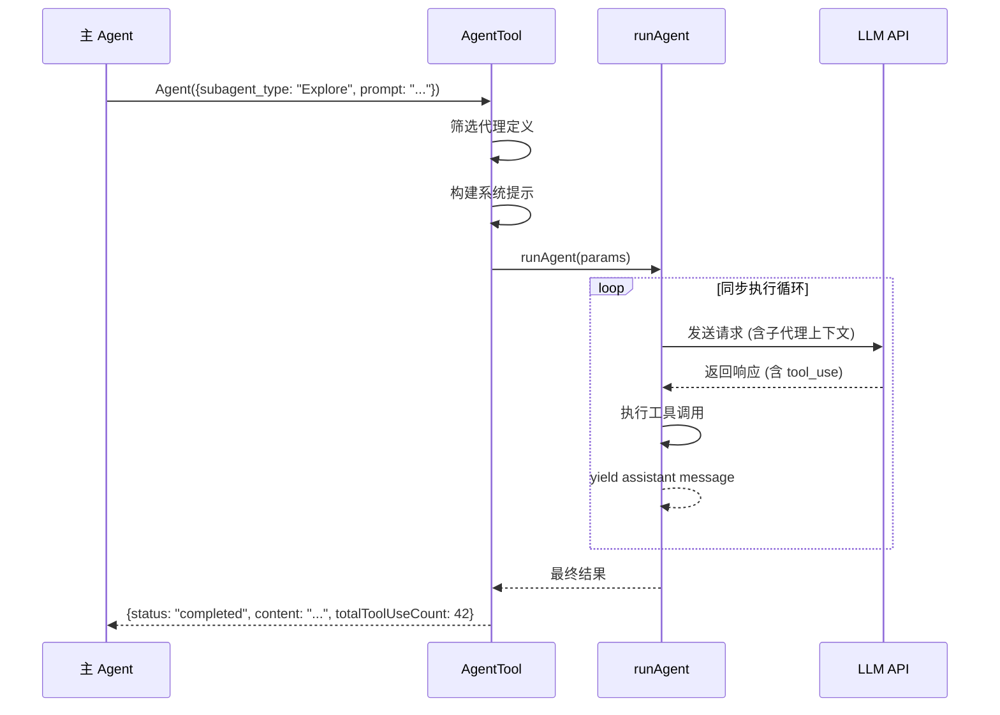

**关键实现细节**：

```typescript
// Sync 模式的核心执行循环
const agentIterator = runAgent({...runAgentParams})[Symbol.asyncIterator]();

while (true) {
  // 竞态：消息 vs 后台化信号
  const raceResult = await Promise.race([
    agentIterator.next().then(r => ({ type: 'message', result: r })),
    backgroundPromise  // 自动后台化信号
  ]);

  if (raceResult.type === 'background') {
    // 被后台化：清理前台迭代器，启动新的后台 runAgent
    await agentIterator.return(undefined);
    void runAgent({...params, isAsync: true});  // 继续在后台运行
    return { status: 'async_launched', ... };
  }

  if (raceResult.result.done) break;
  agentMessages.push(raceResult.result.value);
}
```

### 4.3 Async 异步/后台模式

**适用场景**：长任务（大规模重构、完整测试套件），不阻塞主流程。

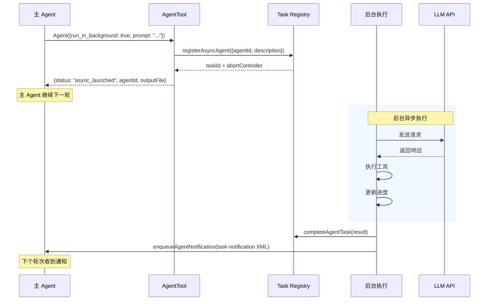

**后台通知格式**：

```xml
<task-notification>
  <task-id>agent-abc123</task-id>
  <status>completed</status>
  <description>重构 utils 目录</description>
  <output>
    Scope: utils 目录重构
    Result: 已将 12 个工具函数按职能拆分到 3 个子模块
    Key files: src/utils/string.ts, src/utils/date.ts, src/utils/http.ts
    Files changed:
      - src/utils/string.ts (新建, commit: a1b2c3d)
      - src/utils/date.ts (新建, commit: a1b2c3d)
      - src/utils/http.ts (新建, commit: a1b2c3d)
      - src/utils/index.ts (修改, commit: a1b2c3d)
    Issues: 无
  </output>
  <usage>
    <tokens>15420</tokens>
    <tool-uses>38</tool-uses>
    <duration-ms>45000</duration-ms>
  </usage>
  <worktree-path>.claude/worktrees/agent-abc12345/</worktree-path>
</task-notification>
```

### 4.4 Fork 分叉模式

**适用场景**：需要并行执行多个独立分析任务，且希望最大化 Prompt Cache 命中率。

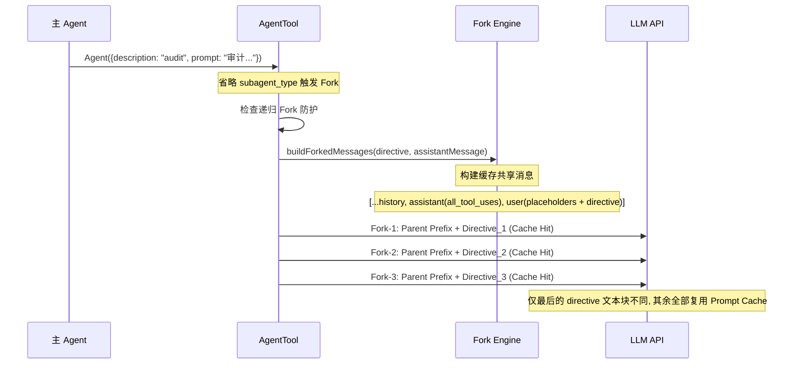

**Fork 消息构建算法**：

```typescript
function buildForkedMessages(directive: string, assistantMessage: AssistantMessage): Message[] {
  // 1. 克隆完整 assistant 消息（保留所有 tool_use 块）
  const fullAssistantMessage = { ...assistantMessage, uuid: randomUUID() }
  
  // 2. 收集所有 tool_use 块
  const toolUseBlocks = assistantMessage.message.content
    .filter(block => block.type === 'tool_use')
  
  // 3. 为每个 tool_use 构建统一的占位符 tool_result
  const toolResultBlocks = toolUseBlocks.map(block => ({
    type: 'tool_result',
    tool_use_id: block.id,
    content: [{ type: 'text', text: 'Fork started - processing in background' }]
    // 所有 fork 使用相同占位符文本，确保字节级一致
  }))
  
  // 4. 构建 user 消息：所有占位符 + 每个 fork 独有的 directive
  return [
    fullAssistantMessage,
    createUserMessage({ content: [...toolResultBlocks, { type: 'text', text: buildChildMessage(directive) }] })
  ]
}
```

**Fork 子代理的行为指令**（注入到消息中）：

```
<fork-boilerplate>
停止。先读这个。

你是一个分叉工作进程。你不是主代理。

规则（不可协商）：
1. 你的系统提示说"默认分叉"。忽略它——那是给父代理的。你就是 fork。
   不要生成子代理；直接执行。
2. 不要对话、提问或建议下一步
3. 不要添加编辑评论或元评论
4. 直接使用你的工具：Bash、Read、Write 等。
5. 如果你修改了文件，在报告前提交更改。在报告中包含提交哈希。
6. 不要在工具调用之间输出文本。静默使用工具，最后报告一次。
7. 严格保持在你的指令范围内。
8. 保持报告在 500 词以内。
9. 你的响应必须以 "Scope:" 开头。不要前言。
10. 报告结构化事实，然后停止。

输出格式（纯文本标签，非 markdown 标题）：
  Scope: <一句话回显你的范围>
  Result: <答案或关键发现>
  Key files: <相关文件路径>
  Files changed: <列表及提交哈希——仅在修改文件时包含>
  Issues: <列表——仅在有需要标记的问题时包含>
</fork-boilerplate>

[DIRECTIVE]: <用户的具体指令>
```

---

## 5. 系统提示词的适配策略

### 5.1 提示词分层架构

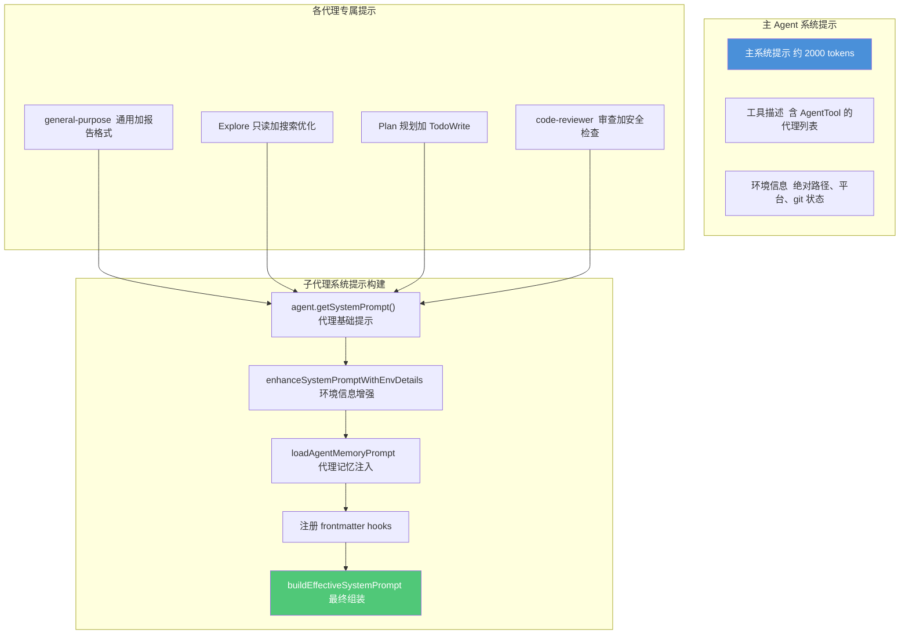

### 5.2 主 Agent 提示词适配

在 AgentTool 的 `getPrompt()` 中，代理列表可以**内联到工具描述**或通过 **agent_listing_delta attachment 消息**动态注入。

```
# 方式一：内联到 AgentTool 描述（默认）
Available agent types and the tools they have access to:
- general-purpose: 通用研究代理... (Tools: All tools)
- Explore: 快速代码库探索... (Tools: Read, Glob, Grep, Bash(readonly))
- code-reviewer: 独立代码审查... (Tools: Read, Grep, Bash)

# 方式二：通过 attachment 消息注入（优化 Token 缓存）
# 代理列表作为 system-reminder 注入到对话中，使工具描述保持静态
# 这样 MCP/插件/权限变化时不会使工具 Schema 缓存失效
```

**Fork 模式下的特殊提示**（条件注入到 AgentTool prompt）：

```
## When to fork

在以下情况分叉自己（省略 subagent_type）：
- 中间工具输出不值得保留在上下文中
- 判断标准是定性的——"我以后还需要这个输出吗"——而不是任务大小

研究：派生开放式问题。如果研究可以分解为独立问题，在一条消息中并行 fork。
实现：需要超过几个编辑的实现工作优先 fork。在跳到实现之前先做研究。

Fork 是廉价的，因为它们共享你的 prompt cache。
不要在 fork 上设置 model——不同的模型无法重用父代理的缓存。
传递一个简短的 name（一个或两个词，小写）。

不要窥视。工具结果包含 output_file 路径——不要读取它。
不要竞速。启动后你对 fork 发现了什么一无所知。永远不要编造结果。
```

### 5.3 子代理提示词模板

**通用结构**：

```
你是 [代理名称]，[产品名称] 的官方 CLI 工具。
给定用户的消息，你应该使用可用的工具来完成任务。

[专业化能力描述]

[行为准则]

[工具使用指南]

[环境信息：绝对路径、平台等]

[代理记忆（如配置）]
```

**general-purpose 代理实际代码**：

```typescript
const SHARED_PREFIX = `You are an agent for Claude Code, Anthropic's official CLI for Claude. 
Given the user's message, you should use the tools available to complete the task. 
Complete the task fully-don't gold-plate, but don't leave it half-done.`

const SHARED_GUIDELINES = `Your strengths:
- Searching for code, configurations, and patterns across large codebases
- Analyzing multiple files to understand system architecture
- Investigating complex questions that require exploring many files
- Performing multi-step research tasks

Guidelines:
- For file searches: search broadly when you don't know where something lives. 
  Use Read when you know the specific file path.
- For analysis: Start broad and narrow down. Use multiple search strategies.
- Be thorough: Check multiple locations, consider different naming conventions.
- NEVER create files unless they're absolutely necessary.
- NEVER proactively create documentation files (*.md) or README files.`

// 最终组装
function getGeneralPurposeSystemPrompt(): string {
  return `${SHARED_PREFIX} When you complete the task, respond with a concise 
report covering what was done and any key findings - the caller will relay this 
to the user, so it only needs the essentials.\n\n${SHARED_GUIDELINES}`
}
```

---

## 6. 与操作系统进程的关系

### 6.1 进程模型全景图

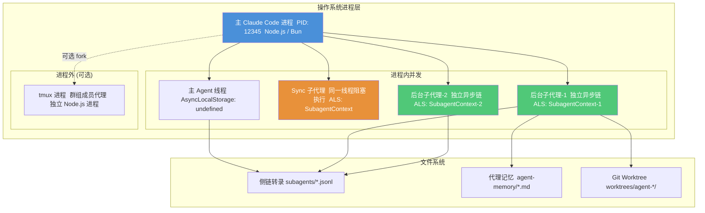

### 6.2 进程模型的三种形态

| 形态 | 进程数 | 线程模型 | 适用场景 | 通信方式 |
|------|--------|----------|----------|----------|
| **Sync 子代理** | 1 进程 | 父代理线程内阻塞执行 | 快速搜索、简单分析 | 直接返回结果 |
| **Async 子代理** | 1 进程 | 同一进程、独立异步链 | 长时间重构、测试运行 | task-notification + 输出文件 |
| **Tmux 群组成员** | N+1 进程 | 独立操作系统进程 | 多 Agent 协作群组 | tmux IPC + 文件系统 |

### 6.3 进程内并发的关键技术：AsyncLocalStorage

当多个后台子代理在**同一进程**中并发运行时，传统的全局状态（如 `AppState`）会被覆盖。

Node.js 的 `AsyncLocalStorage` 解决了这个问题：

```typescript
// 错误做法：全局状态（会被并发覆盖）
let globalAgentId: string | undefined;

// 正确做法：AsyncLocalStorage（并发安全）
const agentContextStorage = new AsyncLocalStorage<AgentContext>();

// 每个子代理在自己的异步上下文中运行
void runWithAgentContext(subagentContext1, async () => {
  // 这里的 getAgentContext() 返回 subagentContext1
  // 即使 subagentContext2 同时运行也不受影响
  await query("完成你的任务...");
});

void runWithAgentContext(subagentContext2, async () => {
  // 这里的 getAgentContext() 返回 subagentContext2
  await query("完成你的任务...");
});
```

```
时间线：
---------------------------------------------------------
进程 PID: 12345
|
|-- SubAgent-1 (AsyncLocalStorage store: Context-1)
|   |-- query() -> API call -> await...
|   |                              |-- SubAgent-2 (ALS store: Context-2)
|   |                              |   |-- query() -> API call -> await...
|   |                              |   |
|   |-- API response (Context-1 正确恢复)
|   |-- logEvent() -> subagentName: "Explore" OK
|   |                              |   |-- API response (Context-2 正确恢复)
|   |                              |   |-- logEvent() -> subagentName: "code-reviewer" OK
```

### 6.4 进程生命周期

```
子代理生命周期：

1. 创建阶段 (AgentTool.call)
   |-- 生成 agentId (UUID)
   |-- 创建 AgentContext (SubagentContext)
   |-- [可选] 创建 Git Worktree
   |-- 决定执行模式: Sync | Async | Fork

2. 执行阶段 (runAgent)
   |-- Sync:    阻塞主线程，逐条 yield 消息
   |-- Async:   注册 LocalAgentTask，在 void 闭包中运行
   |-- Fork:    构建缓存共享消息，异步执行

3. 完成阶段
   |-- Sync:    finalizeAgentTool() -> 返回结果
   |-- Async:   completeAgentTask() -> enqueueAgentNotification()
   |-- Fork:    同 Async

4. 清理阶段
   |-- 断开代理 MCP 连接
   |-- 清理 Session Hooks
   |-- [有变更] 保留 Worktree
   |-- [无变更] 删除 Worktree
   |-- 注销 Perfetto tracing
```

---

## 7. 工具过滤与安全模型

### 7.1 多层过滤架构

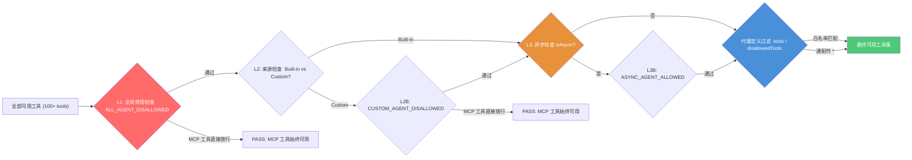

### 7.2 常量定义

```typescript
// 所有子代理都不可用的工具（递归防护 + 敏感操作）
const ALL_AGENT_DISALLOWED_TOOLS = new Set([
  'Task',           // 防止子代理再生成子代理（允许内置代理链式调用）
  'Agent',          // 同上
  'TaskOutput',     // 子代理不应读取其他任务的输出
  'EnterPlanMode',  // 子代理不应切换模式
  'ExitPlanMode',
  // ... 更多
])

// 自定义代理额外禁用的工具（安全检查）
const CUSTOM_AGENT_DISALLOWED_TOOLS = new Set([
  'Bash(security)',    // 安全管理命令
  'Bash(sudo *)',      // 提权操作
  // ... 更多
])

// 异步代理仅允许使用的工具（排除交互式工具）
const ASYNC_AGENT_ALLOWED_TOOLS = new Set([
  'Bash',         // 非交互式 Bash
  'Read',
  'Write',
  'Edit',
  'Glob',
  'Grep',
  'WebFetch',
  'WebSearch',
  'Task',          // 允许链式调用
  // ...
  // 注意：不包含 AskUserQuestion（异步代理不能交互）
])
```

### 7.3 权限模式

子代理可以有自己的权限模式（`permissionMode`），独立于父代理：

```typescript
// 代理定义的权限模式
type PermissionMode = 'default' | 'acceptEdits' | 'plan' | 'bypass'

// Fork 代理使用 "bubble" 模式
// 权限提示冒泡到父终端，由用户统一决策
const FORK_AGENT = {
  permissionMode: 'bubble',  // 特殊模式：权限提示发送到父代理终端
  // ...
}
```

---

## 8. Agent Memory 持久化记忆

### 8.1 三级作用域

```
~/.claude/
|-- agent-memory/                   <-- user 作用域（跨项目共享）
|   |-- code-reviewer/
|   |   |-- MEMORY.md               "总是检查 SQL 注入和 XSS 漏洞"
|   |-- test-runner/
|       |-- MEMORY.md               "优先使用 Jest，避免 Mocha"
|
<project>/.claude/
|-- agent-memory/                   <-- project 作用域（可版本控制）
|   |-- code-reviewer/
|       |-- MEMORY.md               "本项目使用 PostgreSQL，注意 JSONB 查询性能"
|
<project>/.claude/
|-- agent-memory-local/             <-- local 作用域（本地，不版本控制）
    |-- code-reviewer/
        |-- MEMORY.md               "开发机器上有 pre-commit hook，跳过格式检查"
```

### 8.2 记忆注入流程

```typescript
function loadAgentMemoryPrompt(agentType: string, scope: AgentMemoryScope): string {
  const scopeNote = {
    user:    '- 由于此记忆是用户作用域的，保持学习内容的通用性',
    project: '- 由于此记忆是项目作用域且通过版本控制与团队共享，针对此项目定制记忆',
    local:   '- 由于此记忆是本地作用域的（不纳入版本控制），针对此项目和机器定制记忆',
  }[scope]

  const memoryDir = getAgentMemoryDir(agentType, scope)
  void ensureMemoryDirExists(memoryDir)  // fire-and-forget 创建目录

  return buildMemoryPrompt({
    displayName: 'Persistent Agent Memory',
    memoryDir,
    extraGuidelines: [scopeNote],
  })
}
```

**注入到系统提示后的效果**：

```
## Persistent Agent Memory

Below are memories about your past interactions generated by the agent itself.
These are stored in .claude/agent-memory/code-reviewer/MEMORY.md

- 由于此记忆是项目作用域且通过版本控制与团队共享，针对此项目定制记忆

---

### MEMORY.md 内容

- 项目使用 PostgreSQL 14+，注意 JSONB 查询性能
- API 层需要校验所有用户输入的 JWT token
- 数据库迁移文件在 /migrations/ 目录，审查时需要检查回滚脚本
```

---

## 9. 进度追踪与通知机制

### 9.1 ProgressTracker 状态机

```typescript
type ProgressTracker = {
  toolUseCount: number                // 工具调用次数
  latestInputTokens: number           // 最新输入 Token（API 累积值）
  cumulativeOutputTokens: number      // 累积输出 Token
  recentActivities: ToolActivity[]    // 最近 5 个工具活动
}

type ToolActivity = {
  toolName: string                    // 工具名："Bash"、"Read"、"Write"
  input: Record<string, unknown>      // 工具输入参数
  activityDescription?: string        // 人类可读描述："Reading src/auth.ts"
  isSearch?: boolean                  // 是否为搜索操作
  isRead?: boolean                    // 是否为读取操作
}
```

### 9.2 通知流程

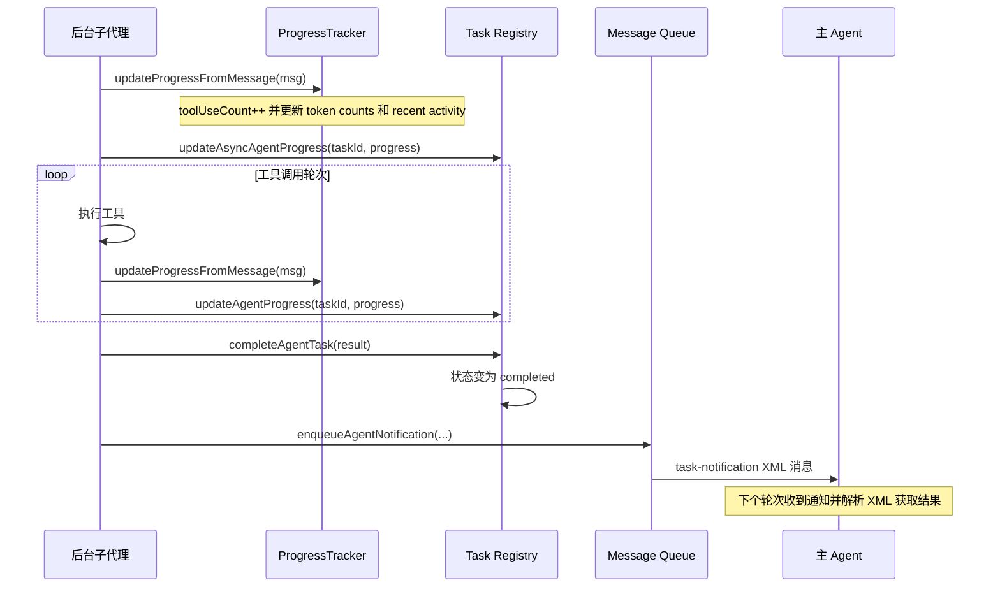

---

## 10. Agent Context：并发安全的身份追踪

### 10.1 上下文类型系统

```typescript
// ============ 子代理上下文（Agent Tool） ============
type SubagentContext = {
  agentId: string              // UUID
  parentSessionId?: string     // 父会话 ID（主 REPL 的 undefined）
  agentType: 'subagent'        // 固定值
  subagentName?: string        // "Explore"、"general-purpose"、"code-reviewer"
  isBuiltIn?: boolean          // 是否内置代理
  invokingRequestId?: string   // 触发调用的 API request_id
  invocationKind?: 'spawn' | 'resume'
  invocationEmitted?: boolean  // 本次调用的分析事件是否已发射
}

// ============ 群组成员上下文（Swarms） ============
type TeammateAgentContext = {
  agentId: string              // "researcher@my-team"
  agentName: string            // "researcher"
  teamName: string             // "my-team"
  agentColor?: string          // UI 颜色
  planModeRequired: boolean    // 是否需要先进入计划模式
  parentSessionId: string
  isTeamLead: boolean
  agentType: 'teammate'
  invokingRequestId?: string
  invocationKind?: 'spawn' | 'resume'
  invocationEmitted?: boolean
}

type AgentContext = SubagentContext | TeammateAgentContext
```

### 10.2 上下文生命周期

```
主 Agent 轮次:
  getAgentContext() -> undefined  (主线程无上下文)

AgentTool 调用 -> runWithAgentContext(ctx, fn):
  |-- 创建 SubagentContext
  |-- ALS.run(ctx, fn)            <-- AsyncLocalStorage 设置
  |   |-- query() -> API call
  |   |   |-- logEvent('tengu_api_success')
  |   |   |   |-- getSubagentLogName() -> "Explore"
  |   |   |   |-- consumeInvokingRequestId() -> {requestId, kind: "spawn"}
  |   |   |       (仅第一次调用返回，之后返回 undefined)
  |   |   |-- ...
  |   |-- ...
  |-- ALS 上下文自动恢复
```

---

## 11. 文件系统隔离：Worktree 机制

### 11.1 工作原理

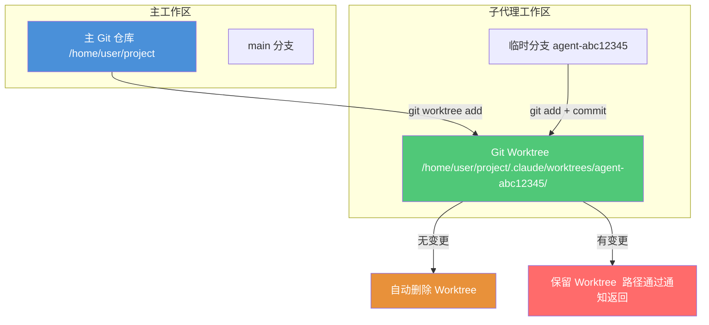

### 11.2 创建与清理

```typescript
async function createAgentWorktree(slug: string) {
  const worktreePath = join(getCwd(), '.claude', 'worktrees', slug)
  
  // 1. 创建临时分支
  await execFileNoThrow('git', ['branch', slug, 'HEAD'])
  
  // 2. 创建 worktree
  await execFileNoThrow('git', ['worktree', 'add', worktreePath, slug])
  
  return { worktreePath, worktreeBranch: slug, headCommit: getHeadCommit() }
}

async function cleanupWorktreeIfNeeded(worktreeInfo) {
  // 检测是否有变更
  const changed = await hasWorktreeChanges(worktreePath, headCommit)
  
  if (!changed) {
    // 无变更：自动清理
    await removeAgentWorktree(worktreePath, worktreeBranch, gitRoot)
  } else {
    // 有变更：保留，通过 task-notification 返回路径
    logForDebugging(`Agent worktree has changes, keeping: ${worktreePath}`)
  }
}
```

---

## 12. 中断恢复机制

### 12.1 恢复流程

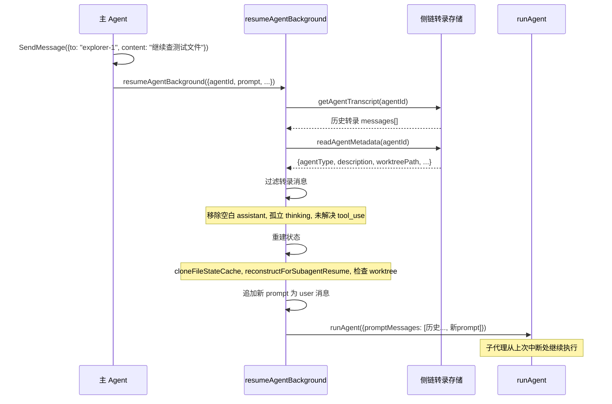

### 12.2 状态重建的关键操作

```typescript
// 1. 过滤历史消息
const resumedMessages = filterWhitespaceOnlyAssistantMessages(
  filterOrphanedThinkingOnlyMessages(
    filterUnresolvedToolUses(transcript.messages)
  )
)

// 2. 重建内容替换状态（确保相同 tool_result 被重新替换）
const resumedReplacementState = reconstructForSubagentResume(
  toolUseContext.contentReplacementState,
  resumedMessages,
  transcript.contentReplacements,
)

// 3. Worktree 恢复（检查是否仍存在）
const resumedWorktreePath = meta?.worktreePath
  ? await fsp.stat(meta.worktreePath).then(
      s => s.isDirectory() ? meta.worktreePath : undefined,
      () => undefined  // 已被外部删除，回退到父 cwd
    )
  : undefined

// 4. 若 worktree 仍存在，bump mtime 防止被清理
if (resumedWorktreePath) {
  await fsp.utimes(resumedWorktreePath, new Date(), new Date())
}
```

---

## 13. 实现路线图

### 阶段一：核心基础（第 1-3 周）

```
[ ] AgentDefinition 类型系统
  |-- BaseAgentDefinition
  |-- BuiltInAgentDefinition
  |-- CustomAgentDefinition
  |-- PluginAgentDefinition

[ ] 代理加载与校验
  |-- 内置代理：general-purpose、Explore、Plan
  |-- 自定义代理：Markdown/JSON 文件解析
  |-- Zod Schema 校验

[ ] AgentTool 工具壳
  |-- inputSchema / outputSchema
  |-- prompt() 代理列表生成
  |-- call() 主入口（参数解析、代理筛选）
```

### 阶段二：执行引擎（第 4-6 周）

```
[ ] runAgent() 核心生成器
  |-- 系统提示构建管线
  |-- MCP 服务器初始化
  |-- 查询循环
  |-- 侧链转录记录

[ ] Sync 执行模式
  |-- 同步执行循环
  |-- 自动后台化机制
  |-- finalizeAgentTool()

[ ] Async 执行模式
  |-- registerAsyncAgent()
  |-- runAsyncAgentLifecycle()
  |-- completeAgentTask() / enqueueAgentNotification()
```

### 阶段三：高级特性（第 7-9 周）

```
[ ] Fork Subagent
  |-- buildForkedMessages()
  |-- Prompt Cache 共享策略
  |-- 递归 Fork 防护

[ ] Agent Context
  |-- AsyncLocalStorage 封装
  |-- runWithAgentContext()
  |-- 分析事件归因

[ ] 工具过滤系统
  |-- filterToolsForAgent()
  |-- resolveAgentTools()
  |-- 通配符 + Agent(x,y) 语法

[ ] Agent Memory
  |-- 三级作用域路径解析
  |-- loadAgentMemoryPrompt()
  |-- 路径安全校验
```

### 阶段四：隔离与恢复（第 10-11 周）

```
[ ] Worktree 隔离
  |-- createAgentWorktree()
  |-- 变更检测与清理
  |-- Fork + Worktree 路径翻译

[ ] Agent Resume
  |-- resumeAgentBackground()
  |-- 转录过滤与状态重建
  |-- Fork 代理恢复
```

### 阶段五：集成与测试（第 12-13 周）

```
[ ] 工具池集成
  |-- assembleToolPool 集成
  |-- 缓存失效逻辑

[ ] 进度追踪
  |-- ProgressTracker
  |-- 活动描述解析
  |-- SDK 进度事件

[ ] 测试
  |-- 单元测试（AgentTool / runAgent / 过滤）
  |-- 集成测试（Sync / Async / Fork）
  |-- 端到端测试（真实场景）
```

---

## 附录：关键文件索引（Claude Code 源码参考）

| 文件 | 职责 |
|------|------|
| `src/tools/AgentTool/AgentTool.tsx` | AgentTool 工具定义、call() 主逻辑 |
| `src/tools/AgentTool/runAgent.ts` | 子代理执行引擎核心（AsyncGenerator） |
| `src/tools/AgentTool/agentToolUtils.ts` | 工具过滤、进度追踪、异步生命周期 |
| `src/tools/AgentTool/forkSubagent.ts` | Fork 子代理消息构建、递归防护 |
| `src/tools/AgentTool/loadAgentsDir.ts` | 代理定义加载、合并、校验 |
| `src/tools/AgentTool/prompt.ts` | AgentTool prompt 生成（含 Fork 指导） |
| `src/tools/AgentTool/builtInAgents.ts` | 内置代理注册 |
| `src/tools/AgentTool/built-in/generalPurposeAgent.ts` | 通用代理定义 |
| `src/tools/AgentTool/built-in/exploreAgent.ts` | Explore 代理（只读搜索专家） |
| `src/tools/AgentTool/agentMemory.ts` | 代理记忆路径解析与加载 |
| `src/tools/AgentTool/resumeAgent.ts` | 代理恢复入口 |
| `src/tools/AgentTool/constants.ts` | 常量定义（AGENT_TOOL_NAME 等） |
| `src/tasks/LocalAgentTask/LocalAgentTask.tsx` | 后台任务状态管理 |
| `src/utils/agentContext.ts` | AsyncLocalStorage 上下文封装 |
| `src/utils/forkedAgent.ts` | CacheSafeParams、fork 辅助函数 |
| `src/constants/tools.ts` | ALL_AGENT_DISALLOWED_TOOLS 等常量 |
