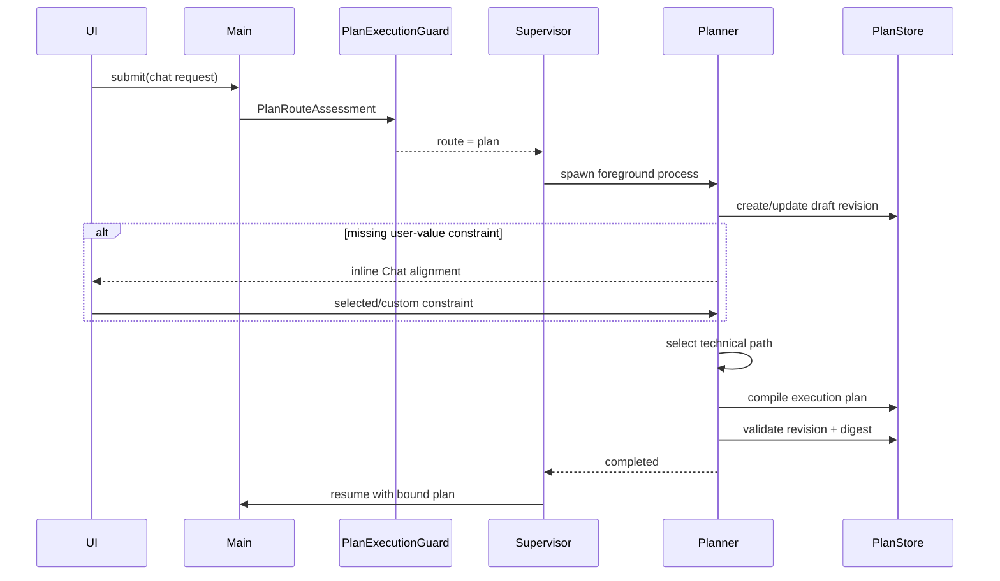

## Context

dscode 已具备实现 Plan Mode 的基础边界：

- Main Agent 已作为真实 `AgentProcess` 注册到 `AgentSupervisor`，Session 是交互 TTY，不是任务实体。
- `AgentApplication.permissionMode: "plan"` 已会剥离 `write_file`、`edit`、`overwrite_file`、`bash` 等副作用工具。
- Agent Process 已支持项目级 JSON 快照、原子替换、运行状态和 `agent:progress`。
- `HarnessEventBus`、`HarnessAPI`、WebSocket 和 Web/TUI adapters 已形成领域事件到呈现层的单向投影。
- 当前没有独立于 transcript 的计划真相源，也没有可恢复的候选路径决策、执行绑定或恢复协议。

Plan Mode 必须是运行时能力，不能依赖只服务于 dscode 开发流程的 OpenSpec `tasks.md`。它还必须避免暴露或持久化模型原始 Chain-of-Thought，只保存用户可理解、可审计的决策摘要。

## Goals / Non-Goals

**Goals:**

- 用户始终从 Chat 提交请求；简单任务直接执行，复杂任务由 Agent 自主进入内部规划。
- 以独立 Planner 进程隔离只读规划能力，保持 capability immutable。
- 使用 RAP-lite 的有界候选、评估、选择和回溯结构；技术路径由 Agent 自主选择，缺失的用户价值判断通过 Chat 对齐。
- 将 PlanRecord、AgentProcess、Session 和客观执行进度保持为不同领域对象。
- 对计划 revision 提供持久化、CAS 更新、digest 绑定、重连恢复和 replanning。
- 为 Web 与 TUI 提供同一 Chat 原生意图对齐交互。

**Non-Goals:**

- 不实现自动 MCTS、无限树搜索或独立 Evaluator Agent 群。
- 不保存私有推理过程，不把 Planner transcript 当作 PlanRecord。
- 不把 PlanItem 当作 Agent Process、SubAgent task 或后台 Job。
- 不以 SubAgent 完成事件自动完成 PlanItem。
- 不引入外部规划服务、数据库或新的前端组件库。
- 不在本 change 中实现跨设备共享、多人协同编辑或通用工作流编排。

## Decisions

### 1. 使用自主路由和首次副作用门禁

产品只有一个 Chat 提交路径。协议可以兼容历史 `planMode` 字段，但 Web/TUI 不展示模式选择。Main 可以先使用只读工具调查，但在首次调用 mutating tool 前必须提交结构化 `PlanRouteAssessment`。
- `PlanExecutionGuard` 在工具调度边界执行门禁。工具注册信息必须声明 `effect` 为 `read | workspace_write | process | network | external_write | unknown`；`unknown` 默认按副作用处理。没有有效 route decision 时拒绝副作用；决策为 `plan` 时不执行该工具，并把控制权交给 Planner；决策为 `direct` 时继续当前 Main 进程。
- route assessment 与 mutating tool 出现在同一模型 tool-call batch 时，只提交 assessment；mutation 必须等 Direct decision 写入当前 request execution context 后在后续模型回合重新发起，避免并行调度绕过门禁。

复杂度维度均为 `0..2`：意图不确定性、方案分歧、影响范围、操作风险、协调复杂度。其中意图不确定性 `2` 表示缺失的用户价值判断会实质改变可见结果，`1` 表示仍存在未消除的轻微意图歧义，`0` 仅表示用户已明确或由既有项目约束固定。类型惯例或看似合理的默认值不得代替用户价值判断。Host 使用确定性策略计算结果：意图不确定性非零，任一影响/风险/协调维度为 `2`，或总分不小于 `4` 时进入 Plan；其余请求直接执行。对于创建游戏、网页、应用、界面或其他用户可见产物的请求，若请求未明确视觉方向，Host 将意图不确定性下限设为 `1`，防止模型用类型惯例将其错误归零；明确视觉方向和修复既有产物不触发该下限。评估包含简短证据摘要，但不包含 Chain-of-Thought。

选择该方案是为了复用 Main 已获得的上下文，避免每次请求额外启动路由模型。仅靠 system prompt 不能形成副作用前的强约束；独立 Host LLM router 则会给所有简单任务增加固定成本。

### 2. Planner 是独立前台 Agent Process

新增内部 `planner` AgentApplication：

- 固定 `permissionMode: "plan"`，工具限于只读调查和计划领域操作。
- capability filtering 只允许 `effect: read` 和无副作用的 Plan domain operations；不能仅依赖工具名黑名单，MCP 和未来工具的 `unknown` effect 默认拒绝。
- 由 `AgentSupervisor` 创建，`parentAgentId` 指向 Main，并取得当前 TTY 的前台控制权。
- Planner 运行时 Main 进入 `waiting`；Planner 等待用户时也进入 `waiting`，但保留可恢复快照。
- Planner 不启动 Evaluator SubAgent。技术候选由 Planner 根据证据自主选择；只有缺失的用户价值判断通过 Chat 请求输入。
- Planner 完成已验证 revision 并取得内部执行绑定后退出；Supervisor 将前台控制权交还 Main。



该模型保持 Agent 即进程、Session 即 TTY。PlanRecord 是进程产生和消费的数据，不是新的进程类型，也不归 Session 所有。

### 3. PlanRecord 是独立、版本化的领域真相源

PlanStore 使用项目级原子 JSON 快照：

```text
~/.dscode/data/plans/by-project/<projectSlug>/<planId>.json
```

核心模型：

```ts
interface PlanRecord {
  planId: string
  projectKey: string
  sessionId: string
  mainAgentId: string
  plannerAgentId?: string
  request: { text: string; submittedAt: number }
  status: PlanStatus
  version: number
  revision: number
  baseRevision?: number
  digest: string
  goal: string
  constraints: PlanConstraint[]
  decisions: PlanDecisionNode[]
  items: PlanItem[]
  approval?: PlanApproval
  pendingInteraction?: PlanInteraction
  commandReceipts: PlanCommandReceipt[]
  trajectoryEvents: PlanTrajectoryEvent[]
  createdAt: number
  updatedAt: number
}
```

`PlanStatus` 为：

```text
drafting
awaiting_decision
awaiting_approval
approved
executing
needs_replan
completed
cancelled
failed
```

`version` 是每次持久化提交递增的 CAS 版本；`revision` 只在目标、约束、决策路径、执行项、验收条件或副作用摘要发生语义变化时递增，并重新计算 canonical digest。审批、执行状态和 evidence 更新只递增 `version`，因此不会让审批自行过期。

每次更新都携带 `expectedVersion`。PlanStore 使用按 `planId` 的进程内串行队列，并在跨进程写入前通过 exclusive-create lock file 取得短期写锁；持锁后重新读取 version、写入临时文件、fsync、rename 并 fsync 父目录，再释放锁。锁包含 owner PID 和创建时间，只有确认 owner 不存活且超过超时阈值时才能回收。冲突返回当前 snapshot，调用方必须重新投影，不能静默覆盖。

`trajectoryEvents` 只记录事实、候选摘要、选择、证据引用、回溯和状态迁移。模型原始思维文本、隐藏 prompt 和未筛选 transcript 不进入 PlanStore。

`pendingInteraction` 记录稳定 interactionId、kind、payload digest、目标 revision/digest、创建时间和 `pending | resolving` 状态。每个 mutation command 携带独立 commandId；已处理命令写入 `commandReceipts`，记录可选 interactionId、payload digest、结果、resultingVersion 和完成时间。同一 commandId 携带不同 payload 时必须拒绝；同一 interactionId 只能被一个成功 command 消费。active Plan 保留全部 receipts；进入终态并超过恢复 TTL 后，Plan 整体按统一 retention policy 归档或删除，而不是提前淘汰单条 receipt。

### 4. RAP-lite 使用有界分支和最少用户打断

每个 decision node 最多包含 3 个候选；每个 revision 最多包含 6 个 decision nodes。候选记录：

- 可执行摘要和受影响范围。
- 支持/反对证据引用。
- 风险、成本、可逆性和约束符合度。
- Planner 推荐及其公开理由。

只有候选差异影响用户可见结果且无法从上下文推断时才打断用户，例如：

- 视觉风格、产品范围或兼容承诺未明确。
- 成本或可逆性差异需要用户做价值判断。
- 用户提供的信息互相冲突，需要补充约束。

技术实现候选不因“存在多个方案”而打断用户。Planner 自动选择证据最充分且满足硬约束的路径，并可自主深入调查或回溯。Chat 对齐只提交选择或自定义约束；回溯会截断其后的未授权轨迹，并产生新 revision。

交互命令使用显式 action union：

```ts
type PlanDecisionAction =
  | { kind: "select"; decisionNodeId: string; optionId: string }
  | { kind: "investigate"; decisionNodeId: string; optionId?: string; question?: string }
  | { kind: "update_constraints"; constraints: PlanConstraintPatch[] }
  | { kind: "backtrack"; targetDecisionNodeId: string }
```

### 5. 内部执行授权绑定 revision 与 digest

内部 `PlanApproval` 作为执行绑定记录，至少包含 `revision`、`digest`、允许的副作用类别、授权时间和 policy source。它不是用户可见的整份计划审批。

- digest 由目标、约束、已选路径、PlanItem 定义、验收条件、effect grants 和副作用摘要的 canonical JSON 计算。
- PlanItem mutable status、evidence、execution binding、approval、telemetry、Agent progress 和非语义时间戳不进入 digest。
- 任一语义更新清除现有内部 authorization。
- Main 只接受状态为 `approved` 且 digest 重新计算一致的 PlanRecord。
- 内部 authorization 不是通用权限；执行时仍遵循现有 tool permission policy。
- authorization 提交只递增 store `version`；它记录并继续绑定授权前后均不变的 semantic `revision + digest`。

每个 PlanItem 都包含 `effectGrants`，由 effect 类别和 canonical resource scope 组成，例如 workspace path pattern、process command class、network origin 或 external resource identity。Main/SubAgent 的执行 binding 必须携带 planId、revision、digest 和 itemId。每次副作用工具调度先由 `PlanExecutionGuard` 验证当前 approval、item 状态、tool effect 和规范化后的实际资源范围，再进入普通 permission policy。超出已审批 effect 或 scope 的调用必须被阻止并触发 `needs_replan`；普通权限不得扩大 Plan approval。

### 6. PlanItem 与执行证据分离

`PlanItem.status` 为 `pending | in_progress | blocked | completed | skipped`。每项包含验收条件和可选 execution binding。

Agent 的 `agent:progress`、Tool 结果和 SubAgent exit 只追加为 evidence。PlanItem acceptance criteria 标记为 `command | observable | human`。只有绑定 Plan 的 Main Agent 可提交 `verify_item`；`human` criterion 还必须引用已消费的人类交互 receipt。PlanService 校验调用者、evidence references 和全部 criteria 后才能把 item 标记为 `completed`。SubAgent 无权直接验证自己的工作。


取消 `drafting`、等待态、`approved` 或 `needs_replan` 会立即终止 Planner/待执行请求；取消 `executing` 会先停止调度新 item，再按既有 abort/settle 语义处理 in-flight tools，随后进入 `cancelled`。取消后 Main 返回空闲并向用户报告未执行或已完成的范围，不继续原请求。`failed`、`completed` 和 `cancelled` 是终态；重试必须显式派生新 revision 或新 Plan。

`blocked` item 可在阻塞证据被解决后回到 `in_progress`；`skipped` 只能通过新的语义 revision 明确记录原因，不能由 Agent exit 自动产生。

### 7. Replanning 先冻结旧计划，再派生新 revision

当新证据使当前步骤不可行、违反硬约束或显著改变副作用范围时：

1. PlanService 将状态 CAS 为 `needs_replan`，停止调度新的 PlanItem。
2. 已开始的原子 Tool 调用按现有 abort/settle 语义结束；其结果只作为 evidence。
3. Supervisor 启动新的 Planner 进程，并以旧 revision 的公开轨迹和新证据作为上下文。
4. 新 revision 设置 `baseRevision`，清除旧内部 authorization。
5. Planner 重新选择并验证技术路径；只有缺失用户价值约束时才在 Chat 中对齐，随后 Main 从新 execution plan 继续。

### 8. PlanService、交互端口和事件总线分层

新增 `PlanService` 负责领域规则和持久化，HarnessAPI 只暴露稳定端口：

```ts
type PlanMutationResult =
  | { ok: true; plan: Readonly<PlanRecord>; receipt: PlanCommandReceipt }
  | { ok: false; reason: "conflict"; conflict: PlanConflict }
  | { ok: false; reason: "invalid_transition" | "invalid_command"; message: string; plan?: Readonly<PlanRecord> }

interface PlanPort {
  getActivePlan(sessionId: string): Promise<PlanRecord | undefined>
  submitDecision(command: PlanDecisionCommand): Promise<PlanMutationResult>
  approve(command: PlanApprovalCommand): Promise<PlanMutationResult>
  verifyItem(command: PlanItemVerificationCommand): Promise<PlanMutationResult>
  requestReplan(command: PlanReplanCommand): Promise<PlanMutationResult>
  cancel(command: PlanCancelCommand): Promise<PlanMutationResult>
}

interface UserInteractionPort {
  requestPermission(...): Promise<PermissionPromptResult>
  requestIntentAlignment(request: IntentAlignmentRequest): Promise<IntentAlignmentResult>
}
```

PlanService 在请求意图对齐前先持久化 pending interaction。只有视觉风格、产品范围、兼容承诺等用户价值判断可以进入该端口；技术候选、调查、回溯和重新规划由 Agent 自主完成。消费交互的命令必须匹配 interactionId 和 interaction payload digest；成功消费后将选择写为显式约束、写入 command receipt 并清除 pending 状态。内存 resolver 只是当前连接的等待机制；重启或重连后由持久状态重新发出，不成为真相源。

HarnessEventBus 增加 presentation-neutral 事件：

- `plan:route`
- `plan:updated`
- `plan:interaction`
- `plan:approval`
- `plan:execution`
- `plan:conflict`

Web/TUI adapters 只把需要用户价值判断的 pending interaction 投影为 Chat 内联对齐项。其余计划事件供恢复、审计和轻量运行状态使用，不形成独立产品模块。领域层不携带 JSX、终端颜色、按钮标签或布局信息。

PlanService 在每个成功提交的 store `version` 后发出 `plan:updated`，包括只改变 approval、status、evidence、pending interaction 或 command receipt 的提交；因此 UI 的 expectedVersion 始终与真相源一致。事件同时携带 semantic revision，消费者不能用 revision 推断是否发生了运行态更新。

### 9. WebSocket 使用 typed commands/events 和幂等交互

现有 `chat` 命令可以继续兼容可选 `planMode` 字段，但 Web/TUI 产品入口不暴露模式选择并省略该字段，由 Main Agent 自主路由。`plan_decision` 用于提交 Chat 内联意图对齐结果；`plan_approve`、`plan_replan` 和 `plan_cancel` 保留为内部或兼容命令，不形成用户可见的计划控制面。所有改变 PlanRecord 的命令携带 `planId`、`expectedVersion`、`commandId`；消费 pending prompt 的 decision 额外携带 `interactionId`。

服务端事件增加 `plan_state`、`plan_interaction` 和 `plan_conflict`。连接建立、Session 切换或后端恢复后，服务端主动发送 active Plan snapshot。

`commandId + payload digest` 用于幂等去重；同一 payload 的重复命令返回 receipt 对应或当前 snapshot，同一 commandId 的不同 payload 被拒绝。已消费的 interactionId 不能被另一 commandId 再次消费。version 冲突发送 `plan_conflict`，客户端刷新后要求用户重新确认，禁止自动重放审批。

### 10. Web/TUI 使用 Chat 原生意图对齐

PlanRecord、候选路径、revision、digest、PlanItem 和执行证据不进入 `UIMessage[]`，也不混入模型 transcript。共享 projection 只暴露当前需要用户回答的意图对齐请求；适配器把它渲染在 Chat 时间线中，用户选择转换为显式约束后再恢复 Agent。

Web：

- composer 保持单一 Chat 输入，不提供 `Auto / Plan` segmented control。
- Agent 需要视觉风格、范围取舍或兼容承诺时，在 Chat 流中展示一句问题、推荐项、最多三个选项和自定义输入。
- 技术候选、证据比较、PlanItem、revision、digest、Agent evidence 和重新规划状态不单独展示；普通执行进度继续沿用现有 Chat/Tool UI。
- 不显示独立“正在准备规划”页面。Agent 可以使用普通 Chat 思考状态，但在意图对齐完成前不得调用副作用工具。
- 整份计划不要求用户审批；危险副作用继续进入现有 permission prompt。

TUI：

- input footer 保持单一 Chat 输入，不提供规划模式切换。
- 意图对齐作为对话中的内联交互，支持方向键选择、Enter 确认和自由文本补充。
- 不增加独立 Plan summary、approval panel 或 Plan/Execution 双层导航。

### 11. 恢复以 PlanStore 为准并与 Process Table 对账

启动或 Session 恢复时：

1. 加载该 Session 的 active PlanRecord。
2. 校验 schema、digest 和 revision。
3. 与 AgentSupervisor 中的 Main/Planner process snapshot 对账。
4. `awaiting_decision`/`awaiting_approval` 重新投影交互；`approved`/`executing` 仅在 Main binding 有效时恢复。
5. 找不到对应运行进程的 `drafting`/`needs_replan` 计划重新启动 Planner；无法安全恢复的执行态转为 `needs_replan`，不自动继续副作用。

## Risks / Trade-offs

- [Main 低估复杂度] → 副作用门禁要求结构化评估；高影响、高风险或高协调维度强制 Plan，并为路由策略增加接受测试。
- [规划增加 token 与延迟] → 简单任务不启动 Planner；内部技术候选不等待用户；需要用户价值判断时，第一条可操作输出必须是 Chat 内联对齐，不能先展示独立准备页或启动副作用工具。
- [等待交互时进程重启] → pending interaction 先写入 PlanStore，恢复时重发；resolver 不承担持久化职责。
- [旧执行授权被错误复用] → store version 与 semantic revision 分离；内部 authorization 同时校验 planId、revision、digest，任何语义修改都会清除它。
- [Plan 与执行进度漂移] → Agent 事件只形成 evidence，PlanItem 由验收条件单独推进。
- [JSON 文件并发写覆盖] → expectedVersion CAS、进程内串行队列、跨进程 exclusive lock、原子 rename 和冲突事件；不做 last-write-wins。
- [原型把内部术语暴露给用户] → 实现文案使用“规划、方案、执行进度”等用户术语；`RAP`、`trajectory`、`AgentProcess` 只存在于技术文档。

## Migration Plan

1. 先实现 Plan model/store、version/revision 分离、写锁、CAS 和单元测试，不接 UI。
2. 加入 Planner AgentApplication、路由门禁和恢复对账，保持默认请求行为可回退。
3. 接入 HarnessAPI、HarnessEventBus 和 WebSocket，完成协议测试。
4. 接入共享 reducer、Web 与 TUI，默认 submission mode 设为 `auto`。
5. 运行类型检查、相关测试、Web 浏览器验收和 TUI 交互验收。

回滚时关闭 Plan 路由入口并恢复原直接执行路径；Plan JSON 是附加数据，可保留但不得在未验证 digest 的情况下恢复执行。该 change 不迁移现有 Session transcript。

## Open Questions

无阻塞问题。复杂度阈值和 RAP-lite 上限作为集中常量实现；后续可根据实际数据调整，但不得改变“高影响/高风险/高协调必须进入内部规划”“用户只处理价值判断”和“执行授权绑定 revision + digest”的契约。
