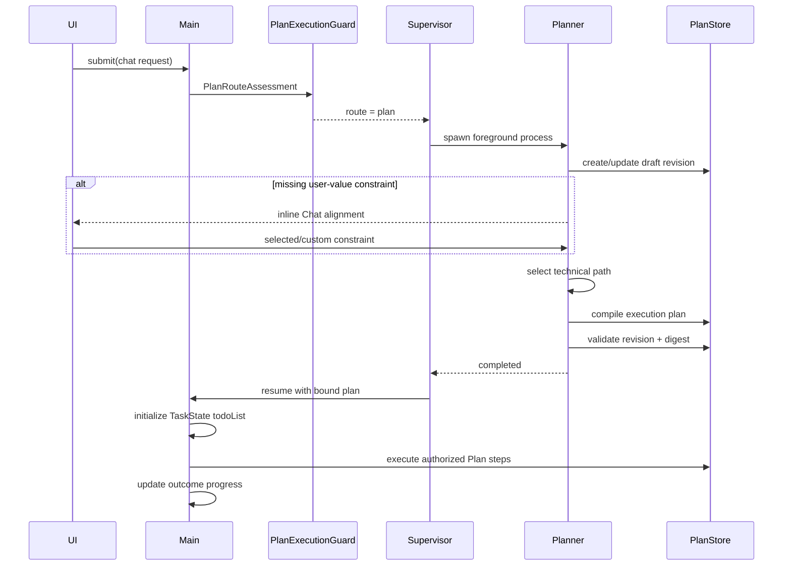
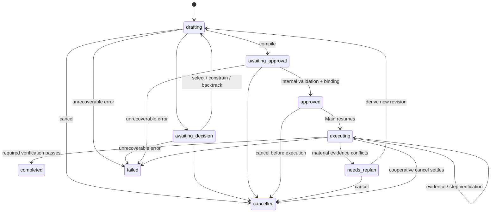

## Context

dscode 已具备实现 Plan Mode 的基础边界：

- Main Agent 已作为真实 `AgentProcess` 注册到 `AgentSupervisor`，Session 是交互 TTY，不是任务实体。
- `AgentApplication.permissionMode: "plan"` 已会剥离 `write_file`、`edit`、`overwrite_file`、`bash` 等副作用工具。
- Agent Process 已支持项目级 JSON 快照、原子替换、运行状态和 `agent:progress`。
- `HarnessEventBus`、`HarnessAPI`、WebSocket 和 Web/TUI adapters 已形成领域事件到呈现层的单向投影。
- 当前没有独立于 transcript 的计划真相源，也没有可恢复的候选路径决策、执行绑定或恢复协议。

Plan Mode 必须是运行时能力，不能依赖只服务于 dscode 开发流程的 OpenSpec `tasks.md`。它还必须避免暴露或持久化模型原始 Chain-of-Thought，只保存用户可理解、可审计的决策摘要。

## Goals / Non-Goals

**Goals:**

- 用户始终从 Chat 提交请求；简单任务直接执行，复杂任务由 Agent 自主进入内部规划。
- 以独立 Planner 进程隔离只读规划能力，保持 capability immutable。
- 使用 RAP-lite 的有界候选、评估、选择和回溯结构；技术路径由 Agent 自主选择，缺失的用户价值判断通过 Chat 对齐。
- 将 PlanRecord、Main Agent 的 TaskState、AgentProcess、Session 和客观执行进度保持为不同领域对象。
- 对计划 revision 提供持久化、CAS 更新、digest 绑定、重连恢复和 replanning。
- 为 Web 与 TUI 提供同一 Chat 原生意图对齐交互和 context-owned TODO 投影。

**Non-Goals:**

- 不实现自动 MCTS、无限树搜索或独立 Evaluator Agent 群。
- 不保存私有推理过程，不把 Planner transcript 当作 PlanRecord。
- 不把 TODO 当作 Plan 执行项、Agent Process、SubAgent task、文件清单、工具调用或验收命令。
- 不以 SubAgent 完成、工具成功、Agent 回合结束或 continuation 预算耗尽直接改写 TODO 状态。
- 不引入外部规划服务、数据库或新的前端组件库。
- 不在本 change 中实现跨设备共享、多人协同编辑或通用工作流编排。

## Decisions

### 1. 使用自主路由和首次副作用门禁

产品只有一个 Chat 提交路径。协议可以兼容历史 `planMode` 字段，但 Web/TUI 不展示模式选择。Main 可以先使用只读工具调查，但在首次调用 mutating tool 前必须提交结构化 `PlanRouteAssessment`。
- `PlanExecutionGuard` 在工具调度边界执行门禁。工具注册信息必须声明 `effect` 为 `read | workspace_write | process | network | external_write | unknown`；`unknown` 默认按副作用处理。没有有效 route decision 时拒绝副作用；决策为 `plan` 时不执行该工具，并把控制权交给 Planner；决策为 `direct` 时继续当前 Main 进程。
- route assessment 与 mutating tool 出现在同一模型 tool-call batch 时，只提交 assessment；mutation 必须等 Direct decision 写入当前 request execution context 后在后续模型回合重新发起，避免并行调度绕过门禁。

复杂度维度均为 `0..2`：意图不确定性、方案分歧、影响范围、操作风险、协调复杂度。其中意图不确定性 `2` 表示缺失的用户价值判断会实质改变可见结果，`1` 表示仍存在未消除的轻微意图歧义，`0` 仅表示用户已明确或由既有项目约束固定。类型惯例或看似合理的默认值不得代替用户价值判断。Host 使用确定性策略计算结果：意图不确定性非零，任一影响/风险/协调维度为 `2`，或总分不小于 `4` 时进入 Plan；其余请求直接执行。

route assessment 同时提交未解决的 `alignmentRequirements`。每项使用稳定
`requirementId`，topic 限于 `visual_direction | delivery | product_scope |
compatibility | cost | reversibility | other`，初始状态为 `pending`。对于创建游戏、
网页、应用、界面或其他用户可见产物的请求，若请求未明确视觉方向，Host 不仅将意图
不确定性下限设为 `1`，还会注入一个 `visual_direction` pending requirement；明确视觉
方向和修复既有产物不触发该规则。评估包含简短证据摘要，但不包含 Chain-of-Thought。

选择该方案是为了复用 Main 已获得的上下文，避免每次请求额外启动路由模型。仅靠 system prompt 不能形成副作用前的强约束；独立 Host LLM router 则会给所有简单任务增加固定成本。

### 2. Planner 是独立前台 Agent Process

新增内部 `planner` AgentApplication：

- 固定 `permissionMode: "plan"`，工具限于只读调查和计划领域操作。
- capability filtering 只允许 `effect: read` 和无副作用的 Plan domain operations；不能仅依赖工具名黑名单，MCP 和未来工具的 `unknown` effect 默认拒绝。
- 由 `AgentSupervisor` 创建，`parentAgentId` 指向 Main，并取得当前 TTY 的前台控制权。
- Planner 运行时 Main 进入 `waiting`；Planner 等待用户时也进入 `waiting`，但保留可恢复快照。
- Planner 不启动 Evaluator SubAgent。技术候选由 Planner 根据证据自主选择；只有缺失的用户价值判断通过 Chat 请求输入。
- Planner 完成已验证 revision 并取得内部执行绑定后退出；Supervisor 将前台控制权交还 Main，并自动发起隐藏的内部 continuation。Main 按依赖顺序执行 Plan 的内部步骤，同时在自身 `AgentContext.taskState` 中维护面向用户的 TODO。
- Main 的无工具响应不是任务完成信号。若 TaskState 仍为 `active`，Host 可以通过 Agent 原生 follow-up queue 有界续跑。续跑预算只控制调度，不写入 TODO；预算耗尽时保留当前 `in_progress` 状态，并报告尚未完成的成果。



该模型保持 Agent 即进程、Session 即 TTY。PlanRecord 是进程产生和消费的数据，不是新的进程类型，也不归 Session 所有。

### 3. PlanRecord 是独立、版本化的领域真相源

PlanStore 使用项目级原子 JSON 快照：

```text
~/.dscode/data/plans/by-project/<projectSlug>/<planId>.json
```

核心模型：

```ts
interface PlanRecord {
  planId: string
  projectKey: string
  sessionId: string
  mainAgentId: string
  plannerAgentId?: string
  request: { text: string; submittedAt: number }
  status: PlanStatus
  version: number
  revision: number
  baseRevision?: number
  digest: string
  goal: string
  constraints: PlanConstraint[]
  alignmentRequirements?: AlignmentRequirement[]
  decisions: PlanDecisionNode[]
  executionSteps: PlanExecutionStep[]
  execution: PlanExecutionState
  approval?: PlanApproval
  pendingInteraction?: PlanInteraction
  commandReceipts: PlanCommandReceipt[]
  trajectoryEvents: PlanTrajectoryEvent[]
  createdAt: number
  updatedAt: number
}
```

`PlanStatus` 为：

```text
drafting
awaiting_decision
awaiting_approval
approved
executing
needs_replan
completed
cancelled
failed
```

`version` 是每次持久化提交递增的 CAS 版本；`revision` 只在目标、约束、对齐要求、决策路径、执行步骤、验证条件或副作用摘要发生语义变化时递增，并重新计算 canonical digest。审批、内部执行状态和 evidence 更新只递增 `version`，因此不会让审批自行过期。TaskState 不进入 Plan digest；TODO 进度变化也不产生 Plan revision。

每次更新都携带 `expectedVersion`。PlanStore 使用按 `planId` 的进程内串行队列，并在跨进程写入前通过 exclusive-create lock file 取得短期写锁；持锁后重新读取 version、写入临时文件、fsync、rename 并 fsync 父目录，再释放锁。锁包含 owner PID 和创建时间，只有确认 owner 不存活且超过超时阈值时才能回收。冲突返回当前 snapshot，调用方必须重新投影，不能静默覆盖。

`trajectoryEvents` 只记录事实、候选摘要、选择、证据引用、回溯和状态迁移。模型原始思维文本、隐藏 prompt 和未筛选 transcript 不进入 PlanStore。

`pendingInteraction` 记录稳定 interactionId、kind、payload digest、目标 revision/digest、创建时间和 `pending | resolving` 状态。每个 mutation command 携带独立 commandId；已处理命令写入 `commandReceipts`，记录可选 interactionId、payload digest、结果、resultingVersion 和完成时间。同一 commandId 携带不同 payload 时必须拒绝；同一 interactionId 只能被一个成功 command 消费。active Plan 保留全部 receipts；进入终态并超过恢复 TTL 后，Plan 整体按统一 retention policy 归档或删除，而不是提前淘汰单条 receipt。

### 4. RAP-lite 使用有界分支和最少用户打断

每个 decision node 最多包含 3 个候选；每个 revision 最多包含 6 个 decision nodes。候选记录：

- 可执行摘要和受影响范围。
- 支持/反对证据引用。
- 风险、成本、可逆性和约束符合度。
- 恰好一个 Planner 推荐项及其公开理由；零个或多个推荐在持久化前拒绝。

只有候选差异影响用户可见结果且无法从上下文推断时才打断用户，例如：

- 视觉风格、产品范围或兼容承诺未明确。
- 成本或可逆性差异需要用户做价值判断。
- 用户提供的信息互相冲突，需要补充约束。

技术实现候选不因“存在多个方案”而打断用户。Planner 通过
`plan_select_decision` 自动选择证据最充分且满足硬约束的路径，并可自主深入
调查或回溯；包含 `constraintFit: uncertain` 的候选仍必须由持久化 Chat
交互解决。Chat 对齐只提交选择或自定义约束；回溯会截断其后的未授权轨迹，
并产生新 revision。

每个需要用户对齐的 decision 通过 `resolvesRequirementIds` 指向恰好一个 pending
requirement；技术 decision 使用空数组或省略该字段。只有匹配的 pending interaction
已持久化且被成功消费时，选择候选或提交自定义用户约束才能把该 requirement 改为
`resolved`。候选选择记录 `resolvedByDecisionNodeId`；自定义约束可以清除 requirement，
但该 resolver 字段可以省略。普通技术 `select`、未持久化的 Agent 决定或内存 resolver
回调都不能清除 requirement。Planner 每轮只处理一个 requirement，并在下一轮重新检查
剩余项；compile 和 authorize 都拒绝任何仍为 `pending` 的 requirement。

`alignmentRequirements` 在 schema v2 中保持 optional，以兼容已写入的早期 v2
Plan；schema v1 也继续只读加载。读取旧记录时不得补写空数组或改变 canonical payload，
因此已有 digest 保持不变。

交互命令使用显式 action union：

```ts
type PlanDecisionAction =
  | { kind: "select"; decisionNodeId: string; optionId: string }
  | { kind: "investigate"; decisionNodeId: string; optionId?: string; question?: string }
  | { kind: "update_constraints"; constraints: PlanConstraintPatch[] }
  | { kind: "backtrack"; targetDecisionNodeId: string }
```

### 5. 内部执行授权绑定 revision 与 digest

内部 `PlanApproval` 作为执行绑定记录，至少包含 `revision`、`digest`、允许的副作用类别、授权时间和 policy source。它不是用户可见的整份计划审批。

- digest 由目标、约束、存在的 alignment requirements、已选路径、PlanExecutionStep 定义、结构化验证、effect grants 和副作用摘要的 canonical JSON 计算；旧记录缺少 alignment requirements 时保留字段缺失状态。
- PlanExecutionState、TaskState、TODO、evidence、execution binding、approval、telemetry、Agent progress 和非语义时间戳不进入 digest。
- 任一语义更新清除现有内部 authorization。
- Main 只接受状态为 `approved` 且 digest 重新计算一致的 PlanRecord。
- 内部 authorization 不是通用权限；执行时仍遵循现有 tool permission policy。
- authorization 提交只递增 store `version`；它记录并继续绑定授权前后均不变的 semantic `revision + digest`。

每个 PlanExecutionStep 都包含 `effectGrants`，由 effect 类别和 canonical resource scope 组成，例如 workspace path pattern、process command class、network origin 或 external resource identity。Main/SubAgent 的执行 binding 必须携带 planId、revision、digest 和 stepId。每次副作用工具调度先由 `PlanExecutionGuard` 验证当前 approval、step binding、tool effect 和规范化后的实际资源范围，再进入普通 permission policy。超出已审批 effect 或 scope 的调用必须被阻止，但一次被拒绝的尝试本身不证明 Plan 已失效，也不得清除当前授权或 execution binding；只有 Main 根据执行证据确认当前路径不可行后显式提交 material conflict，才进入 `needs_replan`。普通权限不得扩大 Plan approval。

`command` verification 同时也是明确的执行意图。编译器必须将每条简单命令的
command class 合并到当前 PlanExecutionStep 的 canonical `process` grant。命令
断言使用结构化 matcher：

```ts
interface CommandVerification {
  kind: "command"
  verificationId: string
  description: string
  command: string
  expect: {
    exitCode: number
    stdout?: {
      matcher: "contains" | "equals" | "regex"
      value: string
      flags?: string
    }
  }
}
```

`description` 只供人阅读，不参与匹配。没有 `stdout` matcher 时，Host 只检查
退出码，因此无输出成功命令不再依赖 `"(no output on success)"` 等占位文本。
包含 pipe、重定向、命令串联或命令替换的复合 verification 在编译期拒绝，由
Planner 拆成可独立授权和取证的命令。

Plan semantic intent、TaskState 和 execution incident 必须分离。工具失败、权限拒绝、
验证命令失败或适配错误只能让当前执行重试、等待恢复或停止自动续跑，不得自行把
TODO 标记为 `blocked`，也不得修改 semantic revision/digest、清除 authorization/binding
或触发 `needs_replan`。Planner 编译
`grep` command criterion 时采用保守规则：必须用 `--` 或 `-e/--regexp` 显式分隔
pattern，避免以 `-` 开头的 pattern 被解释为选项。

### 6. TODO 是 Main Agent Context 中的 TaskState

TODO 不属于 PlanRecord。它是 Main Agent 对当前任务完成状态的持久化记录，随
`AgentContext` 一起由既有 AgentProcessStore 保存：

```ts
interface TaskState {
  taskId: string
  requestId: string
  sessionId: string
  version: number
  status: "active" | "completed" | "blocked" | "cancelled" | "failed"
  sourcePlan?: { planId: string; revision: number; digest: string }
  todoList: TodoItem[]
  updatedAt: number
}

interface TodoItem {
  todoId: string
  title: string
  status: "pending" | "in_progress" | "completed" | "blocked" | "skipped"
  result?: string
  blocker?: {
    kind: "user_decision" | "permission" | "external_dependency" | "environment"
    reason: string
    recovery: string
  }
}
```

TodoItem 描述用户可理解、可观察的成果状态，例如“核心玩法可运行”或“移动端与
离线交付可用”。文件、组件、样式、工具调用、调试动作、命令和测试不自动形成
TodoItem。只有当测试报告或审计结果本身就是用户要求的交付物时，它才可以成为
TodoItem。

Planner 可以在授权交接中提供公开成果里程碑，Main 据此在自身 AgentContext 初始化
TODO；Direct 路径的 Main 也可以在任务需要持续跟踪时创建 TODO。此后 Main 根据实际
进展增补、拆分、合并、跳过或完成
TODO；这些变化只递增 TaskState version，不产生 Plan revision。TodoItem 与
PlanExecutionStep 不建立一对一关系，同一个文件或 workspace scope 可以服务多个成果。

`plan_start_item` 是执行副作用前的强制边界。Host 只允许 owning Main 调用，并要求该
Main 已持有 `status: active` 的 TaskState；TaskState 的 `sessionId` 必须等于 Main
当前 Session，`sourcePlan.planId + revision + digest` 必须与待启动 Plan 完全一致。
缺失、终态或不匹配时，Host 在写入 execution binding 前拒绝调用并要求 Main 先用
`task_update initialize` 建立 TaskState。Host 不得从 PlanExecutionStep 自动投影 TODO。

TaskState mutation 通过 Supervisor 的 typed context operation 串行提交，并遵守：

- 同一时刻最多一个 `in_progress` TodoItem。
- `completed` 必须包含简短的结果摘要；已完成项不因后续普通重排而消失。
- 不再需要的项转为 `skipped` 并记录原因，不能静默删除历史成果。
- `blocked` 必须包含结构化 blocker，且该 blocker 是 Main 当前无法自行消除的外部条件。
- 工具失败、验证失败、SubAgent 退出、Main 回合结束和 continuation 预算耗尽均不能直接产生 `blocked`。
- 外部阻塞解除后，TodoItem 可以从 `blocked` 回到 `in_progress`。

Agent progress、Tool 结果和 SubAgent exit 仍作为内部 evidence。结构化 verification
决定 PlanExecutionStep 是否完成，但不直接生成、拆分或重命名 TODO。Main 根据已产生的
成果更新 TaskState；Host 在存在明确未通过的 required verification 时拒绝将整个
TaskState 标记为 `completed`，但不把该失败映射为用户可见 blocker。



取消 `drafting`、等待态、`approved` 或 `needs_replan` 会立即终止 Planner/待执行请求；取消 `executing` 会先停止调度新 item，再按既有 abort/settle 语义处理 in-flight tools，随后进入 `cancelled`。取消后 Main 返回空闲并向用户报告未执行或已完成的范围，不继续原请求。`failed`、`completed` 和 `cancelled` 是终态；重试必须显式派生新 revision 或新 Plan。

Plan 的 `needs_replan` 与 TaskState 的 `blocked` 相互独立。前者表示已批准路径与语义约束冲突，后者表示任务存在 Main 无法自行消除的外部阻塞；普通执行失败不属于任一状态。

### 7. Replanning 先冻结旧计划，再派生新 revision

当新证据使当前步骤不可行、违反硬约束或显著改变副作用范围，并由 Main 显式报告 material conflict 时：

`plan_report_conflict` 必须绑定当前 Main、revision、digest 和 in-progress item，
明确指向一个现存 hard constraint 或当前 selected decision，并引用该 item 中
`structuredOutcome: success` 的客观 Tool evidence。失败或 unknown Tool evidence、
Agent 自述及 summary 均不能证明 material conflict。显式用户 `requestReplan`
作为独立兼容 API 保留，不伪造成执行 evidence。

1. PlanService 将状态 CAS 为 `needs_replan`，停止调度新的 PlanExecutionStep；TaskState 保留当前 TODO 状态。
2. 已开始的原子 Tool 调用按现有 abort/settle 语义结束；其结果只作为 evidence。
3. Supervisor 启动新的 Planner 进程，并以旧 revision 的公开轨迹和新证据作为上下文。
4. 新 revision 设置 `baseRevision`，清除旧内部 authorization。
5. Planner 重新选择并验证技术路径；只有缺失用户价值约束时才在 Chat 中对齐，随后 Main 从新 execution plan 继续，并仅在成果范围发生变化时更新 TODO。

### 8. PlanService、交互端口和事件总线分层

新增 `PlanService` 负责领域规则和持久化，HarnessAPI 只暴露稳定端口：

```ts
type PlanMutationResult =
  | { ok: true; plan: Readonly<PlanRecord>; receipt: PlanCommandReceipt }
  | { ok: false; reason: "conflict"; conflict: PlanConflict }
  | { ok: false; reason: "invalid_transition" | "invalid_command"; message: string; plan?: Readonly<PlanRecord> }

interface PlanPort {
  getActivePlan(sessionId: string): Promise<PlanRecord | undefined>
  submitDecision(command: PlanDecisionCommand): Promise<PlanMutationResult>
  approve(command: PlanApprovalCommand): Promise<PlanMutationResult>
  requestReplan(command: PlanReplanCommand): Promise<PlanMutationResult>
  cancel(command: PlanCancelCommand): Promise<PlanMutationResult>
}

interface TaskStatePort {
  getTaskState(sessionId: string): Promise<Readonly<TaskState> | undefined>
  mutateTaskState(command: TaskStateMutationCommand): Promise<TaskStateMutationResult>
}

interface UserInteractionPort {
  requestPermission(...): Promise<PermissionPromptResult>
  requestIntentAlignment(request: IntentAlignmentRequest): Promise<IntentAlignmentResult>
}
```

PlanService 在请求意图对齐前先持久化 pending interaction。只有视觉风格、产品范围、兼容承诺等用户价值判断可以进入该端口；技术候选、调查、回溯和重新规划由 Agent 自主完成。消费交互的命令必须匹配 interactionId 和 interaction payload digest；成功消费后将选择写为显式约束、写入 command receipt 并清除 pending 状态。内存 resolver 只是当前连接的等待机制；重启或重连后由持久状态重新发出，不成为真相源。

HarnessEventBus 增加 presentation-neutral 事件：

- `plan:route`
- `plan:updated`
- `plan:interaction`
- `plan:approval`
- `plan:execution`
- `plan:conflict`
- `task:updated`

Web/TUI adapters 把需要用户价值判断的 pending interaction 投影为 Chat 内联对齐项，把内部授权后的 PlanRecord 确定性投影为 Chat 内全局计划输出，并把 Main `AgentContext.taskState.todoList` 投影为 Chat 内联 TODO。全局计划负责解释目标、已确认约束、唯一选定方案、改动范围、执行步骤和验证方式；TODO 只回答当前完成到哪里。候选树、revision、digest、effect grant、evidence、PlanExecutionState、Runtime counters 和内部控制工具仅供恢复与审计，不进入可见 Chat，也不形成独立产品模块。领域层不携带 JSX、终端颜色、按钮标签或布局信息。

PlanService 在每个成功提交的 store `version` 后发出 `plan:updated`，包括只改变 approval、status、evidence、pending interaction 或 command receipt 的提交；因此 UI 的 expectedVersion 始终与真相源一致。事件同时携带 semantic revision，消费者不能用 revision 推断是否发生了运行态更新。

TaskState mutation 成功持久化 Main context 后发出 `task:updated`。事件包含只读 TaskState
snapshot，不携带 Plan verification、Tool evidence 或 continuation counters。Plan 与
TaskState 事件可独立到达；共享 reducer 分别按各自 version 丢弃旧快照。

### 9. WebSocket 使用 typed commands/events 和幂等交互

现有 `chat` 命令可以继续兼容可选 `planMode` 字段，但 Web/TUI 产品入口不暴露模式选择并省略该字段，由 Main Agent 自主路由。`plan_decision` 用于提交 Chat 内联意图对齐结果；`plan_approve`、`plan_replan` 和 `plan_cancel` 保留为内部或兼容命令，不形成用户可见的计划控制面。所有改变 PlanRecord 的命令携带 `planId`、`expectedVersion`、`commandId`；消费 pending prompt 的 decision 额外携带 `interactionId`。

服务端事件增加 `plan_state`、`plan_interaction`、`plan_conflict` 和 `task_state`。
连接建立、Session 切换或后端恢复后，服务端分别发送 active Plan snapshot 和 Main
AgentContext 的 TaskState snapshot；任一对象不存在时发送对应的显式空值。客户端用独立
reducer slice 按各自 version 处理乱序事件，不从其中一个对象重建另一个对象。

`commandId + payload digest` 用于幂等去重；同一 payload 的重复命令返回 receipt 对应或当前 snapshot，同一 commandId 的不同 payload 被拒绝。已消费的 interactionId 不能被另一 commandId 再次消费。version 冲突发送 `plan_conflict`，客户端刷新后要求用户重新确认，禁止自动重放审批。

### 10. Web/TUI 使用 Chat 原生意图对齐

原始 PlanRecord、TaskState 内部标识、候选路径、revision、digest、effect grant 和执行证据不进入 `UIMessage[]`，也不混入模型 transcript。共享 projection 暴露当前需要用户回答的意图对齐请求、已授权 Plan 的公开全局输出，以及 TaskState 中 TodoItem 的公开标题、状态、结果或 blocker 摘要；适配器把它们渲染在 Chat 时间线中，用户选择转换为显式约束后再恢复 Agent。

Web：

- composer 保持单一 Chat 输入，不提供 `Auto / Plan` segmented control。
- Agent 需要视觉风格、范围取舍或兼容承诺时，在 Chat 流中展示一句问题、推荐项、最多三个选项和自定义输入。
- 技术候选、证据比较、revision、digest、PlanExecutionState 和 Agent evidence 不展示；内部控制工具不进入 Chat。Planner 授权后投影一次“计划已生成”，随后展示默认折叠的全局计划输出和 Main TaskState 的单个内联 TODO 列表。Plan 标题不再用 PlanExecutionStep 数量冒充 TODO 数量。
- Host 对聚合 Bash 返回的可重试 `invalid_command` 属于内部执行纠偏；live 与 Session 回放在结果分类后移除该 Tool 行，但保留真实命令失败、Plan scope 冲突和后续逐条命令结果。
- 全局计划输出直接读取已授权 PlanRecord，不重新调用模型生成摘要。折叠头显示标题和计划状态；展开后显示目标、用户已确认约束、唯一选定方案摘要、改动范围、执行步骤和验证方式。
- 计划结果标记保留在原时间线位置；全局计划输出始终紧邻唯一 TODO 之前，并随最新 Chat 内容移动。Plan 从 PlanStore 恢复，TODO 从目标 Session 的 Main AgentContext 恢复；展示恢复不恢复 execution binding，也不自动重放副作用。
- 首次 Planner handoff 插入一次 `进入 Planning Mode`。派生 revision 不重复插入该标记；规划期间保留旧计划输出和当前 TODO，并显示“正在调整执行计划”；新 revision 授权后替换同一计划输出，只有成果范围变化时才修改 TODO。
- Plan 输出默认折叠；展开状态仅是本地展示偏好，不写回 PlanStore、不改变授权，也不阻塞自动进入执行。
- 不显示独立“正在准备规划”页面。Agent 可以使用普通 Chat 思考状态，但在意图对齐完成前不得调用副作用工具。
- 整份计划不要求用户审批；危险副作用继续进入现有 permission prompt。

TUI：

- input footer 保持单一 Chat 输入，不提供规划模式切换。
- 意图对齐作为对话中的内联交互，支持方向键选择、Enter 确认和自由文本补充。
- 在对话区投影与 Web 等价的默认折叠全局计划输出；Enter 切换展开，不增加独立 Plan panel、approval panel 或 Plan/Execution 双层导航。

### 11. 恢复以 PlanStore 为准并与 Process Table 对账

启动或 Session 恢复时：

1. 加载该 Session 的 active PlanRecord。
2. 校验 schema、digest 和 revision。
3. 与 AgentSupervisor 中的 Main/Planner process snapshot 对账。
4. `awaiting_decision`/`awaiting_approval` 重新投影交互；`approved`/`executing` 仅在 Main binding 有效时恢复。
5. 找不到对应运行进程的 `drafting`/`needs_replan` 计划重新启动 Planner；无法安全恢复的执行态转为 `needs_replan`，不自动继续副作用。

当前 completion report tracker 只保存在 Host 内存中。若 Plan 已提交 `completed`，
但进程在最终报告输出前崩溃，恢复流程会恢复 Plan 和 TaskState 终态，不会自动补发
最终报告；持久化 report receipt 属于后续恢复增强。

### 12. 生命周期协调使用显式可恢复边界

Tool lifecycle 以单次调用为计数单位。Guard 只有在 `authorizeTool` 成功并登记 in-flight 后才能在 result 或 release 路径 settle；read Tool 可以记录 evidence，但不得改变其他调用的 in-flight 计数。执行取消必须等待全部已登记调用结束。

Plan approval 是持久化提交，结束 Planner、绑定 Main 和恢复 continuation 是提交后协调。任一步失败时，Host 保留 authoritative `approved` Plan，记录协调失败，并通过同一幂等 completion 路径重试；恢复入口也必须处理未完成协调的 `approved` Plan，不能依赖一次性的内存回调。

UI presentation 与 execution authorization 分离。`cancelled` 或 `failed` 可以清除 authorization，但终态记录保留从 `approved`/`executing` 进入终态的授权历史，使 projection 在增量更新和冷重连时都能重建公开 Plan。TODO 从 Main AgentContext 的 TaskState 独立恢复。Session 重绑时，Main 的旧 `activePlan`、`planBinding` 和 `taskState` 必须在持久化新 Session 前原子清除；目标 Session 的 TaskState 从当前 Main 保留状态与同项目持久化 Main snapshots 中选择最高 version，写入新的 owning Main context 后再向 UI 投影。

Web intent alignment 的 busy 状态以 WebSocket send 的布尔结果为准。发送失败不消费本地交互、不禁用重试；服务端幂等 command identity 处理发送成功但确认丢失的情况。

Plan 进入 `completed` 后，终态清理立即清除 Main/SubAgent 的 Plan binding，并终止仍在
运行的绑定 SubAgent，但保持 owning Main 存活。execution phase 中的 assistant narration
标记为内部消息，live 与 Session 回放都隐藏。即使清理已经清除 Main 的 `activePlan`，
内存 tracker 仍从 `execution` 进入一次 `report` phase：Main 先用合法 TaskState
transition 把实际交付的 outcome 完成并写入结果，再输出一次用户可见最终报告。报告必须
分别说明交付内容、实际执行的验证及结论、未验证项或剩余缺口。report phase 只允许
`task_update` 和 read Tool，不允许新的 Plan side effect。无 Tool 的报告响应结束该
tracker，防止重复报告；`cancelled` 和 `failed` 仍按终态语义终止 Main。

## Risks / Trade-offs

- [Main 低估复杂度] → 副作用门禁要求结构化评估；高影响、高风险或高协调维度强制 Plan，并为路由策略增加接受测试。
- [规划增加 token 与延迟] → 简单任务不启动 Planner；内部技术候选不等待用户；需要用户价值判断时，第一条可操作输出必须是 Chat 内联对齐，不能先展示独立准备页或启动副作用工具。
- [等待交互时进程重启] → pending interaction 先写入 PlanStore，恢复时重发；resolver 不承担持久化职责。
- [旧执行授权被错误复用] → store version 与 semantic revision 分离；内部 authorization 同时校验 planId、revision、digest，任何语义修改都会清除它。
- [TODO 与实际成果漂移] → TODO 是版本化 TaskState，不从聊天文本或 PlanExecutionStep 推导；Main 通过 typed mutation 更新，终态 TaskState 在 required verification 未通过时被拒绝。
- [TODO 过细或过粗] → 以可观察成果为粒度；文件、命令和测试不自动成项，整个复杂交付也不强制压成一项；同一 workspace scope 可以服务多个 TodoItem。
- [自由文本验收误判] → 说明字段与 matcher 分离；默认只检查退出码，stdout 仅在显式 contains/equals/regex matcher 存在时参与判断。
- [运行器停顿伪造业务阻塞] → continuation budget 只停止自动调度；`blocked` 必须携带可恢复的外部 blocker。
- [对齐要求被技术选择误清] → requirement 只由匹配的持久化 human interaction 消费清除；compile 和 authorize 独立检查全部 pending requirements。
- [执行先于成果跟踪] → `plan_start_item` 在写 binding 前校验 owning Main 的 active TaskState 及完整 sourcePlan identity，不从 Plan step 合成 TODO。
- [Plan 完成后缺少交付报告] → completed 清理保留 Main，并由独立 report phase 完成 TaskState 后输出一次可见报告；当前 tracker 为内存态，报告前崩溃仍可能导致报告缺失。
- [JSON 文件并发写覆盖] → expectedVersion CAS、进程内串行队列、跨进程 exclusive lock、原子 rename 和冲突事件；不做 last-write-wins。
- [原型把内部术语暴露给用户] → 实现文案使用“规划、方案、执行进度”等用户术语；`RAP`、`trajectory`、`AgentProcess` 只存在于技术文档。

## Migration Plan

1. 将 schema v2 的 PlanExecutionStep 定义与 mutable execution state 分开，旧 schema v1 PlanItem 只读兼容，不原地重写历史记录。
2. 在 Main AgentContext 增加版本化 TaskState 和 typed mutation；Direct 与 Plan 路径共用该状态。
3. 替换自由文本 `expectedOutput`，新增结构化 command matcher；旧 criterion 按兼容规则读取，不用于创建新 Plan。
4. 接入 HarnessAPI、HarnessEventBus、WebSocket 和共享 reducer，使 `task_state` 独立于 `plan_state` 同步与恢复。
5. 更新 Web/TUI projection 和 continuation 规则，移除 PlanItem 到 TODO 的投影及预算耗尽自动 blocked。
6. 运行类型检查、相关测试、Web 浏览器验收和 TUI 交互验收。

回滚时关闭 Plan 路由入口并恢复原直接执行路径；Plan JSON 是附加数据，可保留但不得在未验证 digest 的情况下恢复执行。该 change 不迁移现有 Session transcript。

## Open Questions

无阻塞问题。复杂度阈值和 RAP-lite 上限作为集中常量实现；后续可根据实际数据调整，但不得改变“高影响/高风险/高协调必须进入内部规划”“用户只处理价值判断”“执行授权绑定 revision + digest”和“TODO 是 Agent Context 中当前任务状态”的约定。
