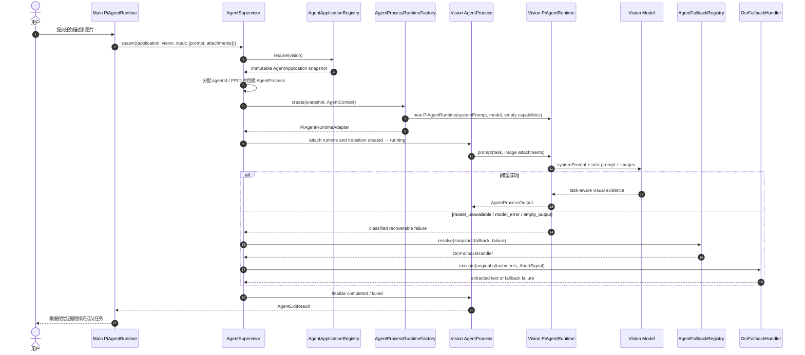

## Context

dscode 当前由 `Harness` 直接构造并持有一个 `pi-agent-core.Agent`。这个实例同时承担消息转录、模型调用、工具执行、权限检查和事件产生。`SessionManager` 只管理当前用户会话，内部有可变的 `current` 指针；`HarnessEventBus` 将单个 Agent 的事件转发到 TUI/Web；工具通常基于进程级 cwd 执行。

旧版 SubAgent 方案以 Claude Code 内部实现为模板，直接引入 `AgentTool`、Task Registry、`QueryEngine`、侧链转录和隐式 Fork。该方案与当前 dscode 存在结构错位：

- dscode 使用 `pi-agent-core.Agent`，不需要复制 Claude Code 的 Query Engine；
- dscode 没有 AppState 或 QueryEngine；
- dscode 工具名、模型注册和权限规则均与 Claude Code 不同；
- Session 是用户会话，不适合作为并发子进程的全局可变管理器；
- `process.chdir()` 是进程全局状态，不能用于并发子 Agent；
- 旧方案中的 `.claude` 存储路径、Claude 模型枚举和 Zod 不是 dscode 原生约定。

本设计将操作系统模型作为领域语言，并用当前 Harness、Session、Tool、Permission、EventBus 和 `pi-agent-core` 能力实现。

### 术语映射

| 操作系统 | dscode |
|-|-|
| Kernel | `Harness` 及其基础设施 |
| PID 1 / init | Main Agent |
| Application / executable | `AgentApplication` 配置 |
| Process | `Agent` |
| Child process | SubAgent |
| PID / PPID | `agentId` / `parentAgentId` |
| Process table | `AgentSupervisor` |
| argv / stdin | spawn 参数与 prompt |
| Environment | `AgentContext` |
| System call | Tool 调用 |
| Capability | Tool + Permission |
| cwd / mount namespace | Agent cwd / Worktree |
| foreground/background job | `attachment` |
| signal | TERM / KILL / STOP / CONT |
| stdout / exit status | Agent output / `AgentExitStatus` |
| IPC | `send_agent_message` 与 lifecycle events |
| TTY | Session |

## Goals / Non-Goals

**Goals:**

- Main Agent 与 SubAgent 使用相同的 Agent 进程模型和 PiAgentRuntime 执行链。
- Agent 配置表示 Application；一个 Application 可启动多个 Agent 进程。
- Vision 作为首个 Bundled Application 由 Agent.md 定义，模型升级时可独立更新 Prompt、model、capability 与 fallback 配置。
- Main Agent 作为 PID 1 管理进程，通过受控工具表达 spawn、wait、IPC 和 signal 意图。
- foreground、background、并行和 Fork 是正交维度，不再混用。
- Session 保持用户会话/TTY 语义；子进程不污染普通 Session 列表。
- Claude Code Agent Markdown 配置在语法、目录、字段和常用行为上可兼容。
- 权限只能从父进程向子进程单调收窄。
- 并发 Agent 的 cwd、身份、日志、Checkpoint 和工具状态相互隔离。
- MVP 优先完成同步 Agent、并行 spawn、进程表和确定性退出结果。

**Non-Goals:**

- Agent Teams、Swarm、共享任务板或多主协调。
- 远程执行环境。
- 在 MVP 中实现完整 checkpoint/restore。
- 在 MVP 中实现 Agent 专属 MCP Server 生命周期。
- 在 MVP 中实现长期 Agent Memory。
- 逐字节复制 Claude Code 内部实现。
- 将所有 SubAgent 暴露成普通用户 Session。

## Decisions

### 1. Agent 是进程，AgentApplication 是应用

领域层不把 `pi-agent-core.Agent` 直接等同于完整 Agent。依赖导入统一别名为 `PiAgentRuntime`：

```typescript
import { Agent as PiAgentRuntime } from "@earendil-works/pi-agent-core";
```

领域对象：

```typescript
interface AgentApplication {
  name: string;
  description: string;
  systemPrompt: string;
  tools?: string[];
  disallowedTools?: string[];
  model?: string;
  effort?: string | number;
  permissionMode?: string;
  mcpServers?: AgentMcpServerSpec[];
  hooks?: AgentHookSpec[];
  maxTurns?: number;
  skills?: string[];
  initialPrompt?: string;
  memory?: "user" | "project" | "local";
  background?: boolean;
  isolation?: "worktree";
  fallback?: AgentFallbackSpec[];
  color?: string;
  source: AgentApplicationSource;
}

interface Agent {
  agentId: string;
  parentAgentId?: string;
  parentSessionId: string;
  application: AgentApplication;
  applicationSource: AgentApplicationSource;
  applicationDigest: string;
  registryGeneration: number;
  role: "main" | "subagent";
  state: AgentProcessState;
  attachment: "foreground" | "background";
  runtime: AgentProcessRuntime;
  context: AgentContext;
}
```

任务不是独立运行实体。prompt 是进程启动输入；结果是进程 stdout/exit result。

Agent 启动时 SHALL 保存编译后的不可变 Application snapshot。运行期间即使源 Agent.md 被修改，当前进程的 systemPrompt、capability、模型和权限语义也不变。

**替代方案：Task-backed Agent Run。** 会把任务、进程和运行时状态混成一个对象，不符合本项目采用的操作系统领域语言。

**替代方案：Session-backed Agent。** OpenCode 采用此方式，但 dscode 当前 SessionManager 是单当前会话模型，会造成 Session 列表污染和大规模存储/UI 重构。

### 2. Harness 是 Kernel，AgentSupervisor 是确定性进程管理器

Main Agent 可以决定何时调用 `spawn_agent`，但不能直接修改 Process Table。`AgentSupervisor` 负责：

- 分配 `agentId`；
- 建立 PID/PPID 与 parentSessionId；
- 创建 AgentProcessRuntime；
- 维护状态机；
- 处理 attachment 和 signal；
- 保存转录、Usage 和退出结果；
- 发送生命周期事件；
- 在 Harness shutdown 时按策略清理进程。

```text
Harness
└── AgentSupervisor
    ├── Main Agent (PID 1)
    ├── Explore Agent
    ├── Reviewer Agent
    └── General Agent
```

Main Agent 的 `agentId` 在 Harness 生命周期内稳定。为了兼容现有调用，`Harness.agent` 可暂时作为 `Harness.mainAgent.runtime` 的只读 getter。

### 3. Session 是 TTY，不是 Process

Main Agent 连接当前 Session。SubAgent 记录 `parentSessionId`，但不调用 `SessionManager.createSession()`，也不出现在普通会话列表中。

SubAgent 的持久化由 `AgentProcessStore` 管理：

```typescript
interface SerializedAgentProcess {
  version: 1;
  metadata: AgentProcessMetadata;
  applicationSnapshot: AgentApplicationSnapshot;
  messages: unknown[];
  result?: AgentExitResult;
}
```

存储路径使用 dscode 命名空间：

```text
~/.dscode/data/agent-processes/by-project/<project-slug>/<agentId>.json
```

Store 使用临时文件 + rename 原子写入，并在 `turn_end`、状态变化和退出时保存。

### 4. Main Agent 和 SubAgent 共用 PiAgentRuntime 执行链

每个 AgentProcess 都通过 PiAgentRuntimeAdapter 持有独立的 `pi-agent-core.Agent`。系统保留统一运行时协议以隔离领域对象与依赖实现，但 MVP 不提供 PipelineRuntime 特例：

```typescript
interface AgentProcessRuntime {
  start(input: AgentProcessInput, signal: AbortSignal): Promise<AgentProcessOutput>;
  terminate(): Promise<void>;
  suspend?(): Promise<void>;
  continue?(): Promise<void>;
  sendMessage?(message: AgentMessage): void;
  kill(): void;
}
```

`AgentProcessRuntimeFactory` SHALL 对所有 Application 创建 `PiAgentRuntimeAdapter`。Factory 从不可变 Application snapshot 装配 systemPrompt、model、tools、Skills、MCP、Hooks、PermissionManager 和 ContextManager；缺省或空配置产生空能力，不改变执行流程。

把 `Harness.initialize()` 中的 PiAgentRuntime 构造逻辑提取到 `PiAgentRuntimeAdapter`。Factory 输入包括已编译的不可变 Application snapshot、AgentContext、模型、工具 capability、权限、ContextManager 和共享基础设施。

共享：

- model registry 与 `streamSimple`；
- MCPManager 已连接的工具；
- DriverRegistry 中的工具定义；
- Logger 与 HarnessEventBus；
- Skills Manifest。

隔离：

- AgentProcessRuntime instance；
- runtime state 与 messages（如适用）；
- ContextManager；
- ToolRegistry discovery state；
- PermissionManager session grants；
- AbortController；
- cwd 与 Checkpoint namespace；
- Usage 和进度统计。

不为每个 SubAgent 重新连接父级 MCP Server。Agent 专属 MCP 作为后续能力。

### 5. AgentApplication 配置兼容 Claude Code

#### 5.1 Bundled Agent.md

`bundled` 是 Application 的发行来源，不是代码实现类型。为控制首版范围，MVP 只把 Vision 文件化为 Agent.md；Main Agent 与其他内置角色不在本变更中迁移。

源码资产：

```text
resources/agents/
└── vision.md
```

唯一 npm 发布 staging 中的构建产物：

```text
release/package/dist/resources/
├── manifest.json
└── agents/
    └── vision.md
```

Bundled Agent.md、`.dscode/agents/*.md` 和 `.claude/agents/*.md` MUST 使用同一 parser、TypeBox schema、tool alias adapter、model resolver、permission compiler 和 diagnostics。Bundled 配置不得拥有绕过校验的专用代码路径。

Application 可以声明受信任 fallback handler。编译器 SHALL 只接受系统注册的 handler 名称与事件类型，任何 Agent.md 都不能通过配置选择任意代码入口。

构建 SHALL 校验 `resources/agents/vision.md`，复制到 release staging，并生成包含 packageVersion、逻辑资源 ID、相对路径和 SHA-256 的 manifest。`vision.md` 缺失、无效或 digest 不匹配 SHALL 使构建和启动失败。

AgentApplicationRegistry SHALL 为每次原子加载分配递增 generation，并为每个编译结果计算基于规范化配置与正文的 digest。热更新只替换 Registry 中的新 generation：

- 已运行 Agent 保留启动 snapshot；
- 新启动 Agent 使用最新 generation；
- Process Store 记录 source、digest 和 generation，保证问题可复现。

#### 5.2 外部与兼容目录

原生目录：

```text
~/.dscode/agents/*.md
<project>/.dscode/agents/*.md
```

兼容目录：

```text
~/.claude/agents/*.md
<project>/.claude/agents/*.md
```

优先级从低到高：

```text
bundled
< user .claude
< user .dscode
< project .claude
< project .dscode
< managed policy
```

文件名提供默认 name，frontmatter 提供配置，正文作为 systemPrompt。使用 dscode 现有 YAML/frontmatter 解析能力与 TypeBox 校验，不引入 Zod。

#### 5.4 Claude Code 兼容编译

兼容分为四层：

1. **语法兼容**：Markdown、frontmatter、正文 Prompt；
2. **路径兼容**：读取 `.claude/agents`；
3. **字段兼容**：解析 Claude Code 常用字段；
4. **行为兼容**：工具、模型和 permissionMode 经过适配器编译。

工具别名：

```text
Read -> read_file
Write -> write_file
Edit -> edit
Glob -> glob
Grep -> grep
Bash -> bash
Agent / Task -> spawn_agent
```

模型别名通过设置映射：

```text
inherit -> 父进程模型
haiku -> fast alias
sonnet -> balanced alias
opus -> powerful alias
```

无法解析的 model、tool、permissionMode 或字段必须产生结构化诊断。不得静默授予更宽能力。

#### 5.5 Vision 作为首个通用 Agent Application

`vision.md` 不声明特殊 runtime 或 entrypoint。它和任意外部 Agent.md 一样由 PiAgentRuntimeAdapter 执行，差异只来自配置：

```markdown
---
name: vision
description: Analyze images with task-aware visual reasoning
model: vision
tools: []
skills: []
permissionMode: plan
fallback:
  - handler: ocr
    on: [model_unavailable, model_error, empty_output]
---

You are an image analysis Agent. Inspect the attached images and return
visual evidence relevant to the user's task. Do not execute the parent task.
```

- Markdown 正文作为 PiAgentRuntime systemPrompt；
- `AgentProcessInput.prompt` 直接作为本次用户任务 prompt；
- 图片通过通用 Attachment 传入 PiAgentRuntime；
- `model: vision` 解析到运行配置中的 Vision provider/model，也允许项目覆盖为明确的 `provider/model`；
- `tools: []` 表示没有内置工具和父级 MCP 工具；
- `skills: []` 表示不加载 Skills；缺省 `mcpServers` 与 `hooks` 表示空配置；
- fallback 只描述失败恢复策略，不改变 Agent 的主 Runtime。

通用进程输入信封：

```typescript
type AgentAttachment =
  | { type: "image"; data: ImageContent | ImageRef }
  | { type: "file"; uri: string }
  | { type: "text"; text: string };

interface AgentProcessInput {
  prompt: string;
  attachments?: AgentAttachment[];
}

type ContextSelectionItem =
  | {
      type: "message";
      messageId: string;
    }
  | {
      type: "tool_result";
      toolCallId: string;
    }
  | {
      type: "file";
      path: string;
      lineStart?: number;
      lineEnd?: number;
    }
  | {
      type: "diff";
      scope: "working-tree" | "staged" | "commit";
      ref?: string;
      paths?: string[];
    };

interface ContextSelection {
  items: ContextSelectionItem[];
  maxBytes?: number;
  overflow?: "error" | "truncate-tail";
}

interface SpawnAgentRequest {
  application: string;
  parentAgentId: string;
  attachment: "foreground" | "background";
  input: AgentProcessInput;
  contextMode?: "minimal" | "selected" | "fork";
  contextSelection?: ContextSelection;
}
```

Supervisor 和 Runtime Factory 不识别 `images`、Vision 或 OCR。PiAgentRuntimeAdapter 负责把通用 image attachment 映射为 `PiAgentRuntime.prompt(prompt, images)`。

#### 5.6 通用 Agent 创建与 Vision fallback 时序



OCR 在主 PiAgentRuntime 失败后、进程进入终态前执行。Fallback 成功时保留原 agentId，并在退出结果中记录 `executionSource=ocr`；OCR 也失败时，AgentProcess 才进入 failed。

图片压缩、缓存和 ImageRef 解析属于通用 Attachment 基础设施。原 `ImagePipeline` 不再作为 Agent Runtime；其中 OCR 能力迁移到受信任 `OcrFallbackHandler`，缓存能力迁移到 Attachment resolver。Fallback Handler 不得直接读写 `SessionManager.current`，父进程集成层根据 parentSessionId 记录结果。

### 6. 前后台是 attachment，不是 Agent 类型

进程状态：

```typescript
type AgentProcessState =
  | "created"
  | "running"
  | "waiting"
  | "stopped"
  | "exited"
  | "failed"
  | "killed";
```

`attachment` 独立表示 foreground/background。

- foreground：`spawn_agent` 等待 AgentProcessRuntime 退出；
- background：工具返回 PID，AgentProcessRuntime Promise 继续执行；
- foreground 转 background：只更新 attachment 并让工具提前返回，不能 abort 或重建 AgentProcessRuntime；
- 同一 Main Agent turn 中多个 `spawn_agent` 由 pi-agent-core 的 parallel tool execution 并发执行。

后台退出后，Supervisor 发出 `agent:exit`。UI 立即显示，结构化通知进入父 Session 的 pending notification queue，在下一轮 `transformContext` 注入。MVP 默认不自动唤醒空闲 Main Agent，避免无界自治循环。

### 7. 进程工具使用 dscode 风格命名

核心工具：

```text
spawn_agent
list_agents
wait_agent
get_agent_output
terminate_agent
kill_agent
suspend_agent
continue_agent
send_agent_message
```

模型可调用的 `spawn_agent` 工具输入：

```typescript
interface SpawnAgentToolInput {
  application: string;
  description: string;
  input: {
    prompt: string;
    attachments?: AgentAttachmentRef[];
  };
  attachment?: "foreground" | "background";
  context_mode?: "minimal" | "selected" | "fork";
  selected_context?: ContextSelection;
  isolation?: "none" | "worktree";
}
```

工具层校验引用和权限后，从当前 AgentContext 派生 parentAgentId，并转换为 5.5 节的内部 `SpawnAgentRequest`。Application 必须显式指定；model、tools、Skills、MCP、Hooks、权限和 fallback 来自不可变 Application snapshot，spawn 不允许覆盖这些能力字段。

`terminate_agent` 是协作式 TERM；`kill_agent` 是强制 KILL。`suspend_agent`、`continue_agent` 和 `send_agent_message` 依赖 Runtime capability：仅在 Runtime 实现相应接口时可用，否则返回明确 unsupported，不能伪装状态变化。

### 8. 权限是 capability 派生且单调收窄

最终能力计算：

```text
父级 hard deny
+ 项目路径边界
+ Application tools/disallowedTools
+ permissionMode 映射
+ attachment 限制
+ isolation 限制
+ nesting depth
= 子进程 capability set
```

规则：

- 子 Application 不能覆盖父级 deny；
- 默认不向 SubAgent 暴露 `spawn_agent`，最大深度为 1；
- 后台 Agent 不能弹出权限 UI，`ask` 映射为 deny；
- `bypassPermissions` 仅 managed policy 可启用；
- MCP 工具与内置工具采用同一过滤流程，不存在“始终放行”；
- 后台写 Agent 必须使用 worktree；
- permission session grant 不从父进程复制。

### 9. AsyncLocalStorage 同时承载身份与执行环境

```typescript
interface AgentContext {
  agentId: string;
  parentAgentId?: string;
  parentSessionId: string;
  applicationName: string;
  role: "main" | "subagent";
  attachment: "foreground" | "background";
  cwd: string;
  depth: number;
}
```

文件、Shell、Checkpoint、日志和事件归因从 `AgentContext` 获取 cwd 与进程身份。禁止 SubAgent 调用 `process.chdir()`；Main Agent 项目切换也应逐步迁移到显式 cwd。

### 10. Context mode 控制父上下文继承

三个模式保持正交：

- `minimal`：只传 Application systemPrompt、任务 prompt、attachments 和必要运行环境；
- `selected`：在 minimal 基础上，增加调用方显式选择并固定的父上下文；
- `fork`：继承父消息稳定前缀与兼容的精确工具 Schema。

`selected` 必须提供非空 `ContextSelection.items`。`minimal` 和 `fork` 不得携带 `contextSelection`，避免调用方误以为字段已生效。Application 不得省略；`contextMode` 省略时使用 minimal，绝不能隐式 Fork。

`ContextAssembler` 在创建 Runtime 前完成：

1. 校验 message 和 tool_result 属于父 Agent 可见转录；
2. 校验 file 和 diff 位于允许的项目/worktree 边界；
3. 按 `items` 顺序解析内容并生成不可变 selection snapshot；
4. 应用 `maxBytes` 和显式 overflow 策略；
5. 将规范化上下文消息插入 systemPrompt 与任务 prompt 之间；
6. 保存引用、内容 digest、截断信息和实际字节数，便于复现。

Selected context 只传递信息，不授予文件、工具或 MCP 权限。子 Agent 的 capability 仍从父级 hard deny 和目标 Application 单独派生。

模型工具调用示例：

```typescript
await spawn_agent({
  application: "reviewer",
  description: "Review the authentication changes",
  input: {
    prompt: "检查认证逻辑是否存在安全和兼容性问题",
  },
  context_mode: "selected",
  selected_context: {
    items: [
      { type: "message", messageId: "msg-requirement" },
      {
        type: "file",
        path: "src/auth.ts",
        lineStart: 1,
        lineEnd: 240,
      },
      {
        type: "diff",
        scope: "working-tree",
        paths: ["src/auth.ts", "tests/auth.test.ts"],
      },
      { type: "tool_result", toolCallId: "call-test-output" },
    ],
    maxBytes: 64_000,
    overflow: "error",
  },
});
```

工具层校验后转换为内部调用：

```typescript
await agentSupervisor.spawn({
  application: "reviewer",
  parentAgentId: mainAgentId,
  attachment: "foreground",
  input: {
    prompt: "检查认证逻辑是否存在安全和兼容性问题",
  },
  contextMode: "selected",
  contextSelection: {
    items: [
      { type: "file", path: "src/auth.ts" },
      { type: "diff", scope: "working-tree" },
    ],
    maxBytes: 64_000,
    overflow: "error",
  },
});
```

Fork 仍是普通 Agent 进程，不创建特殊 Agent 类型；它必须显式请求、默认禁止递归，并只在 provider 缓存评测通过后启用。

### 11. Memory、MCP 和 Hooks 是 Application 能力

Claude Code 字段需要被解析和保留，但实现可分阶段：

- `skills` 在 MVP 可实现；
- `memory` 在后续接入现有 MemoryManager 的 per-application namespace；
- `mcpServers` 后续支持独立连接生命周期；
- `hooks` 后续映射到 Agent lifecycle events。

尚未实现的字段必须显示 `unsupported` 诊断，不能静默忽略。

### 12. 可观测性围绕 Process Table

新增事件：

```typescript
agent:spawned
agent:state
agent:progress
agent:output
agent:exit
```

每个事件包含 agentId、parentAgentId、applicationName 和 parentSessionId。Logger tag 使用 PascalCase 常量，例如 `AgentSupervisor`、`AgentProcess`、`AgentApplication`。

### 13. 发行资源与 npm fat package

Bundled Agent.md 是产品发行资源，不属于 TypeScript 源码。仓库 SHALL 使用顶层 `resources/` 作为资源作者目录，并使用唯一 release staging 生成 npm 包：

```text
dscode/
├── src/
├── resources/
│   ├── catalog.json
│   ├── agents/
│   │   └── vision.md
│   ├── mcp/
│   │   └── sandbox.html
│   └── mdx/
│       └── mdx-runtime.js
└── release/package/
    ├── package.json
    ├── README.md
    ├── LICENSE
    └── dist/
        ├── dscode.mjs
        └── resources/
            ├── manifest.json
            ├── agents/
            │   └── vision.md
            ├── mcp/
            │   └── sandbox.html
            ├── mdx/
            │   └── mdx-runtime.js
            └── web/
```

`resources/catalog.json` 是资源逻辑 ID 和 required 状态的作者清单。构建生成的 manifest 至少包含：

```json
{
  "schemaVersion": 1,
  "packageVersion": "0.2.7",
  "entries": {
    "agent:vision": {
      "path": "agents/vision.md",
      "mediaType": "text/markdown",
      "sha256": "<digest>",
      "required": true
    }
  }
}
```

生产运行时 SHALL 从打包入口的 `import.meta.url` 精确解析 `./resources/manifest.json`。`PackageResourceProvider` 校验 manifest schema、packageVersion、required entry 和 SHA-256 后，向 AgentApplicationRegistry 提供 Bundled 文档。生产代码 MUST NOT 搜索 cwd、`src/` 或多个候选目录；开发和测试必须通过构造参数显式注入 resource root。

Bundled Application 的可追溯来源 SHALL 使用稳定逻辑 URI，例如：

```text
pkg:@creative-dswork/dscode@0.2.7/agents/vision.md
```

Process Store 保存逻辑 URI、packageVersion 和 digest，不保存 npm 全局安装绝对路径。包内资源只读，用户和项目覆盖仍通过既有优先级加载，不复制到 `~/.dscode`。

构建发布流水线：

```text
clean dist + release/package
  -> typecheck/test
  -> 校验 resources/catalog.json 和 Agent.md
  -> esbuild CLI + build Web
  -> 复制并规范化全部 runtime resources
  -> 生成 manifest 和最小 release package.json
  -> npm pack ./release/package
  -> 校验 tarball allowlist、版本、digest 和体积
  -> 临时目录安装 tgz
  -> 从随机 cwd 执行 CLI 和资源加载 smoke test
  -> 发布同一个已验证 tgz
```

根 package.json SHOULD 设置 `private: true`，防止误从仓库根目录发布。release package.json 由构建生成并移除 private，只包含运行依赖、bin、engines、license、repository 和 `dist/**` files。fat package 表示 CLI 与产品资源同一版本发布，不内嵌 `node_modules`。

GitHub Actions SHALL 由版本 Tag 触发，build job 只生成一次 tgz 并将其作为 artifact 上传；publish job 下载该 tgz，使用 npm Trusted Publishing/OIDC 执行：

```bash
npm publish package/*.tgz --access public --provenance
```

CI MUST 发布 build job 已验证的同一字节产物，不得上传目录后在 publish job 重新 `npm pack`。Token 只作为未启用 Trusted Publishing 时的受控回退。

## Acceptance Strategy

Vision 是 SubAgent 系统的首个验收 Application。现有 ImagePipeline 仅作为迁移来源：图片缓存/压缩下沉为通用 Attachment 基础设施，OCR 下沉为 fallback handler，Vision Agent 本身必须走标准 PiAgentRuntime。

### Gate 0: 迁移前基线恢复

当前 `tests/drivers/vision/pipeline.test.ts` 的 ImageCache mock 缺少 `get()`，而 Pipeline 已在压缩后调用 `ImageCache.get()`，导致现有 9 个用例在业务断言前全部失败。开始 SubAgent 迁移前 MUST：

- 为 mock 补齐 `ImageCache.get()` 和压缩图 readback；
- 让现有 9 个 Pipeline 用例全部通过；
- 将该结果记录为迁移前基线；
- 不通过修改 Pipeline 业务行为来绕过测试漂移。

### Gate A: Application 与构建

- `vision.md` 与外部 Agent.md 通过统一编译；
- `vision.md` 不包含特殊 runtime/entrypoint；
- model、空 tools/skills 和 fallback 配置进入不可变 snapshot；
- Vision Prompt 不再硬编码在 `client.ts`；
- 作者资源位于 `resources/agents/vision.md`，不位于 `src/`；
- release staging 包含 `dist/resources/agents/vision.md` 和有效 manifest；
- Process Store 记录 vision Application digest 和 generation。

### Gate B: 通用 Runtime 验收

使用 fake PiAgentRuntime 与 fake Vision provider，覆盖：

- Factory 为 Vision 创建 PiAgentRuntimeAdapter；
- vision.md 正文成为 systemPrompt；
- 用户任务成为 prompt，图片成为通用 attachments；
- model=vision 与明确 provider/model 均可解析；
- tools/skills/MCP 缺省或空值不引入任何能力；
- 图片缓存只持久化 ImageRef；
- AbortSignal 可终止 PiAgentRuntime。

### Gate C: Fallback 与 AgentSupervisor 集成

使用 fake Vision model 和 fake OCR，验证：

- Main Agent 是父进程，Vision Agent 获得独立 agentId；
- Process Table 状态按 created -> running -> exited/failed/killed 变化；
- `agent:spawned`、`agent:progress`、`agent:exit` 顺序正确；
- Vision 成功时不调用 OCR；
- model_unavailable、model_error、empty_output 按 vision.md 策略进入 OcrFallbackHandler；
- fallback 前后 agentId 不变，成功结果标记 executionSource=ocr；
- PiAgentRuntime 与 OCR 都失败时才进入 failed；
- terminate/kill 的 AbortSignal 贯穿 PiAgentRuntime 和 OCR；
- Process Store 只保存 ImageRef，不保存原始 base64；
- Vision Agent 不创建普通用户 Session。

### Gate D: 端到端验收

CI SHALL 使用确定性 fake provider，不依赖外部凭据：

1. 用户上传图片且 Main 模型不支持图片时，以通用 SpawnAgentRequest 创建 foreground Vision Agent；
2. Vision PiAgentRuntime 失败时同一 Agent 进入 OCR fallback，PID 不变化；
3. 用户 abort 时 Vision Agent 进入 killed/exited，Main Agent 不继续 prompt；
4. MCP 返回图片时复用同一 Vision Application；
5. Vision 运行期间切换 Session，结果仍写入 parentSessionId；
6. Main 模型原生支持图片且未配置独立 Vision 时保持直接传递，不创建 Vision Agent；
7. Vision 只产生其自身 PiAgentRuntime 所需的模型调用，不存在 PipelineRuntime 包装调用。

### Gate E: npm tarball 与 GitHub Actions

- `npm pack ./release/package` 只包含运行时、声明的资源、最小 package.json、README 和 LICENSE；
- Tag、release package.json 与 resource manifest 的版本一致；
- tarball 中 required resource 存在且 SHA-256 匹配；
- 临时目录安装 tgz 后，从随机 cwd 能执行 `dscode --version` 并加载 vision Application；
- tarball 不包含 `src/`、tests、截图、`.env`、工作区配置或 release 外文件；
- GitHub Actions publish job 发布 build job 验证并上传的同一个 tgz；
- 发布支持 npm Trusted Publishing/OIDC 和 provenance。

验收命令统一为：

```bash
npm run test:subagent
```

可选真实 Provider smoke test 使用显式环境开关，默认不进入 CI：

```bash
DSCODE_VISION_E2E=1 npm run test:subagent:vision:live
```

验收通过标准：

- 所有 Application、Supervisor、Vision PiAgentRuntime 与 fallback 单元/集成测试通过；
- 原有 ImagePipeline 能力完成 Attachment/OCR Handler 迁移；
- 无 Process Table 残留 running 进程；
- 无错误 Session 路由；
- 无原始图片 base64 持久化；
- 无 PipelineRuntime 特例或额外包装 LLM 调用；
- npm tarball 和 GitHub Actions Gate E 通过。

## Risks / Trade-offs

- **[Agent 与 pi-agent-core.Agent 命名冲突]** → 依赖统一别名 `PiAgentRuntime`，领域层保留 Agent=进程。
- **[Vision 特例破坏通用流程]** → Vision 与其他 SubAgent 一律使用 PiAgentRuntimeAdapter，OCR 只作为失败恢复 Handler。
- **[Vision 迁移破坏现有路径]** → 先保留原 Pipeline 测试作为能力基线，再将缓存/压缩与 OCR 分别迁移到 Attachment 服务和 fallback handler。
- **[Bundled 配置缺失或损坏]** → 构建时校验 `vision.md`，缺失或无效时 fail fast。
- **[npm 安装位置不稳定]** → 只通过入口 `import.meta.url` 和 manifest 相对路径寻址，不依赖 cwd 或全局安装路径。
- **[根目录误发布或包体膨胀]** → 根 package 标记 private，只发布 release staging，并对 tarball allowlist 和体积设置 Gate。
- **[构建与发布产物漂移]** → GitHub Actions 上传并发布同一个经过安装测试的 tgz，不在 publish job 重新打包。
- **[热更新导致运行不可复现]** → 每个进程保存不可变 snapshot、source、digest 与 Registry generation。
- **[兼容配置被误认为完全等价]** → 提供逐字段 compile diagnostics 和兼容性测试，不支持字段明确报错。
- **[并发 cwd 污染]** → 使用 AsyncLocalStorage + 显式路径解析，禁止子进程 `process.chdir()`。
- **[后台权限等待]** → background 中 ask 一律 deny，写 Agent 强制 worktree。
- **[父级权限被子级放宽]** → capability 派生以父级 hard deny 为不可覆盖基线。
- **[并行写冲突]** → 默认只读；写进程使用 worktree，最终合并由 Main Agent 串行处理。
- **[Process Store 泄漏]** → 状态终结、保留期限和清理策略可配置，退出时原子保存。
- **[Fork 成本高或缓存无收益]** → 不进入 MVP，先以 Eval 对比 minimal/selected/fork。
- **[Main Agent 职责过载]** → 调度意图由 Main Agent产生，进程状态机和资源清理由 Supervisor 确定性执行。
- **[旧 Session API 依赖 Harness.agent]** → 提供临时兼容 getter，分阶段迁移到 `mainAgent.runtime`。

## Migration Plan

### Phase 0: 运行时抽取

1. 引入 `AgentApplication`、Agent、AgentContext 和 Process State 类型。
2. 引入 AgentProcessRuntime 接口、PiAgentRuntimeAdapter 和 AgentProcessRuntimeFactory。
3. 将 `Harness.agent` 变为 Main Agent runtime 兼容 getter。
4. 为工具路径解析增加 AgentContext cwd，保持主 Agent 行为不变。
5. 保持 Main Agent Prompt 和其他既有角色不变，仅为 Vision 准备 Bundled Application。

### Phase 1: Foreground MVP

1. 实现 Agent.md loader、构建复制、Claude compatibility compiler 和 Registry generation。
2. 仅提供 `vision.md` 作为 Bundled Application。
3. 使用 PiAgentRuntimeAdapter 启动 Vision，并迁移用户图片和 MCP 图片入口。
4. 实现 AgentSupervisor、Process Table 与 AgentProcessStore。
5. 将图片缓存/压缩迁移为 Attachment 服务，将 OCR 迁移为 Application fallback handler。
6. 实现 foreground `spawn_agent`、`list_agents`、`wait_agent`。
7. 通过 Vision SubAgent Gate A-D 验收。
8. 验证同一 turn 多个 spawn 的并行执行。

### Phase 2: Background 与进程控制

1. 实现 background attachment，保证同一进程不中断续跑。
2. 实现 output、TERM、KILL、STOP、CONT、IPC 和 pending notification queue。
3. 增加 TUI/Web 的最小进程状态展示。

### Phase 3: Isolation 与恢复

1. 实现 Worktree、写进程强制隔离和串行合并。
2. 实现 checkpoint/restore 与进程转录恢复。

### Phase 4: 高级 Application 能力

1. 通过评测决定是否启用 Fork。
2. 实现 per-application Memory、专属 MCP 和 Hooks。

### Phase 5: 统一资源与 npm 发布

1. 将 Bundled Agent 和其他运行时静态资源迁移到顶层 `resources/`。
2. 实现 catalog、manifest、SHA-256 和 PackageResourceProvider。
3. 使用 `release/package/` 作为唯一 npm staging，并禁止从仓库根目录发布。
4. 增加 tarball allowlist、版本、完整性、体积和随机 cwd 安装测试。
5. 修改 GitHub Actions，构建一次 tgz、上传 artifact，并发布同一个 tgz。
6. 通过 Gate E 后再视为本 change 完整交付。

### Rollback

- Process Store 与 Session Store 分离，关闭 `agents.enabled` 即可停止暴露进程工具。
- Main Agent 兼容 getter 保留现有单 Agent 运行路径。
- Bundled Agent.md 随发布包版本回滚；Application loader 和 AgentSupervisor 无全局数据迁移；删除进程索引不影响用户 Session。

## Open Questions

- `bypassPermissions` 是否只允许 managed policy，还是允许用户级显式总开关？
- 后台 Agent 退出后是否支持可选 `auto_resume_main`，默认保持关闭。
- checkpoint/restore 是否保留原 agentId，还是创建新 PID 并记录 `restoredFromAgentId`？
- Claude Code 的 `effort` 数字值如何映射到不同 provider 的 thinking level？
