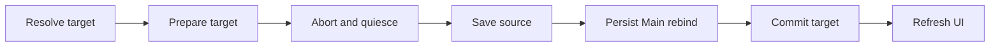
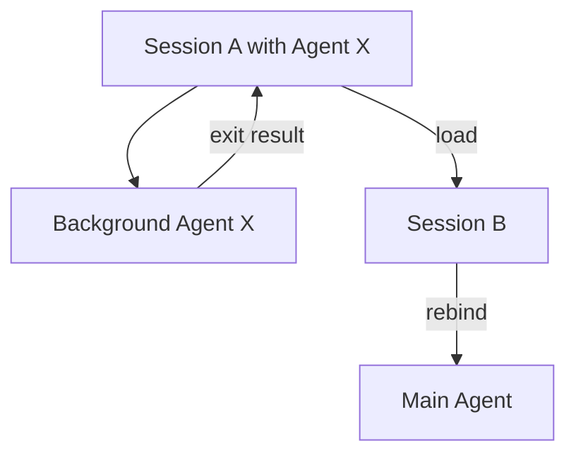
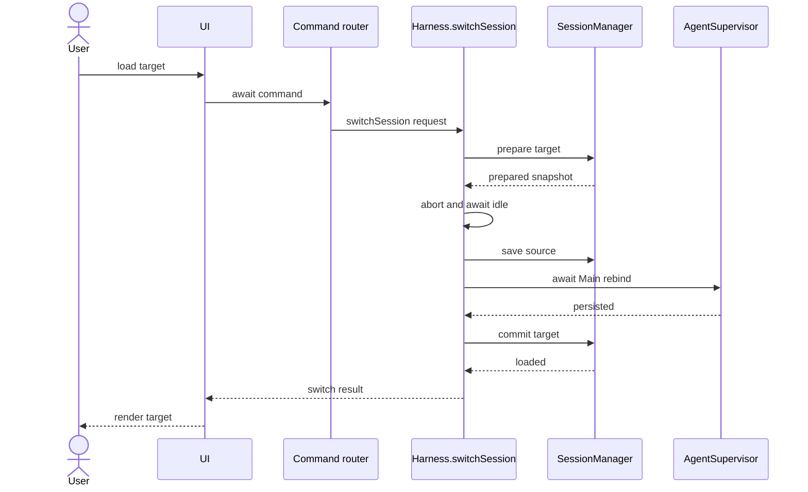

## Context

dscode 将 Session 视为 TTY，将 Main Agent 和 SubAgent 视为进程。Main Agent
Process 可在运行期间连接不同 Session；每个 SubAgent 在 spawn 时记录
`parentSessionId`，完整运行记录进入 Agent Process Store，轻量关联记录进入父
Session 的 `agentMessages`。

当前 Session 加载分散在 TUI slash command、Web slash command 和 Web 侧边栏。
共享 slash command 虽然调用 `SessionManager.loadSession()`，但不会统一执行
abort、save 和 UI 刷新；`executeSlashCommand()` 也不会等待异步 command。
`session:loaded` 通过 fire-and-forget 事件更新 Main Process，无法作为切换成功的
事务保证。

## Goals / Non-Goals

**Goals:**

- 为全部 Session 加载入口提供同一个可等待的核心用例。
- 保证旧 Session 保存、目标 Session 恢复和 Main Process TTY 重绑定顺序确定。
- 保证已有 SubAgent 和新 SubAgent 在 Session 切换前后路由正确。
- 保持 `agentMessages` 与 Main Agent 推理消息隔离。
- 在任何前置验证或持久化失败时保持原 Session 可继续使用。

**Non-Goals:**

- 不创建 SubAgent Session。
- 不把运行中 SubAgent 迁移到新 Session。
- 不恢复已退出 Agent Process。
- 不改变 Session Store 或 Agent Process Store 的物理目录。
- 不设计跨项目 `/session load --all`。
- 不改变 Web 或 TUI 的视觉设计。

## Decisions

### 1. Harness 提供唯一 `switchSession()` 用例

Session 切换跨越 Main Agent、SessionManager、AgentSupervisor 和 UI 生命周期，
因此由 Harness 层协调。UI 只解析输入、收集 pending permission，并等待结果。

```typescript
export interface SwitchSessionRequest {
  sessionIdOrPrefix: string;
  pendingPermission?: PendingPermission;
}

export interface SwitchSessionResult {
  session: SessionMetadata;
  messages: unknown[];
  agentMessages: AgentSessionMessage[];
}

export interface HarnessAPI {
  switchSession(request: SwitchSessionRequest): Promise<SwitchSessionResult>;
}
```

**替代方案：** 继续由各 UI 直接调用 SessionManager。该方式会复制 abort、save、
权限和 Process 重绑定逻辑，无法形成单一事务边界，因此不采用。

### 2. 使用 prepare/commit 两阶段加载

`SessionManager.prepareLoad()` 读取、校验并恢复目标 Session 图片，但不修改
`current`、Main Agent messages 或 `agentMessages`。所有可能失败的读取工作在
切换前完成。

完成旧 Session 保存和 Main Process 重绑定后，
`SessionManager.commitPreparedLoad()` 同步替换内存状态并发出
`session:loaded`。commit 不执行文件 I/O。



**替代方案：** 先调用现有 `loadSession()`，失败时再回滚。该方式会先污染
`SessionManager.current` 和 Main messages，回滚还需重复恢复图片，不采用。

### 3. Main Process 重绑定必须原子且可等待

`AgentSupervisor.updateParentSession()` 只更新指定 Main Agent Process。它应保存
旧 `parentSessionId` 和 context，在 Process Store 持久化失败时恢复内存值并抛错。
`switchSession()` 必须 await 该操作后才能 commit Session。

`session:loaded` 事件改为通知用途，不再负责 fire-and-forget 的关键重绑定。
`session:created` 也应通过明确的 Harness 路径完成 Main Process 绑定。

**替代方案：** 保留事件监听器并等待事件回调。当前 EventBus 不提供异步 handler
聚合和失败传播，扩展整个 EventBus 的影响面更大，因此不采用。

### 4. Load 不创建进程，已有子进程归属不可变

Session load 只恢复历史轨迹并重绑定 Main Process，不调用 `spawn()`，也不创建
任何 Agent Process。已经存在的 foreground 或 background SubAgent 不被遍历、
不被重写，其 `parentSessionId` 仍指向启动它的 Session。



前台子进程属于当前 Main turn。切换先 abort Main turn 并等待执行静止；后台子进程
继续运行。切换完成后的独立任务如果调用 `spawn()`，新子进程才从 Main Process
派生 Session B；该调用不是 load 事务的一部分。

### 5. Session 切换使用互斥门

Harness 在切换期间拒绝新的 prompt 和第二次 Session 切换。UI loader 不是正确性
边界，核心层必须保证 prepare、save、rebind、commit 不被交错执行。

互斥门只覆盖切换事务，不阻塞已存在 background SubAgent 的完成和按
`parentSessionId` 写回。

### 6. Slash command 协议改为异步

`executeSlashCommand()` 返回 `Promise<string | undefined>`，TUI 与 Web 都必须
await。command 成功后，UI 才刷新 Session 列表、conversation、config 和 loader。

Web 侧边栏的 typed session command 与 slash command 共用
`Harness.switchSession()`；pending permission 的 UI 交互仍在 Web adapter 中
完成，结构化值作为 request 传给核心用例。



### 7. `agentMessages` 只用于关联和显示

prepared Session 同时恢复 `messages` 和 `agentMessages`。commit 只把 `messages`
赋给 Main PiAgentRuntime；`agentMessages` 保留在 SessionManager，供 UI 和审计
使用，不拼接到模型上下文。

## Risks / Trade-offs

- **[Abort 无可等待完成信号]** → Harness 跟踪当前 turn Promise，提供
  `abortAndWaitForIdle()`；不得用固定 sleep。
- **[Main Process Store 写入失败]** → Supervisor 在抛错前恢复旧
  `parentSessionId` 和 context，Session commit 不执行。
- **[后台 Agent 同时写旧 Session]** → `upsertAgentMessage()` 继续按显式
  sessionId 写入；Session Store 保持原子 rename。
- **[切换期间收到新 prompt]** → Harness 互斥门拒绝请求并返回明确错误。
- **[UI 重复发送 ready]** → typed load 和 slash load 收敛到同一 adapter 完成回调，
  command 内不直接发送第二套 ready。
- **[prepare 后目标文件被外部修改]** → prepared snapshot 是本次事务的固定输入；
  下次加载再读取新版本。

## Migration Plan

1. 增加 `SessionManager.prepareLoad()` 和 `commitPreparedLoad()`，保留
   `loadSession()` 作为内部兼容包装。
2. 使 `AgentSupervisor.updateParentSession()` 在持久化失败时回滚内存状态。
3. 在 Harness 增加切换互斥门、turn quiescence 和 `switchSession()`。
4. 将 TUI/Web slash command 改为异步等待。
5. 将 Web typed session load 改为调用 `switchSession()`，删除重复编排。
6. 增加 Session A/B 与 background SubAgent 的路由验收测试。
7. 所有入口迁移后，移除关键路径上的 `session:loaded` 重绑定监听器。

回滚时可以恢复旧 UI 编排和事件监听器；磁盘格式没有变化，不需要数据迁移。

## Open Questions

- `loadSession()` 是否保留为公开兼容 API，还是在所有调用迁移后降为
  SessionManager 私有方法。
- Main turn Promise 应由 Harness 自身维护，还是由 PiAgentRuntimeAdapter 暴露
  通用 `waitForIdle()` capability。
