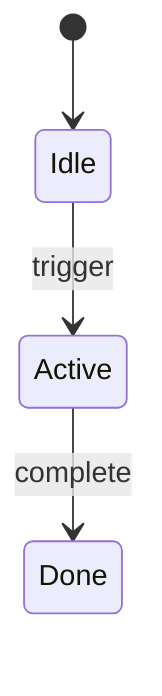

## Visual Direction

<!-- Color palette, typography, spacing philosophy, mood -->
<!-- Example: Dark theme, Inter + JetBrains Mono, 8pt grid, editorial tone -->

## Layout

<!-- Wireframe or structural diagram (ASCII art or Mermaid) -->
<!-- Show component hierarchy, not pixel-level details -->

```
┌─────────────────────────────────────┐
│                                     │
│              (sketch)               │
│                                     │
└─────────────────────────────────────┘
```

## Interaction Flow

<!-- Key state transitions or user journey -->
<!-- Use state diagrams or numbered steps -->



## Design References

<!-- Inspiration, existing patterns, constraints -->
<!-- Links to existing components or external references -->

## Accessibility Notes

<!-- Keyboard, screen reader, contrast, motion considerations -->
